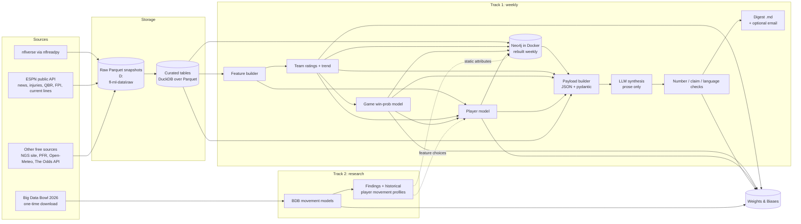

# 02: System Architecture

## High-level flow



**Key idea: Parquet is the source of truth.** Everything downstream (features, models, the graph, the payload) can be regenerated from the raw snapshots. The Neo4j graph is a **derived view that's rebuilt every week**, so it can be wiped and recreated at any time with no data loss.

## Components

| Component | Responsibility | Notes |
|---|---|---|
| Ingestion | Pull each source into dated raw Parquet snapshots | Idempotent. A rerun on the same day overwrites that day's snapshot. See [03](03-data-sources.md). |
| Curation | Clean, standardize team codes and player IDs, build analysis tables | DuckDB SQL plus Polars. Data-quality checks run here. |
| Feature builder | Build model features using **only data available at prediction time** | One function per feature family, each tested against leakage. |
| Team ratings | Opponent-adjusted EPA ratings and trend | Not a learned label: a calculation. See [04](04-track1-models.md). |
| Game model | Win probability and expected margin for every game | Two versions: model-only and market-informed. |
| Player model | Projected output vs the player's own baseline, with uncertainty | Separate target per position group. |
| Knowledge graph | Multi-hop insight queries, plus a store of model outputs | Neo4j Community in Docker. See [05](05-knowledge-graph.md). |
| Payload builder | Assemble one validated JSON payload per run | Pydantic schema. Numbers are pre-formatted as display strings. |
| Synthesis | LLM turns the payload into prose sections | Called through a **provider-agnostic `LLMClient`**. Starts with a `PlaceholderLLM` (a deterministic template writer); Rishi connects a real provider later. Tables (game probabilities, report card) are rendered by code, not the LLM. |
| Checks | Number provenance, entity binding, banned language, length | On failure: regenerate once, then publish with a warning banner. See [06](06-weekly-digest.md). |
| Delivery | Write Markdown to `reports/`, optionally send email or a notification | |
| Tracking | Log experiments and every production run to W&B | See [08](08-experiment-tracking.md). |
| Control room (planned, CR00–CR03) | Local web app: run the week with one button (`nfl weekly run --auto --expect-week N`), watch the steps live, read each week's results and the MLOps / season views | Localhost only; FastAPI in `src/nflengine/app/` + a Vite / React app in `web/`. Spec: [control-room/](control-room/README.md) (D94–D96) |
| Live decisions (planned, LD00–LD03) | A live 3rd- / 4th-down bot in the control room's **Game day** week tab: new win-probability, yards-gained, field-goal, punt and pass models, scored on a click from ESPN's live feed | `src/nflengine/live/`; one allowlisted outbound host (`site.api.espn.com`). Spec: [live-decisions/](live-decisions/README.md) (D107–D109) |
| Play calling (planned, PC00–PC03) | Team tendency pages (Explore → Play calling), a weekly tendency forecast (**Play calls** week tab), reconstructed play diagrams | `src/nflengine/playcalling/`, files under `{NFL_DATA_ROOT}/playcalling/`. Spec: [play-calling/](play-calling/README.md) (D107, D108, D110) |
| Ask the Engine (planned, AE00–AE04) | Plain-English questions over the weekly graph, curated data and a second **history graph** (Neo4j container `nfl-neo4j-history`, play-level, compose profile `history`) | `src/nflengine/ask/`, `src/nflengine/history_graph/`. Spec: [ask-the-engine/](ask-the-engine/README.md) (D107, D108, D111, D112) |

## Tech stack

| Concern | Choice | Why |
|---|---|---|
| Language | Python 3.12 | Ecosystem fit |
| Environment | `uv` (pyproject + lockfile) | Fast, reproducible |
| NFL data | `nflreadpy` (the successor to the deprecated `nfl_data_py`) | Official nflverse Python loader, returns Polars, has caching |
| DataFrames | Polars (main), pandas only where a library needs it | Speed, matches nflreadpy |
| Analytical SQL | DuckDB over Parquet | Zero setup, fast, works well with Polars |
| Tabular ML | scikit-learn (logistic / ridge), LightGBM | Simple baselines first, then gradient boosting |
| Explanations | SHAP (TreeExplainer) | Per-prediction drivers for the digest |
| Deep learning (Track 2) | PyTorch | Sequence and interaction models |
| Graph | Neo4j Community (Docker) + APOC + Graph Data Science plugin, official `neo4j` Python driver | Learning goal, multi-hop queries, GDS algorithms |
| Schemas | Pydantic v2 | Payload and config validation |
| LLM | `LLMClient` interface. Providers: `placeholder` (default), later `anthropic` and `openai_compatible` (covers open-source model servers such as Ollama, vLLM and LM Studio) | Rishi picks and connects the real model later; only config changes |
| Tracking | `wandb` | Already set up and paid for |
| CLI | Typer | One command per pipeline step, plus `weekly run` |
| Tests | pytest | Leakage tests, query golden tests, check tests |
| Scheduling | Windows Task Scheduler running the CLI | Local machine hosts Docker Neo4j; see below |

## Proposed repository layout

```
NFL-ML-AI/
├── documentation/              # these docs
├── docker-compose.yml          # Neo4j (+ plugins)
├── pyproject.toml / uv.lock
├── .env.example                # secrets template (real .env is git-ignored)
├── config/
│   ├── settings.yaml           # seasons, paths, model + LLM choices, thresholds
│   └── followed_teams.yaml     # digest personalization (prioritization only)
├── src/nflengine/
│   ├── cli.py                  # `nfl ingest`, `nfl features`, `nfl train`, `nfl graph build`, `nfl digest`, `nfl weekly run`
│   ├── ingest/                 # one module per source
│   ├── curate/                 # cleaning, ID/team normalization, quality checks
│   ├── features/               # feature families with as-of-date guarantees
│   ├── models/
│   │   ├── ratings.py          # team ratings + trend
│   │   ├── elo.py              # Elo baseline
│   │   ├── game.py             # win probability model(s)
│   │   └── player.py           # player projections
│   ├── graph/
│   │   ├── schema.cypher       # constraints + indexes
│   │   ├── load.py             # Parquet -> Neo4j
│   │   └── queries/            # one .cypher file per insight query
│   ├── digest/
│   │   ├── payload.py          # pydantic models + builder
│   │   ├── prompt/             # system prompt + section specs
│   │   ├── render.py           # deterministic tables
│   │   ├── synthesize.py       # LLM call
│   │   └── checks.py           # number / entity / language / length checks
│   ├── track2/                 # BDB pipeline + models
│   └── tracking.py             # W&B helpers
├── notebooks/                  # exploration only; nothing production lives here
└── tests/
```

No data lives in the repo. Everything large lives under the data root on D: (see the next section).

## Storage: data lives on D:

The repo (code, config, docs) stays on **F:** (SSD). All data lives under one **data root** on **D:** (Seagate One Touch HDD, ~500 GB free as of 2026-09-30), set by one variable:

```
# .env
NFL_DATA_ROOT=D:\nfl-ml-data
```

```
D:\nfl-ml-data\
├── raw\{source}\{dataset}\snapshot=YYYY-MM-DD\   # dated raw snapshots
├── curated\                                     # curated Parquet tables + DuckDB file
├── features\                                    # cached feature tables
├── models\                                      # local model files (also W&B artifacts)
├── runs\{season}\week{NN}\                      # per-run payload, predictions, checks, logs
├── reports\{season}\                            # published digests
├── rehearsals\{season}\                         # P10: `nfl weekly rehearse` sandboxes (safe to delete)
├── bdb\                                         # Track 2: raw CSV, Parquet, outputs
├── neo4j\data\  neo4j\logs\                     # Neo4j database files (Docker bind mount)
├── wandb\                                       # W&B local run files (WANDB_DIR)
└── cache\nflreadpy\  cache\uv\  cache\http\     # nflreadpy cache, uv package cache, HTTP cache
```

- All code reads paths from one `paths` module built from `NFL_DATA_ROOT`. **No hard-coded paths.**
- `UV_CACHE_DIR` and `WANDB_DIR` also point under the data root (PyTorch alone is several GB).
- **The D: drive is probably an external USB drive.** Every command starts with a data-root check. If `D:\nfl-ml-data` is missing, it stops with a clear "data drive not connected" error and writes nothing. Give the drive a fixed letter in Disk Management.
- **HDD speed:** fine for Parquet and for a graph of a few hundred MB. Neo4j reading a Windows folder through Docker is slower than Docker's own storage. If weekly rebuilds get slow, move only the Neo4j folder; nothing else changes.
- Expected size: about 10–30 GB at first (mostly Big Data Bowl data, snapshots and model files).

## Weekly schedule

The schedule is **driven by the game calendar, not fixed weekdays.** Each run reads the schedule to find (a) whether the previous week's games are all final and in the data, and (b) the next slate's first kickoff, which is the digest deadline.

| Run | Default time | What it does |
|---|---|---|
| **Main run** | Tuesday 10:00 local (after Monday Night Football; nflverse play-by-play normally updates overnight) | Full pipeline: ingest → curate → features → refit → predict → graph rebuild → payload → digest → checks → deliver |
| Retry | Every 3 hours until Wednesday 18:00 if the data-readiness check fails | Same as the main run |
| **Injury update** (optional) | Saturday 10:00 (final injury designations come out Friday) | Re-ingest injuries and ESPN news, rerun the game and player predictions, publish a short addendum **only if** something material changed (a win probability moved ≥ 5 points, or a watch-list player's status changed) |

Calendar edge cases the scheduler and the digest handle:
- **Thursday games:** the main run must finish before the first Thursday kickoff. Thanksgiving week has several Thursday games.
- **Odd game days:** Christmas, Saturday games late in the season, Black Friday, and international morning games are handled by reading kickoff times from the schedule, not by assuming Sunday.
- **Byes:** teams on bye are skipped in game outlook, and their trend section notes the rest.
- **Week 18:** teams that have clinched or been eliminated may rest starters. These games are marked low confidence.
- **Playoffs:** the same pipeline runs with `game_type != 'REG'`. The bracket replaces a full slate.
- **Weeks 1–3:** ratings lean on last season's numbers pulled toward the average (see [04](04-track1-models.md)). Confidence is shown as lower.

## Orchestration

**Main option: Windows Task Scheduler on the home machine** runs `uv run nfl weekly run`. Neo4j runs in local Docker, so running the pipeline on the same machine is simplest. Requirements: the machine is on (or wakes for the task), and Docker Desktop starts at login.

**Fallback: GitHub Actions on a schedule.** Because the graph is rebuilt from Parquet every week, CI can start Neo4j as a temporary *service container*, rebuild it, run the queries and throw it away. To use this we'd need to keep raw snapshots somewhere CI can reach (a release asset or cache). Only set this up if the local machine proves unreliable.

No heavyweight orchestrator such as Prefect or Airflow. `nfl weekly run` is a plain sequence of idempotent steps, and each step writes to `{NFL_DATA_ROOT}/runs/{season}/week{NN}/` so a failed run can resume from the step that failed (`--from-step graph`).

## Failure handling

| Failure | Behavior |
|---|---|
| Data drive (D:) not connected | Stop immediately with a clear error; write nothing; send a notification |
| nflverse data not ready (previous week's games missing) | Don't run; retry on schedule; alert if still missing by Wednesday 18:00 |
| ESPN endpoint changed or down | **Fail soft:** continue without news or current lines and note it in the footer |
| Current market lines unavailable | Publish model-only probabilities; skip the "disagreement with consensus" item |
| Neo4j down | Try to start the container once; if it still fails, publish the digest without graph sections and add a banner. As built in P05: the `graph` step fails soft at once (recorded as `degraded`, D61). As built in P07: the step first runs `docker compose up -d` once (starting Docker Desktop if the engine is down) and waits up to 3 minutes |
| LLM check fails | Regenerate once with the list of failures; if it still fails, publish with a warning banner and mark the run in W&B |
| Any unhandled exception | Run marked failed in W&B, notification sent, nothing published |

Notifications: email through the SMTP settings in `.env`, or a push notification service. One channel is enough.

## As built in P07: manual-first weekly operations (D71)

Rishi chose **manual-first** at the start of P07: the project isn't deployed, and every manual weekly run so far worked (about 5 minutes plus the LLM). So nothing is scheduled, and no SMTP or push channel was added. Everything a scheduler would need *is* built, so scheduling later only wraps one command. The operator's view is the [runbook](runbook.md); how each piece works is the [weekly operations guide](guides/weekly-operations.md).

| Spec above | As built |
|---|---|
| Calendar-driven, not fixed weekdays | `src/nflengine/ops/calendar.py`: from the schedule and a clock it works out the season, the target week (the earliest week with a game still to kick off), whether week N−1 is final, the **deadline** (first kickoff), the retry window (Wednesday 18:00 ET) and the special cases (Thursday, Thanksgiving, Black Friday, Christmas, Friday / Saturday / midweek games, neutral sites and games abroad, morning kickoffs, byes, week 18, playoffs, offseason). Tested over the real 2024–2026 schedules |
| Main run Tuesday 10:00, retries every 3 h until Wednesday 18:00 | `nfl weekly run --auto`, run by hand. It skips a week already published (exit 0), and exits **3** ("not ready") when week N−1 isn't final (a schedule-only refresh decides first, so a hopeless retry costs no full ingest), so a person, or a scheduler later, simply runs it again. Not ready after Wednesday 18:00 ET (or the first kickoff, if earlier) raises an alert. **No Task Scheduler entries** (D71; the steps to add them are in the runbook) |
| Injury update Saturday 10:00 | `nfl weekly injury-update --auto`, run by hand (`flags.injury_update_enabled: true`) |
| Data drive not connected | Exit 5 (2 is a usage error) with "Data drive ... is not connected ... Nothing was written", before anything is written |
| nflverse not ready | Exit 3 (above) |
| ESPN / extra source down; lines missing | Unchanged (fail soft since P01 / P03); the run summary's freshness table marks a dataset stale after 7 days and the `data_freshness` drift check alerts |
| Neo4j down | One `docker compose up -d` (and Docker Desktop if needed), then wait; else `degraded` as in P05. Checked live: up again after 50 s |
| LLM check fails | Unchanged (regenerate once, banner); the pipeline adds a warn alert |
| Unhandled exception | The run is `failed` (exit 1), the W&B pipeline run ends with exit code 1, an error alert is printed and recorded; nothing is published |
| Two runs at once | An operating-system lock on `runs/.weekly.lock` shared by the weekly run and the injury update (exit 4 while held); the OS releases it when the holding process ends, crash included |
| Notifications | Alerts print at the end of the run, go into `run_summary.json`, and go out as **W&B alerts** (W&B's own email / app notifications; `ops.wandb_alerts`). No SMTP |
| Time travel | `--as-of` (ISO, Eastern without an offset): in the past it simulates the run (readiness from `kickoff + ops.data_lag_hours`, the digest as a backtest), writing only to the backtest folders |

## As built in P10: rehearsals and the season calendar (D89–D91)

- **Rehearsals** (`nfl weekly rehearse`, `ops/rehearsal.py`): the live steps `ready → game → player → digest` on any past or current week, with the steps' clock (`clock.py`) pinned to that week's Tuesday and the data root redirected (`paths.redirect_data_root`): raw and curated data are read from the data root, features / models / runs / reports go under `rehearsals\<season>\`. No W&B, no Neo4j write, no run records. Used for the playoff check every January and the pre-season dry run ([season operations guide](guides/season-operations.md)).
- **Playoff weeks** run the same eight steps; the player model and the digest learned the playoffs in P10 (D91).
- **The season beyond one week** (the Tuesday season log, the playoff check, the season review after the Super Bowl, the pre-season checklist) is a dated calendar in PROGRESS and the runbook, run by hand like the weekly command (D71, D89).

## Secrets and config

- `.env` (git-ignored) holds `NFL_DATA_ROOT`, `NEO4J_PASSWORD`, `WANDB_API_KEY`, optional `LLM_API_KEY` / `LLM_BASE_URL`, optional `ODDS_API_KEY`, SMTP credentials and the Kaggle token. `.env.example` lists the variable names.
- `config/settings.yaml` holds non-secret settings: training seasons, rating decay, thresholds, `llm.provider` (default `placeholder`) and `llm.model`, word budgets, feature flags (such as `injury_update_enabled`, `source.odds_api.enabled`).
- Each run's config is logged to W&B with a hash so it can be reproduced.
