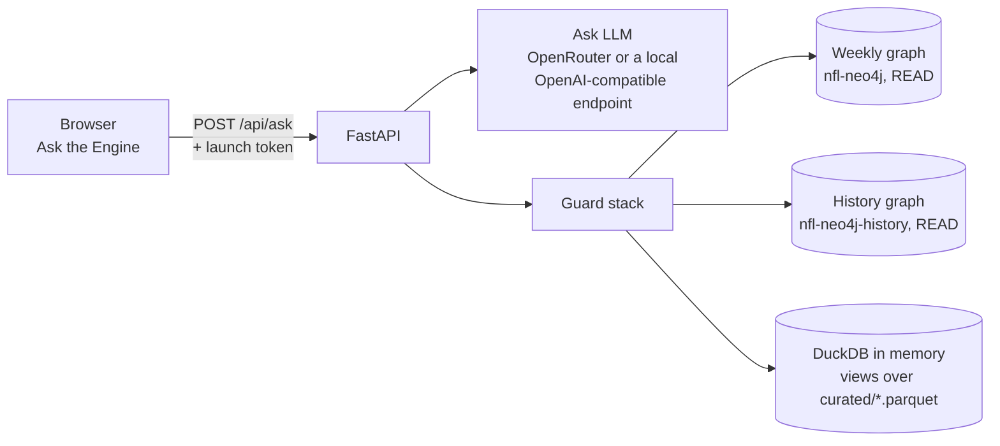
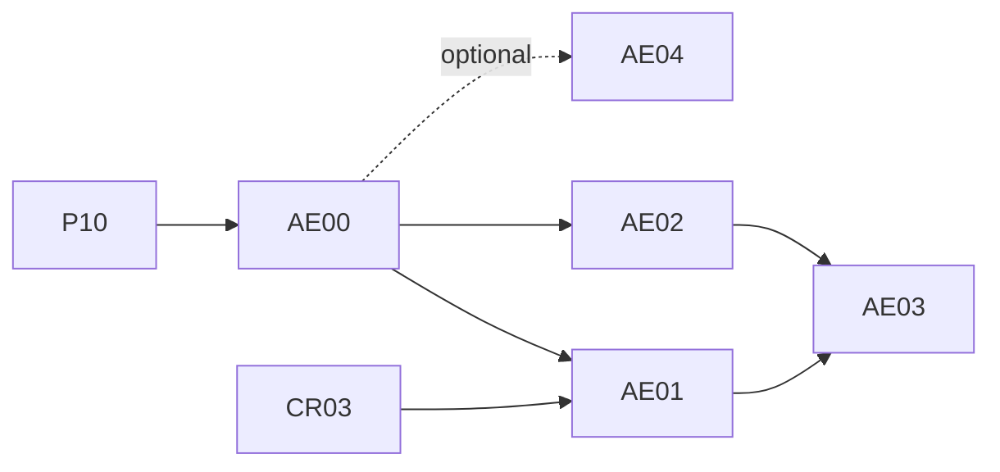

# Ask the Engine: questions in plain English, and the history graph

Status → see the **Ask the Engine** rows in [plans/PROGRESS.md](../plans/PROGRESS.md). Decisions: D107, D108, D111, D112 in the [decisions log](../10-decisions-log.md). Planned 2026-10-08; promoted from [STRETCH.md](../plans/STRETCH.md) (the Q&A agent over the graph, and play-level nodes).

A new **Explore → Ask the Engine** page in the control room. Rishi types a question in plain English, for example:
- "Which receivers have the most 100-yard games against Dallas since 2020?"
- "Who are the former teammates on this week's Bills–Chiefs game?"
- "How does Detroit's play-action do on 3rd down?"

He gets a short answer, the table it came from, and the exact query that produced it (Cypher for the graph, SQL for the curated tables). A second, permanent **history graph** holds every play since 2018 with the players on the field, so connection questions ("six degrees" between any two players or coaches) and new graph experiments become possible **without touching the weekly graph**. It's its own track, **AE00–AE04** (AE04 optional).

## 1. What was agreed (Rishi, 2026-10-08)

| Topic | Decision |
|---|---|
| Where it lives | **Explore → Ask the Engine** in the sidebar (a general page, not tied to a week; D108) |
| The LLM | **Not GLM** (too slow at max reasoning, and too costly for chat). A **smaller, faster, cheaper model through OpenRouter**, chosen by a bake-off on our own question set (AE00); its own settings block, so the digest's writer is untouched. A **local model** behind an OpenAI-compatible HTTPS endpoint stays possible through the same interface (D111) |
| JEPA ("Jev") | JEPA-style models (LeCun's Joint Embedding Predictive Architecture) predict embeddings, not text, so they can't write a query on their own. **LLM-JEPA** ([arXiv 2509.14252](https://arxiv.org/abs/2509.14252), ICLR 2026) is a *training objective* for ordinary LLMs and was tested on text-to-SQL (Spider). That makes it a good optional ML experiment: AE04 fine-tunes a small local model with and without it on our questions |
| How questions become queries | **Templates first** (the 17 tested graph queries and a set of SQL recipes, with the LLM picking one and filling its values), free-form generation as the fallback with up to three check-and-retry rounds. The query is always shown |
| Play-level data | In a **second Neo4j database**, a separate container (Neo4j Community allows one user database per server), so the weekly digest graph stays exactly as it is (D112) |
| Six degrees | Yes: the shortest connection between any two players or coaches, with the evidence for each link |
| The sub-cubic paper | Alman & Vassilevska Williams, "Truly Subquadratic 3SUM and Truly Subcubic APSP via Triangles in Sparse Lopsided Graphs" ([arXiv 2610.06783](https://arxiv.org/abs/2610.06783), 2026-10-05; the paper says Claude found the algorithm). A landmark theory result, but **it can't speed up anything here**: the saving is n^0.0005 (about 0.5% at our size) before enormous constants, the authors call it potentially impractical, there's no code, and our "how are these connected" questions are single-pair searches (milliseconds), not all-pairs. AE03 instead builds a **shortest-path benchmark** on the history graph (Cypher, GDS, scipy, Floyd–Warshall, the 2025 "Breaking the Sorting Barrier" SSSP) and explains the paper in the guide |

## 2. What the research found (2026-10-08)

**Text-to-query accuracy:**
- Free-form text-to-Cypher is far from solved. On CypherBench ([arXiv 2412.18702](https://arxiv.org/abs/2412.18702)), Claude 3.5 Sonnet scored 61.6% execution accuracy, GPT-4o 60.2%, the best open model 41.9%, and models under 10B under 20%. Newer models report 77–85%. Neo4j's own text2cypher benchmark gave GPT-4o about 30% exact execution match.
- The working recipe ([Neo4j's Text2Cypher guide](https://neo4j.com/blog/genai/text2cypher-guide/)):
  - a curated schema in the prompt;
  - few-shot examples picked per question;
  - rule-based checks before LLM checks;
  - a verify-and-correct loop of at most 3 rounds, with most fixes in round 1.
- Template retrieval, where the LLM only fills the values of a fixed query, is the safest pattern.

**Safety, tested live on our Neo4j 5.26 Community and DuckDB 1.5.6:**
- **Neo4j:**
  - **Writes are blocked:** a READ-mode transaction rejects them (`Neo.ClientError.Statement.AccessMode`), including a `SET` inside a `CALL` subquery.
  - **Some "reads" still need blocking:** `LOAD CSV`, `apoc.load.*`, `apoc.export.*`, `gds.graph.project` and `apoc.util.sleep` all plan as **read**, and `LOAD CSV file:///` actually tried the read. The app must ban them itself, because the server allows `apoc.*` and `gds.*` for the weekly build.
  - **Timeouts work:** a per-transaction timeout killed a 3 s sleep at 1.4 s. The server has no default timeout or memory cap per transaction.
  - **No read-only user:** Community has no role-based access control.
- **DuckDB:** an in-memory connection with views over `curated/*.parquet`, then `allowed_directories` (curated only), `enable_external_access = false`, `lock_configuration = true` and extension autoload off. That blocked the research folder, `COPY TO`, `ATTACH`, `INSTALL` and reading a system file. In-memory `CREATE TABLE` still works, so only `SELECT` statements are allowed (`duckdb.extract_statements`). `con.interrupt()` from a timer stopped a query at 1.0 s.

**Our weekly graph (2026-10-08):**
- 22,387 nodes and 606,289 relationships, wiped and rebuilt every week in about 1.5–3 minutes (D58).
- The store takes **5.2 GB on disk** for that size: space isn't reclaimed across wipes. A separate housekeeping issue, not this track's.

**Play-level size, measured from curated data:**
- 2018–2025 is 389,358 play rows (about 341k real plays) and about 48.9k drives.
- Participation adds about 8.0M player-on-play links (about 22 per play from 2023).
- Expect roughly 10M relationships and 0.6–1 GB on disk.
- Loading that with batched `UNWIND` at about 10k relationships/s takes 15–20 minutes on the HDD. `neo4j-admin database import full` is much faster but needs an empty, stopped database, which is why play-level data gets its own database, rebuilt per finished season.

**Cheap, fast OpenRouter models** (from OpenRouter's public model list, 2026-10-08; prices per million tokens in / out): Claude Haiku 5.5 ($0.10 / $0.50), GPT-6 Luna ($0.10 / $0.50), Qwen3.8 Flash ($0.15 / $0.47), DeepSeek V4.1 Flash ($0.30 / $1.20), Mercury 2.5 (a diffusion model, $0.04 / $0.15), and GLM 5.3 Flash at low effort ($0.15 / $0.50) as the control. Prices and the list change: AE00 re-reads them.

## 3. Screens

**Explore → Ask the Engine** (sidebar):

| Part | Shows | Phase |
|---|---|---|
| Ask | A question box with example chips; the answer (2–3 sentences, every number traceable to the rows), the rows table, the query with a copy button, the source ("weekly graph as of 2026 week 6" / "curated data through 2026 week 5" / "history graph through 2025"), the route (template name or free-form, retries), time and cost; the session's earlier questions (kept in the browser) | AE01 |
| Connections | Pick two people (players or coaches, with fuzzy name search) → the shortest chain between them, drawn as a path with the evidence on each link ("teammates on 2019 KC, 612 snaps together"), plus "show 3 more paths" | AE03 |
| Graph lab | The history graph's experiments: player neighbourhoods ("players most like X by who they played with", FastRP embeddings), communities ("football families", Louvain / Leiden), QB → receiver chemistry; and the shortest-path benchmark's results | AE03 |

## 4. Architecture

- **`src/nflengine/ask/`** (new package):
  - `llm.py`: the Ask provider, separate from `digest/llm/`;
  - `templates.py`: the template library, a YAML of graph and SQL templates with typed parameters;
  - `route.py`: template vs free-form;
  - `guard.py`: Cypher and SQL checks, sandboxes, timeouts, row caps;
  - `answer.py`: the short answer with a number-provenance check modelled on the digest's;
  - `names.py`: fuzzy entity resolution in Python against curated `players`, `teams` and coaches, so the weekly graph needs no new index;
  - `evaluate.py`: the golden set.
- **`src/nflengine/history_graph/`** (new package, AE02): export → bulk import, weekly append, derived relationships, GDS jobs.
- **Settings:** a new `ask:` block (`llm.provider: openrouter | openai_compatible`, `model`, `reasoning_effort`, `timeout_s`, `max_tokens`, row caps, which sources are on) and a `history_graph:` block.
- **Secrets:** existing names only: `OPENROUTER_API_KEY`, or `LLM_API_KEY` + `LLM_BASE_URL` for a local endpoint, and `NEO4J_PASSWORD` for both Neo4j containers. No new secret.
- **The second container:** `nfl-neo4j-history` in `docker-compose.yml` under a compose **profile** (`history`), so the weekly run's `docker compose up -d` never starts it. Its own ports (7475 / 7688), data under `{NFL_DATA_ROOT}/neo4j-history/`, a smaller heap, GDS and APOC for AE03.

## 5. Safety rules

On top of the control room's §5 and CLAUDE.md:
1. **The free-text endpoint is a new kind** (the app's first). `POST /api/ask` needs the launch token and `Origin` like every POST, caps the question at 500 characters, allows one question at a time, and has a rate limit (about 10 a minute).
2. **Generated queries run only after the guard:**
   - **Cypher:**
     - one statement;
     - a parser allowlist with no `CALL` except allowlisted read procedures, and no `LOAD CSV`, `apoc.`, `gds.`, `dbms.`, `USE`, `SHOW` or `:` commands;
     - `EXPLAIN` must report query type `r` with no `ProcedureCall` or `LoadCSV` operators;
     - `execute_read` with a 10 s timeout;
     - at most 500 rows.
   - **SQL:**
     - the locked DuckDB sandbox (curated folder only);
     - `SELECT` only;
     - a 10 s interrupt;
     - at most 500 rows.
3. **Data is data:** text in the rows (names, play descriptions) is shown as text. The answer step sees the rows but has no tools, and free-text tables (`espn_news`) are left out of the sandbox.
4. **What leaves the server:** the answer, the rows (scalar columns only, never whole nodes: some nodes have a property named `key`, which `scrub()` treats as a credential), the query, timings and cost, all through `clean()`.
5. **No writes from Ask**, ever. The history graph is written only by its own CLI commands.

## 6. The no-touch rule (D107)

The Live decisions README §6 applies word for word:
- new code in `src/nflengine/ask/` and `src/nflengine/history_graph/`;
- the weekly graph's schema, loaders, queries and container are unchanged (Ask only reads it);
- the digest's LLM settings are unchanged;
- the production-unchanged check at every close, plus a **weekly-graph check** at AE02's close: rebuild a test week with and without the history container running and compare `graph_results.json` (candidates and picks).

## 7. Phases

| Phase | Title | Depends on | Delivers |
|---|---|---|---|
| [AE00](AE00-query-layer.md) | The safe query layer and the model bake-off | P10 | The guard stack and DuckDB sandbox with tests; the Ask LLM provider; the template library; the golden question set and the evaluation harness; the model bake-off (🧑) and the chosen model |
| [AE01](AE01-ask-tab.md) | The Ask the Engine page | AE00, CR03 | Mockup first; Explore → Ask the Engine (weekly graph + curated data); the free-text endpoint with its safety review |
| [AE02](AE02-history-graph.md) | The history graph | AE00 | The second Neo4j container; play-level nodes 2018–2025 bulk-imported, the current season appended weekly; Ask routes to it; the weekly-graph check |
| [AE03](AE03-connections-and-graph-ml.md) | Connections, graph experiments and the path benchmark | AE01, AE02 | Six degrees (Connections), derived relationships (teammates, QB → receiver chemistry), GDS experiments (embeddings, communities), the shortest-path benchmark and the paper's explainer |
| [AE04](AE04-local-query-model.md) | Optional: a local text-to-query model | AE00 (golden set) | A small local model fine-tuned on our schema, with and without the LLM-JEPA objective, served behind an OpenAI-compatible endpoint and scored in the same bake-off |

Commit prefixes `[AE00]` … `[AE04]`. **Mockup first** for AE01 and AE03.

**Docs each phase leaves:**
- the guides `guides/ask-the-engine.md` (AE00 onward) and `guides/history-graph.md` (AE02 onward);
- the W&B guide's section (`ask-eval`, `history-graph-build`, `path-benchmark`, `ask-finetune`);
- the skill `.claude/skills/ask-the-engine/SKILL.md` (AE00);
- the `neo4j-graph` skill: a pointer to the second database, and the rule that the weekly graph is untouched;
- a model card for AE04 if it ships a model.

## 8. As built

Each phase adds what it built and any differences from this spec here, with decision numbers.
