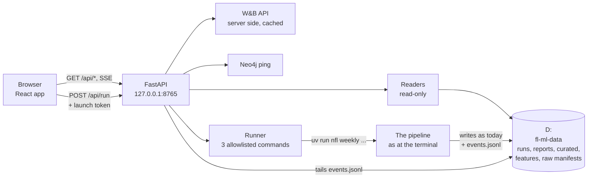
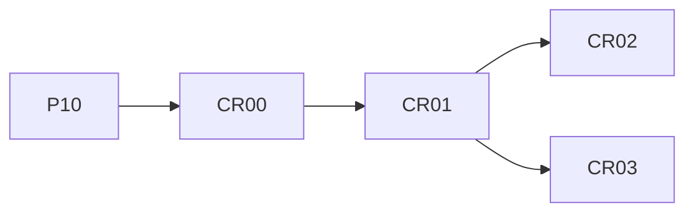

# Control room: the local web app for the weekly pipeline

Status → see the **Control room** rows in [plans/PROGRESS.md](../plans/PROGRESS.md). Decisions: D94–D96 in the [decisions log](../10-decisions-log.md).

The control room is a web app that runs on Rishi's machine (localhost only). On Tuesday he opens it and presses **one button** to run the week's pipeline. He watches every step happen, then reads the digest and checks last week's results. He can also look at the MLOps side (run health, W&B runs and charts, artifacts) and at season-long views.

The app adds no new modelling. It's a window onto the files the pipeline already writes, plus a safe launcher for three `nfl` commands. W&B stays the system of record for charts and artifacts, and the CLI stays the tool for repairs and everything else.

It's its own track, **CR00–CR03**, not a P phase. It was promoted from [STRETCH.md](../plans/STRETCH.md) on 2026-10-05 (D94).

## 1. The mockup is the visual spec

**Mockup:** <https://claude.ai/artifact/1z7AapJzJwKusNtWzXYfQw> (version 2, 2026-10-05, approved by Rishi: "I love this it is literally perfect", then the changes in §2).
- The link is private to Rishi's account. Agents read it with the Artifact tool's `read` action (that returns the page's HTML).
- **Source in this repo:** [`mockup/`](mockup/README.md) (`template.html`, `styles.css`, `app.js`, `build_mockup.py`).
- **Rebuild:** `uv run python documentation/control-room/mockup/build_mockup.py` writes `{NFL_DATA_ROOT}/cache/control-room-mockup/control-room.html`. The data it shows is read from D: at build time, so no data is committed.

**How to use it:**
- Build what the mockup shows: the layout, components, wording, colour tokens, chart styles and the geometry of the three pipeline views.
- It's **not production code.** It's plain JavaScript with a simulated run.
- **What's labelled as sample in it:**
  - the week-4 **Results** tab (week 4 wasn't graded yet);
  - the numbers from the simulated week-5 run (10:14 AM, 8m 41s, $0.012, "≈17.4k nodes");
  - the statuses on the **Health** page.

  Everything else is real 2026 week-4 / week-5 data, the 2025 backtest, and the live W&B artifact list.
- The striped **"Mockup controls"** strip at the top (week-5 state: Not ready / Ready / Running / Failed / Published) only exists in the mockup, to show each state.
- **Changes go mockup first.** If Rishi asks for a design change, update the mockup (republish to the same artifact), then this file, then the code. If the build differs from the mockup on purpose, record it in §10 "As built" and in the decisions log.

## 2. What was agreed (Rishi, 2026-10-05)

| Topic | Decision |
|---|---|
| Where it runs | Local only, in the browser, at `http://127.0.0.1:8765`. Never exposed to the network |
| Stack | **Vite + React + TypeScript** single-page app, served by a **FastAPI** backend inside `nflengine` (`uv run nfl app`). Not Streamlit, and not Next.js (no server rendering needed) |
| Charts | **Redrawn in the app** from the same local files W&B is fed from, each linked to its W&B run or report. No W&B iframes |
| The Run button | Runs only `nfl weekly run --auto --expect-week N`. **No week picker:** the week always comes from the calendar. `--auto` also refuses to run until last week is final (exit 3) |
| Before running | A **pre-flight** panel. While something is wrong, the Run button is greyed out with the reason and a "Check again" button. A **confirm dialog** names the week, last week's status, the deadline and what gets published |
| Repairs | "Resume from <step>" only for the **current week's failed run**, from the step that failed. Re-running a published week, `--force`, `--as-of` and graph rebuilds stay in the terminal |
| Saturday | A **Saturday injury update** button (`nfl weekly injury-update --auto`), greyed out until the week's Tuesday run exists |
| Themes | **Turf & Pylon** (field green, end-zone pylon orange) and **Playbook** (whiteboard by day, chalkboard by night), each with a dark and a light mode, plus "System". Chosen under the gear next to "Control Room" and saved in the browser. Floodlight and Sideline Tablet were shown and dropped |
| Pipeline views | All three stay: **Drive chart** (each step is a play, the digest is the touchdown, run records are the extra point, a failure is a fumble), **Pipeline map** (sources flow through the steps; files and W&B artifacts appear as each finishes), **Timeline** (a bar per step). Picked on each week's Pipeline tab and remembered per week, with **"Surprise me"** |
| Week tabs | Pipeline · Digest · Games · Players · Results · **MLOps** · Graph. The current week is first; earlier weeks stay as a track record |
| MLOps tab | Three sections behind a switcher: **Health · W&B runs · Artifacts** |
| Season pages | Scorecard (2026 live / 2025 backtest example) · Teams & rankings · Models · Alerts · Health |
| Not P11 | Its own track and folder in the docs (`documentation/control-room/`) |

## 3. Screens: what each shows, where it reads from, which phase builds it

**Shell** (CR00):

| Element | Shows | Reads |
|---|---|---|
| Sidebar: 2026 weeks | One row per week: number, short status line, a badge (Published / Failed / Running / Ready to run / Waiting on week N−1). "Before go-live" (weeks 1–3) is shown but disabled | `runs/<S>/week<NN>/weekly_run.json`, `run_summary.json`, `reports/<S>/week<NN>-digest.md`; the calendar (`ops.calendar.plan_week`) for the current week |
| Sidebar: Season, System | Scorecard, Teams & rankings, Models, Alerts (with a count), Health (with a status) | Alerts count from the run summaries; Health status from §3 Health |
| Sidebar footer | Run lock, Neo4j, data drive | `ops.lock.is_locked`, a Neo4j ping, `ensure_data_root` |
| Gear → Appearance | Theme (Turf & Pylon / Playbook), mode (System / Dark / Light) | Browser `localStorage` |
| Week header | Season + "this week", status chips, slate tags (Thursday opener, international venue, byes), the first-kickoff countdown and retry window (current week) or the publish time (past weeks), the Saturday injury-update button with its reason, an "Open in W&B" link | Calendar `WeekPlan` (`special`, `deadline`, retry window), `run_summary.json` (`published`, `on_time`) |

**Week tabs:**

| Tab | Shows | Reads | Phase |
|---|---|---|---|
| Pipeline: before the run | Pre-flight checks, the Run button (greyed with a reason when blocked), the command, "the plan for this run" in the chosen view (expected times), the dry-run log | `run_pipeline(dry_run=True)`, doctor-style checks (set / not set only), the lock, a Neo4j ping | CR02 (the plan view itself: CR01) |
| Pipeline: running | Now-bar (step x of 9, what it's doing, progress, elapsed, about how long is left), the live view, the streaming log, "closing this tab doesn't stop a run" | `events.jsonl` (new, CR02) + the command's output (scrubbed) over server-sent events | CR02 |
| Pipeline: finished / failed | The finished run in the chosen view with real step times, the rebuilt log; on a failure, the reason and **Resume week N from <step>** | `weekly_run.json`, `run_summary.json` → `steps` | CR01 (finished), CR02 (failed + resume) |
| Pipeline: view picker | Drive chart · Pipeline map · Timeline · Surprise me, per week | Browser `localStorage` (`vizByWeek`) | CR01 |
| Digest | The rendered digest; checks (pass / rewrite / banner, each check); words per section; the writer (model, route, provider, prompt id, each call's time, reasoning tokens and cost); file paths; Saturday's addendum when there is one | `reports/<S>/week<NN>-digest.md`, `checks.json`, `raw_llm_output.json` (metadata fields only), `reports/<S>/week<NN>-injury-update.md` | CR01 |
| Games | Tiles; "where the model disagrees with the market" (biggest model-only vs market gaps); one card per game: win %, predicted score, a dot strip of the home team's chance (model as shown, model only, Elo, market), market spread / total, QBs with ⚠ on a QB change, confidence, the final and hit / miss once played. The current, unrun week shows the slate (kickoff, stadium, market) | `predictions_games.parquet` (primary + `model_only` rows); curated `games` (finals, slate) via read-only DuckDB; QB changes from `payload.json` | CR01 |
| Players | Watch-list cards (projection, 80% range bar, baseline marker, main driver, injury), tough spots, the projections table with group filters | `watchlist.parquet`, `predictions_players.parquet`, tough spots from `payload.json` | CR01 |
| Results | How this week's calls did, once the next week's run has graded them: picks right, Brier for model / Elo / market, game by game (pick, final, hit, per-game Brier, margin error), player model vs baseline by group, the watch list against its range and baseline. Before that, an empty state ("graded by week N+1's run") | Saved predictions + finals, `accuracy_scoreboard.parquet`, box scores for the watch list: reuse the digest's report-card code | CR01 |
| MLOps → Health | Tiles (status, datasets, quality checks, drift alerts, projections); step timings; **What ran** (model versions, trained-through week, graph build, writer and route, prompt, promotions, launched by); data freshness; **This week vs last week** (time, GLM time, cost, games, projections, graph size, datasets, first-pass checks, with a trend line from week 5); **ingest dataset by dataset** (source, dataset, rows, status); **quality checks** (name, block / warn, result, detail); the five drift signals | `run_summary.json` (`steps`, `freshness`, `ingest`, `quality`, `models`, `digest`, `drift`, `alerts`), the ingest manifest `raw/_runs/ingest-*.json`, `curated/_quality/latest.json`, `pipeline_history.parquet`, `consistency.json` | CR03 |
| MLOps → W&B runs | The week's runs (job, name, group / job type, link); the season-dashboard run; one card per run with its main chart redrawn and the W&B keys named: game fit (model only vs market per game, `slate/*`), player scoreboard (`scoreboard/improvement_*`), player fit (`projections_per_target`), graph build (time by stage, `load/*`, `query_seconds`), digest (`words_per_section`, `check_issue_counts`), pipeline run (`step_seconds`; from week 5) | The W&B API (server side, cached): runs tagged `season:S` + `week:NN`, their summaries and history; local files where they hold the same numbers | CR03 |
| MLOps → Artifacts | Where `production` points (game-model, player-model, team-model); total versions; the lineage behind the week's digest; one table per artifact (`game-model`, `player-model`, `graph-results`, `digest`, `team-model`, `injury-update`): version, created, aliases, the run that logged it, size | The W&B API: artifact versions, aliases, `logged_by`, `used_by` | CR03 |
| Graph | Tiles (nodes, relationships, build time by stage, insights used of candidates); the insights used (game, section, query, strength, confidence, text); rows per query; found but not used; nodes by label; a Neo4j Browser link | `graph_results.json` | CR01 |

**Season pages** (CR03):

| Page | Shows | Reads |
|---|---|---|
| Scorecard | Switch: **2026 live** / **2025 backtest (example)**. Tiles (season Brier model / Elo / market, pick accuracy, ECE, games graded, weeks published, checks pass rate, LLM spend); season-to-date Brier lines; pick accuracy; calibration curve; player model vs baseline by group; pipeline health (one row per weekly run); a link to the W&B Season Dashboard | `runs/<S>/season_scorecard.parquet`, `accuracy_scoreboard.parquet`, `pipeline_history.parquet`, saved predictions + finals; the example from `runs/backtests/game/market/predictions_games.parquet` and `runs/backtests/player/scoreboard.parquet` |
| Teams & rankings | Biggest risers / fallers (Elo change); power rankings (rank, Elo, move, a sparkline, net / off / def EPA) with an AFC / NFC filter; click a team for its Elo by week, this week's game and next week's | `features/team_elo.parquet`, `features/team_ratings.parquet`, the week's predictions and slate |
| Models | One card per production model (game, ratings and Elo, player, team totals and the digest writer): version, headline backtest numbers vs baselines, settings, a "model card" button that renders the card | `documentation/model_cards/*.md`, W&B `production` aliases, `config/settings.yaml` |
| Alerts | The season's alerts with their investigation notes; when each drift signal can first fire this season; what an alert looks like (the 2025 week-10 calibration example and D75) | Every week's `run_summary.json` → `alerts` / `drift`; `settings.yaml` → `drift`; notes written in PROGRESS's Season log |
| Health | Services (Neo4j + plugin versions, Docker, W&B, OpenRouter routing, data drive, the lock); keys by **name** with set / not set (optional keys marked); recent runs (time, command, status, launched by) | The `nfl doctor` check functions (never values), `nfl data-status`, `pipeline_history.parquet` |

## 4. Architecture



- **`web/`:** the Vite + React + TypeScript app.
  - Tailwind CSS, with the mockup's colour tokens as CSS variables.
  - Radix primitives (dialog, popover, tooltip, tabs) for accessible widgets.
  - TanStack Query for data, TanStack Table for the big tables, React Router.
  - `react-markdown` + `remark-gfm` for the digest and model cards.
  - Charts are small in-house SVG components ported from the mockup: line, bars, dumbbell, calibration, sparkline, range bar, dot strip. They follow the dataviz rules (hover tooltips, legends, text in text colours, chart colours checked for colour blindness).
  - Fonts are bundled with `@fontsource` (Barlow, Barlow Condensed, JetBrains Mono), so the app works offline.
  - Built to `web/dist/`.
- **`src/nflengine/app/`:** the FastAPI backend.
  - `server.py`: app factory, security middleware, JSON with NaN → null.
  - `readers/`: one module per area (weeks, pipeline, digest, games, players, results, graph, mlops, season, teams, models, alerts, health).
  - `runner.py`: the allowlist, detached processes, re-attaching after a reload.
  - `events.py`: server-sent events from `events.jsonl` plus the command's output.
  - `wandb_api.py`: cached, read-only W&B reads.
  - `preflight.py`: the checks behind the Run button.
- **`uv run nfl app`:** serves `web/dist/` and the API on `127.0.0.1:8765` and opens the browser. Options:
  - `--port`;
  - `--no-browser`;
  - `--dev`: API only, with CORS for the Vite dev server; run `npm --prefix web run dev` alongside;
  - `--rehearsal`: the Run button runs `nfl weekly rehearse` into a scratch folder instead of the live week, for testing the live views.
- **What the app writes, and where:**
  - **Readers:** nothing. Everything under `raw/`, `curated/`, `features/`, `models/`, `runs/` and `reports/` is read-only to them.
  - **The commands it launches:** they write exactly as they do at the terminal.
  - **The app's own files:** only under `{NFL_DATA_ROOT}/cache/control-room/` (the W&B cache, each launched command's output log).
- **UI preferences** (theme, mode, the view per week) live in the browser.

**API (v1 sketch; CR00–CR03 settle the details):**

| Endpoint | Purpose |
|---|---|
| `GET /api/weeks` | Weeks with status; the calendar's current week |
| `GET /api/weeks/{season}/{week}` | Header data: plan, status, publish time, slate tags |
| `GET /api/weeks/{season}/{week}/{pipeline,digest,games,players,results,graph}` | One per tab |
| `GET /api/weeks/{season}/{week}/mlops/{health,wandb,artifacts}` | The MLOps sections |
| `GET /api/season/{season}/scorecard?source=live\|backtest`, `/api/teams`, `/api/models`, `/api/alerts`, `/api/health` | Season and system pages |
| `GET /api/preflight` | The checks and whether Run is allowed, with reasons |
| `POST /api/run` | `{"kind": "weekly" \| "resume" \| "injury_update", "expect_week": N}`; needs the launch token |
| `GET /api/run/current`, `GET /api/run/stream` (SSE) | The run in progress (also after a page reload) and its live events |

Season and week are validated integers. **No endpoint takes a file path.**

## 5. Safety rules (non-negotiable)

These sit on top of the Security section of `CLAUDE.md`, which always wins.

1. **Localhost only.** Bind to `127.0.0.1`, never `0.0.0.0`. `nfl app` refuses any other host. Requests whose `Host` header isn't `127.0.0.1:<port>` or `localhost:<port>` are rejected, which blocks DNS-rebinding tricks from other websites.
2. **Changes need the launch token.** `POST` endpoints need a token generated when `nfl app` starts and handed to the page, plus a matching `Origin`. No CORS, except the Vite dev origin under `--dev`.
3. **Three commands, built in code.** The browser sends a kind, never a command line:
   - `weekly` → `nfl weekly run --auto --expect-week N`. N is the server's own calendar week, and the browser's `expect_week` must match it.
   - `resume` → `nfl weekly run --season S --week N --from-step X`. Only when the calendar's current week has a last run that failed, and X is that run's failed step.
   - `injury_update` → `nfl weekly injury-update --auto`. Only once the week's Tuesday run exists; the button opens on Saturday (ET) until the week's last kickoff.
   - Under `--rehearsal`, `nfl weekly rehearse --season S --week N --out <scratch>` instead.
   - Nothing else: no `--force`, `--as-of`, re-runs of a published week, graph rebuilds or deletes from the app.
4. **Secrets stay on the server.**
   - Keys are loaded only through `nflengine.settings` (W&B through the same helper the pipeline uses).
   - No endpoint returns an environment value; key checks report set / not set only.
   - Every text that reaches the browser (step details, log lines, alerts, W&B summaries) passes through `scrub()` (`ops/summary.py`).
   - A test scans every endpoint's response for key-shaped strings.
5. **No credential files.** The app never opens `.env`, `~/.netrc` or any credential store (CLAUDE.md), and never runs commands that print resolved settings.
6. **Writing:** see "What the app writes" in §4. The lock still makes sure only one run happens at a time, and closing the browser never stops a run.

## 6. Repo layout (planned)

```
web/                          # Vite + React + TS (package.json, src/, tests); node_modules/ and dist/ git-ignored
src/nflengine/app/            # FastAPI: server.py, readers/, runner.py, events.py, wandb_api.py, preflight.py
tests/app/                    # pytest: readers on fixture run folders, security, runner allowlist, SSE
documentation/control-room/   # this folder: README (spec), CR00–CR03, mockup/
documentation/guides/control-room.md   # the reader-first guide (started in CR00)
.claude/skills/control-room/SKILL.md   # the agent how-to (created in CR00)
```

## 7. Quality gates (every CR phase)

- `uv run pytest` and `uv run ruff check` (as for every phase).
- In `web/`: `npm run lint`, `npm run typecheck`, `npm test` (Vitest + Testing Library), `npm run build`.
- **Mockup parity:** at each phase close, screenshot the built screens next to the same screens in the mockup and list any differences (each one fixed, or logged as a deliberate change).
- A Codex / Sol review before the commit, as in P07–P10.

## 8. The phases

| Phase | Title | Depends on | Delivers |
|---|---|---|---|
| [CR00](CR00-foundations.md) | Foundations | P10 | `nfl app`, the FastAPI skeleton with the safety rules and their tests, the React app shell (sidebar, header, tabs, routing), both themes × modes, shared components and chart primitives, the guide and skill |
| [CR01](CR01-week-archive.md) | The week archive (read-only) | CR00 | Every week tab from real files (Pipeline finished / plan view with the three views and the per-week picker, Digest, Games, Players, Results, Graph); the current unrun week's slate and empty states; partial weeks (week 4) |
| [CR02](CR02-run-control.md) | Run control and the live pipeline | CR01 | `--expect-week`, `events.jsonl` with progress inside steps, pre-flight + Run + confirm, the runner and live stream, the three views live, failure + resume, the Saturday injury update, notifications, `--rehearsal`; **the first live Tuesday run from the app** |
| [CR03](CR03-mlops-and-season.md) | MLOps, W&B and the season pages | CR01 (any order with CR02) | MLOps → Health · W&B runs · Artifacts (W&B API, cached), Scorecard, Teams & rankings, Models, Alerts, Health; closes the track |



The plan is read-only first (useful from day one with no risk to the live pipeline), then the Run button, then the W&B and season pages. CR03 can go before CR02 if Rishi prefers. The phases use the same 🤖 / 🧑 / ✋ tags and the same protocol as the main build ([plans/README.md](../plans/README.md)). Commit prefixes are `[CR00]` … `[CR03]`.

## 9. Findings so far (checked on 2026-10-05 while building the mockup)

- **Week 4 has no run records.** It ran before P07 added them, so there's no `run_summary.json` and no `pipeline-2026-w04` W&B run. Every reader must handle a week that has only `weekly_run.json` and the step files. Week 5 (2026-10-06) is the first full week.
- **QB changes can't be read from the prediction files.** `predictions_games.parquet` lists every QB with source `schedule`, so it can't tell a QB change from a regular starter. The digest's ⚠ list comes from the payload; read it from `payload.json`.
- **Some curated columns have blank values** (for example a stadium's `roof`). Pandas sends them as `NaN`, which is invalid JSON and makes the browser reject the whole response. The backend must turn NaN and infinity into `null`.
- **The live W&B artifacts** (via the API):
  - `game-model` v0–v4, `production` + `2026-w04` on v4 (`st8440zw`);
  - `player-model` v0–v1, `production` on v1 (`kl4fzvl8`);
  - `graph-results` v0–v1;
  - `digest` v0–v8 (v8 = `0eh6h6ll`, the published week 4);
  - `team-model` and `injury-update` don't exist yet: the first comes from the week-5 run, the second from Saturday 2026-10-10.
- **The ingest manifest has a row per dataset** (`raw/_runs/ingest-<time>.json` → `results[]`: source, dataset, status, rows): 30 rows for week 4 across nflverse, ESPN, the NGS site, Open-Meteo and The Odds API.
- **Week 4's digest took 39 minutes** (two GLM calls on DeepInfra: 24.7 and 13.9 minutes), about 90% of the run. The live view has to keep showing progress (elapsed time, provider) through a long LLM step.
- **The preview tool writes `.playwright-mcp/` into the repo root.** It's git-ignored since 2026-10-05.

## 10. As built

Each phase adds what it built and any differences from this spec here, with decision numbers.

**CR00 (2026-10-05, D97).**
- **What runs:** `uv run nfl app` serves the built React app and the API on `127.0.0.1:8765` (exit 1 port in use, 2 no build). The guide is [`guides/control-room.md`](../guides/control-room.md); the skill is `.claude/skills/control-room/SKILL.md`.
- **Endpoints so far:** `/api/meta`, `/api/weeks`, `/api/session`.
- **Differences from §4–§5:**
  - no CORS headers at all: dev mode uses Vite's proxy;
  - the token comes from `GET /api/session`;
  - extra headers (CSP `frame-ancestors 'none'` and friends, `no-store` on the API);
  - no API docs routes;
  - the Neo4j status is polled every 30 s;
  - short status badges in the sidebar;
  - the W&B link in the week header moves to CR03.
- **The week-status rules** (Running, Published, Failed, Incomplete, Ready, Waiting, No run) are in the guide §2. A not-ready run is "not ready", not "failed".
- **Sol review:** 8 findings, all fixed (D98). The ones that change this spec's rules:
  - unexpected errors are handled inside the safety layer (scrubbed, with headers);
  - the data root's path never reaches the browser;
  - the lock check doesn't probe the lock unless a run has written its note;
  - the week tabs are navigation links.
