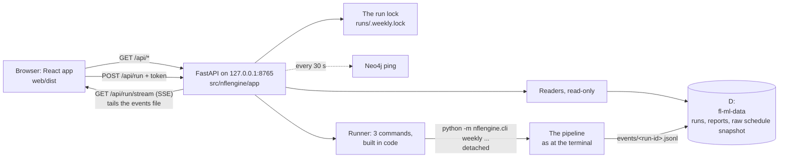

# The control room: a local web app for the weekly pipeline

The control room is a small website that runs only on this computer. On Tuesdays it's where you press **Run**, watch the pipeline work, then read the digest and check last week's results. It also shows the MLOps side of each week (run health, the W&B runs with their charts, the artifacts) and the season (scorecard, team rankings, the production models, alerts, system health).

It was built in four phases, CR00–CR03; **the track is complete**. The spec, the phases and the approved mockup are in [`documentation/control-room/`](../control-room/README.md). This guide explains every screen, what it reads and how to change it.

**What it does:**
- The app starts with one command.
- The sidebar shows the season's weeks with their real status.
- Each week has its header and **seven tabs, all from the week's real files** (Pipeline, Digest, Games, Players, Results, Graph: §2a; MLOps: §2c).
- The Pipeline tab draws the run in three views (drive chart, pipeline map, timeline), picked per week.
- **The Run button (CR02, §2b):** pre-flight checks, **Run week N** with a confirm dialog, the run **live** in the three views with the log streaming, **Resume** after a failure, the **Saturday injury update**, toasts and browser notifications. It runs exactly the terminal's commands, with the same lock and records.
- **MLOps (CR03, §2c):** Health (run health, data freshness, ingest dataset by dataset, quality checks, this week vs last week, what ran, drift), W&B runs (the week's runs with their main charts redrawn and linked) and Artifacts (versions, aliases, where `production` points, the lineage behind the digest).
- **The season pages (CR03, §2d):** Scorecard (2026 live, or the 2025 backtest as an example), Teams & rankings, Models (with each model card), Alerts, Health.
- W&B is read on the server, cached, never written to; without W&B the pages still show everything local, with a banner (§4c).
- Both themes work in dark and light mode.
- The safety rules are in place and tested.

## 1. Start it

**Once, after cloning or after a web change:** build the web app. Node.js 24 and npm 11 are installed on this machine.

```powershell
npm --prefix web ci          # install the exact package versions from web/package-lock.json
npm --prefix web run build   # writes web/dist/ (about 235 KB of script, gzipped, plus the fonts)
```

**Every time:**

```powershell
uv run nfl app               # opens http://127.0.0.1:8765/ in your browser; Ctrl+C stops it
uv run nfl app --no-browser  # same, without opening a tab
uv run nfl app --port 8800   # another port (1024-65535)
```

- `/` takes you to the calendar's current week, Pipeline tab.
- Leave the terminal open while you use the app. Closing the browser tab doesn't stop anything.

| Exit code | Meaning |
|---|---|
| 0 | Stopped normally (Ctrl+C) |
| 1 | The port is already in use (is another control room running?) |
| 2 | `web/dist` is missing: run the two build commands above, or use `--dev` |

**Working on the web code:** run the API and the Vite dev server side by side. Vite reloads the page as you edit.

```powershell
uv run nfl app --dev           # API only, on 127.0.0.1:8765
npm --prefix web run dev       # the page on http://localhost:5173/ (Vite forwards /api to 8765)
```

`uv run nfl app --rehearsal` points the Run button at `nfl weekly rehearse` of the newest published week into `rehearsals/control-room`, never the live week; a banner says so (§2b).

## 2. What you see

**Sidebar:**
- The brand and the **gear** (appearance, §3).
- The **season's weeks**, newest first. The calendar's current week is always listed, even before it has a run folder.
- **"Before go-live"**: the weeks before the first live run (2026: weeks 1–3, which only have walk-forward rows), shown greyed out.
- Links to the season pages (Scorecard, Teams & rankings, Models, Alerts) and Health.
- A status footer:
  - **Run lock:** free / held; hover to see the command holding it;
  - **Neo4j:** up / down / checking;
  - **Data drive:** free space;
  - **Now:** the time in ET.

**A week's status** follows the pipeline's own rules (`src/nflengine/app/readers/weeks.py`):

| Badge (sidebar) | Header label | When |
|---|---|---|
| Running | Running | The weekly-run lock is held by a run of this week (`--season S --week N`, or an `--auto` run of the calendar's week) |
| Published | Published | The digest step finished `ok` **and** the report file exists (the same rule `--auto` uses to skip a published week, `weekly.already_published`) |
| Failed | Failed | A step's last status is `failed`. A "not ready" run doesn't count: the run summary's status decides, and for weeks before run summaries only the not-ready wordings of the `ready` step count |
| Incomplete | Incomplete | Steps ran but no digest was published, or the last run stopped because the week before wasn't final |
| Ready | Ready to run | The current week, and last week is final in the local schedule snapshot |
| Waiting | Waiting on week N | The current week, and last week isn't final in the local schedule snapshot |
| Waiting | Waiting on the schedule | The current week has no games in the schedule yet (the next playoff round before nflverse adds it); the run would stop with exit 3 |
| No run | No run | A past week with no run |

**"Waiting" can be out of date on a Tuesday morning.**
- The app reads the newest schedule snapshot on D:, which only refreshes when something ingests.
- `nfl weekly run --auto` refreshes it first, under the lock, before deciding.
- So "Waiting on week 4" with "1/16 final" before the Tuesday run doesn't mean the run would stop.
- The pre-flight panel (§2b) says so in words, and doesn't block the Run button on it.

**The week header:**
- the season and "this week", and the title (a playoff week shows its round's name);
- the status, the slate (games and days), the calendar's tags for that week (Thursday game, Thanksgiving, morning kickoff, games abroad by team name, other neutral sites, byes). Past weeks get their tags from the calendar too;
- **for the current week:** the first game (team chips), the countdown to its kickoff (updated every 30 s), the kickoff time in ET, the end of the "not ready" retry window, and the Saturday injury-update button, greyed out with its reason (it works from CR02);
- **for a past week:** when it was published, an **On time** or **Late run** chip (published before or after the week's first kickoff: the run summary's `on_time`, or worked out from the slate for weeks before run summaries), and **Open week N in W&B ↗**, the week's digest run. 2026 week 4 shows "Late run · first live week" (published on Sunday, after Thursday's game) and "No run records".

**Tabs:** Pipeline, Digest, Games, Players, Results, MLOps, Graph and **Game day** (LD02, §2e), with counts on Games (games predicted), Players (projections) and Graph (insights used). Each tab is a link, so a tab can be bookmarked (`/week/2026/4/games`).

## 2a. The week tabs (CR01)

Every tab reads its own endpoint (`/api/weeks/<season>/<week>/<tab>`), which reads the files the weekly run wrote. Nothing the pipeline already decided is recomputed, and nothing is written. A tab with no data shows a designed empty state; for the **current week before its run**, Digest, Players, Results and Graph say what will appear and link to the same tab of the last published week.

### Pipeline
- **Reads:** `runs/<S>/week<NN>/weekly_run.json` (each step's latest state, times and detail), `run_summary.json` when it exists (from week 5: seconds per step, `this_run`, the run records), `checks.json` and `raw_llm_output.json` (for the tiles).
- **Shows, for a finished week:**
  - tiles: status and publish time, steps ok, time in steps and the digest's share of it, digest checks passed, LLM cost and provider;
  - a notice when something is special: a week without run records (week 4), a failed step (with the exact resume command for the terminal), a run that stopped before the digest, a run in progress;
  - **the run** in the view you pick (below), with the real step times;
  - **the log**, rebuilt from the step details: one line per step with its start time, a `$ nfl weekly run … --from-step X   (resumed)` line wherever the week ran in several sittings, and the publish line. Paths are relative to the data drive and W&B runs appear as `W&B <run id>`. The original flags (`--promote`, `--auto`) aren't recorded anywhere, so they aren't shown.
- **Shows, for the current week before its run:** "The plan for this run", every step waiting with its **expected time** (from the newest published week's real times; estimates before the first one), and the calendar's plan as the log (last week final or not, deadline, retry window, slate, byes, lock). The real dry run and the Run button are CR02's.
- **The three views.** Pick one per week; the choice is saved in this browser (`cr.vizByWeek`, keyed `"2026-4"`), the default is the drive chart, and **Surprise me** picks one of the other two and shows a "surprise pick" chip.
  - **Drive chart:** the run as a football drive from your own 20. Each step is a play that ends at its yard line (ingest 30, ready 35, curate 45, ratings 50, game model 60, knowledge graph 72, player model 85; the digest is the touchdown). Finished plays are chalk arcs; the blue line of scrimmage and the yellow first-down line show where a running step is and where it ends; a failure is a **FUMBLE** mark; the run records are the extra point (green goalposts when recorded, grey before P07). The scorebug says Final, Turnover, Stopped or Waiting, and the drive log under the field lists each step as "1st & 10 at OWN 20" with its detail and time.
  - **Pipeline map:** sources → nine steps → Published, in a snake. A finished step gets a green ring and its file or W&B artifact as a chip (W&B ones highlighted); the Published circle reads LIVE once the digest is out.
  - **Timeline:** a bar per step on a time axis in minutes, striped while running, dashed when only expected. Below it: the digest's share of the run, and how many sittings the week took (the gaps between sittings are left out). Hover or focus a bar for its time.
- **Why a summary can be ignored:** `run_summary.json` describes the week's last run only if no step started after it was written. If a retry dies before writing its records, the earlier summary (a "not ready" one, say) is set aside and the steps speak for themselves.
- **Week 4, read off the tab:** 8/8 steps ok in three sittings (two resumes); 43m 30s in steps, 89% of it the digest (two GLM calls on DeepInfra, $0.026); no run records.

### Digest
- **Reads:** `reports/<S>/week<NN>-digest.md` byte for byte (a run folder's `digest.md` shows as an unpublished draft when there's no report), `checks.json`, `raw_llm_output.json` (**metadata only**: provider, model and, per call, the upstream provider, time, prompt / completion / reasoning counts, cost and finish reason; never the prompt or the LLM's text), and Saturday's addendum (`reports/<S>/week<NN>-injury-update.md`, `injury_update.json`).
- **Shows:** the digest rendered (tables scroll sideways); on the right, the checks (passed first time or after a rewrite, the banner, each check with its level), words per section, the writer (model, route, the prompt id from the digest's footer, total cost, a row per call), the file paths, Saturday's addendum.

### Games
- **Reads:** `predictions_games.parquet` (the row the digest shows, and the model-only row), `payload.json` → `qb_changes`, and the curated `games` table for finals and stadiums (corrected by `config/stadiums.yaml` → `game_venues`).
- **Shows:** tiles (games predicted, lines used, model version); **where the model disagrees with the market** (the model-only chance against the market's for the home team, the three biggest gaps); a card per game: kickoff in ET, neutral site, confidence, both teams with their QB (⚠ on a QB change, the digest's sentence on hover), win % and predicted score (the final in bold once played), a dot strip of the home team's chance from four sources (model as shown, model only, Elo, market; hover a dot), the market line and total, and ✓ hit / ✕ miss once final. A game first predicted after its kickoff (week 4's Thursday game: the first live run was on Saturday) says "predicted after kickoff" and "final · not graded": the report card never grades it, so it gets no hit or miss.
- **The current week before its run** shows the slate instead: kickoff, game, stadium, market line and total from the schedule snapshot, with the snapshot's date (it can be days old) and "after the run" in the win % and score columns.

### Players
- **Reads:** `predictions_players.parquet`, `predictions_teams.parquet` (from week 5), `watchlist.parquet`, and `payload.json` → `players_to_watch` (the digest's own words) and `tough_spots`.
- **Shows:** the watch-list cards (rank, team, position, opponent, injury, the projection, the 80% range with his baseline marked, how far above his baseline, the main driver or "no single factor stands out"), offense and defense apart from week 5; tough spots; **all projections**: the main stat per group by default (QB, RB, WR/TE, EDGE/DL, LB/S, CB/S, and TEAM from week 5), sorted by how far above the baseline, each with a small range bar. **Show every stat** switches to every stat; yes/no stats (touchdown, interception) show a chance instead of a range. The table shows 40 rows, then "Show all N".
- **The projection** is the digest's: the median for yards, the expected count for counts.

### Results
- **Week N is graded by week N+1's run.** Until then the tab says so, with the Tuesday the grading run is due.
- **Reads** (D101): week N+1's `payload.json` → `report_card` for the published numbers; week N's saved predictions and the curated finals, through the report card's own grading code, for game by game; the report card's watch-list look-back with week N's `watchlist.parquet`; the season's `accuracy_scoreboard.parquet` for the player groups.
- **Shows:** tiles (picks right, Brier for the model / Elo / market, watch-list picks that beat their baseline); game by game (the pick and its chance, the final, ✓ / ✕, each source's Brier for that game, the margin error); player model vs baseline by group (MAE improvement; hover for the stats behind it); the watch list with each pick's range and a ◆ at the actual. If a recomputed number disagrees with the published report card (a final score corrected later), a notice says so and the published number is shown.
- **On Tuesday 2026-10-06** week 4's tiles should match week 5's digest report card (the parity test checks that too). Before that, the graded view was checked on 2025 week 10 (P07's simulation): 8/14 picks, Brier 0.221 vs Elo 0.223 vs market 0.219, 15 of 20 watch picks beat their baseline.

### Graph
- **Reads:** `graph_results.json`, the weekly graph build's record (the query rows themselves stay on the server).
- **Shows:** tiles (nodes, relationships and count mismatches, build seconds split into wipe / load / queries, insights used of candidates); the insights the digest used (section, query, strength, confidence, the text); rows per query; **found but not used**, with why (game already started, used in a recent digest, same player as another pick, or simply not picked); nodes by label; GDS status from week 5; **Neo4j Browser ↗**, which opens `http://localhost:7474/browser/` on this machine.
- **Week 4:** 15,522 nodes and 588,330 relationships, built in 144 s (wipe 48 s, load 88 s), 3 of 57 candidates used, 2 skipped because their game had started.

## 2b. Running the week (CR02)

The current week's **Pipeline** tab is where the Tuesday run starts. Everything here runs the same `nfl` commands as the terminal, takes the same lock and writes the same records; the app adds no new way to run anything.

**Before the run: pre-flight.** A panel at the top of the tab, checked when the page opens, every minute, on **Check again**, and once more by the server when you press Run:

| Check | ok when | If not |
|---|---|---|
| Calendar | The calendar has a week with games: "2026 week 5 · 15 games · Thu Oct 08 → Mon Oct 12" | Blocks (offseason, or the next playoff round isn't in the schedule yet) |
| Week N−1 is final | Every game of last week has a final score in the local schedule snapshot | **A warning only**, with the snapshot's age: the snapshot is often a day old on a Tuesday morning, and the run refreshes it first and stops with "not ready" (exit 3, nothing published) if the week really isn't final. **It blocks for 30 minutes after such a not-ready run** ("Try again after 10:32 AM ET; the retry window runs to Wed 6:00 PM ET"), then **Check again** opens the button |
| Not published yet | No `weekN-digest.md` | Blocks: re-running a published week stays in the terminal (`--force`) |
| Run lock | Free | Blocks: another run (or an injury update) is going, maybe from a terminal. The app shows it live |
| Data drive | Found | (The path itself never reaches the page) |
| Neo4j | Up | **A warning only**: the run starts it (`docker compose up -d`, about a minute) |
| Keys | `NEO4J_PASSWORD`, `WANDB_API_KEY`, `OPENROUTER_API_KEY` set | Blocks, naming the missing variable (names only, the doctor's check; never a value) |
| Season setting | `seasons.current` = the calendar's season | Blocks: update `settings.yaml` (pre-season checklist) |

Beside the checks: **Run week N** (greyed out with the reason while a blocking check fails; replaced by "Run in progress" while a run is going), the command it runs (`nfl weekly run --auto --expect-week 5`), and "Publishes the digest and moves W&B's production alias. Closing this tab doesn't stop a run." Below: the plan in the view you picked (each step's expected time) and the **dry run's log** (what `--auto --dry-run` would print).

**The confirm dialog:** the week ("5 · from the calendar"), last week ("week 4 · 16/16 final"), the deadline (the first kickoff, in ET, and hours left), the steps, what gets published (`week05-digest.md`, the production alias), the command, and why `--expect-week` is there: if the calendar's week has changed by the time the run starts, it stops before touching anything (exit 6). Focus starts on the confirm button; Escape cancels. The first Run click asks once for permission to show a browser notification.

**During the run:**
- the **now-bar**: "Step 7 of 9", the step's name, what it's doing ("refitting 7/23 · rec_yds-wrte", "loading 12/23 · node:Player", "dataset 18/30 · nflverse · injuries"), a progress bar, the time so far and about how long is left (from the last published week's step times);
- the run in the view you picked, moving: the ball advances within a step, the map's ring fills, the timeline's bar grows. Switching views mid-run keeps everything;
- the **log**, streamed line by line (the same lines the terminal prints, colours as classes, secrets scrubbed, data-drive paths made relative);
- **the GLM step** shows "GLM writing · waiting for the model", the elapsed time and the route (`baseten/fp8 → novita/fp8 → relace`) for its whole length (3–40 minutes); when the call returns: the provider, its time, the reasoning count and the cost. A live token counter (the mockup's) would need the digest's call to be streamed, which P09's rules don't allow without a real-LLM re-check (D103);
- **closing the tab, the browser, or even the app doesn't stop the run.** It runs in its own process with its own console; reopen the page (or restart `nfl app`) and it finds the run again from the lock and its events file. A run started from a terminal shows up the same way ("started from a terminal").

**When it ends:** a toast ("Week 5 published · checks passed first time", or "Week 5 failed at the player step" in red, "Week 4 isn't final yet: try again later", "The calendar's week changed: nothing ran") and a browser notification if allowed; the sidebar badge, the header and every tab refresh. The Pipeline tab then shows the finished run, its log being the run's own console from its events file.

**A failure:** a red banner, "The player step failed." with the reason, "Steps before it are saved; the digest didn't run, so nothing was published", and **Resume week 5 from player** with the command it runs (`nfl weekly run --season 2026 --week 5 --from-step player --promote`; `--promote` because it finishes an `--auto` run, which promotes). Its own confirm dialog. It's offered only for the **current week's** failed run and only from the step that failed; older weeks show the terminal command instead. In the views: a FUMBLE at that yard line, a red ring, a red bar.

**Saturday:** the header's **Saturday injury update** opens on Saturday (ET) once the week's Tuesday run is published, until the week's last kickoff (the week's Saturday: the one after a Thursday opener, the same day for a slate that starts on Saturday, the one before a Sunday-only playoff round) (otherwise greyed out with the reason: "Needs this week's Tuesday run first", "Opens Saturday Oct 10 (ET)", "A run is in progress"). Its confirm dialog says what it does; while it runs, a card under the header streams its log; its toast says "Addendum published" or "Nothing material changed: no addendum" (the Digest tab shows the addendum).

**Rehearsal mode** (`uv run nfl app --rehearsal`): a banner says so, and the Run button **rehearses the newest published week** (`nfl weekly rehearse --season 2026 --week 4 --out rehearsals/control-room --fresh`: `ready`, `game`, `player`, `digest` with the clock pinned to that week's Tuesday, the placeholder writer, no W&B, no graph write, no records; ingest, curate, ratings and graph show as skipped). The current week can't be rehearsed before its previous week is in the data, which is why it's a past week. `--fail-at <step>` (a hidden option, rehearsal mode only) makes the first rehearsal fail at that step on purpose, to try the failure banner and Resume (a rehearsal resume runs `--steps <that step onward>`). The rehearsal's result shows in its own card ("The rehearsal"); its files stay in the rehearsal folder, not in the archive.

**What stays in the terminal:** re-running a published week, `--force`, `--as-of`, graph rebuilds, resumes of older weeks, deletes. The app runs exactly three commands (§4b).

## 2c. The MLOps tab (CR03)

A switcher at the top picks one of three sections, each with a one-line description. The choice is remembered while you move between weeks (this browser tab: `sessionStorage`, key `cr.mlopsSection`). Only the open section is loaded.

### Health: did the run go cleanly, and was the data fresh?
- **Reads** (all local): `runs/<S>/week<NN>/run_summary.json` (the run's own record: status, steps, freshness, ingest, quality, models, drift, alerts), `weekly_run.json`, the run's events file (the command and who launched it), the ingest manifest the ingest step names (`raw/_runs/ingest-<time>.json`), `curated/_quality/latest.json`, the week's prediction files (row counts from their footers), `graph_results.json`, `checks.json`, `raw_llm_output.json` (metadata only), `models/game-model/<S>-w<NN>/meta.json` (trained through), and the same files of the season's other weeks for "this week vs last week".
- **Shows:**
  - **five tiles:** run status (steps ok, degraded), data (datasets, failures, snapshot date), quality checks (passed of all, blocking ones), drift alerts (and how many signals still lack the weeks they need), projections (players, team rows, written to the graph);
  - **step timings** (a bar per step, with the long pole's share: week 5's digest was 54% of 16.5 minutes in steps) beside **what ran:** the game model and the week it was trained through, the player model and how many stats it projected, the team model, the graph build (time, nodes, relationships), the writer (model, route, upstream provider, calls), the prompt id, what this run promoted to `production`, the exact command, who launched it and whether it came from the control room;
  - **data freshness** (38 rows on week 5: every source and dataset with its snapshot date, age, newest and expected week; stale or failed ones first) beside **this week vs last week:** time in steps, the GLM's time, the LLM's cost, games predicted, player projections, graph nodes, datasets ingested, digest passed first time, each with the change and a small trend line over the season;
  - **ingest, dataset by dataset** (the manifest: source, dataset, rows, status) and **quality checks** (name, block / warn, result, detail) in scroll boxes. The quality file is overwritten by every curate, so a past week whose curate run isn't the file's says so and shows only its summary's counts;
  - **drift signals:** each signal's status (ok, alert, or "insufficient data" until it has the graded weeks it needs), its value against its threshold, the run's own sentence, and doc 08's response. Player signals are grouped per status ("insufficient data: QB, RB, …").
- **A week without run records** (2026 week 4, before P07) shows what its files hold, with a notice; a week without a run says so.

### W&B runs: this week's runs, their main charts redrawn here
- **Reads:** the run list from W&B (cached, §4c); **every chart from a local file** that holds the same numbers W&B was fed (a parity test checks each one against W&B).
- **Shows:**
  - **Runs this week:** job, name, group / job type, the run id linking to W&B. The newest run of each job is the one that counts; re-runs fold away under "Show N earlier runs" (week 4 has 27 runs, 6 current). The player **scoreboard** run is tagged with the week it grades, so week N's list shows `scoreboard-S-w(N−1)`, the one its run made. Without W&B, the links come from the steps' detail lines;
  - **Season dashboard:** the W&B Report's link, the run it reads now (tag `dashboard-current`, from `runs/<S>/dashboard.json`) and this week's dashboard run;
  - **one card per run**, each naming its W&B run and keys and the local file it's drawn from:

| Card | W&B run · keys | Drawn from |
|---|---|---|
| Game fit: model only vs market (a dumbbell per game, sorted by the gap) | `train-S-wNN` · `slate/*` | `predictions_games.parquet` (the model-only and market rows) |
| Player scoreboard: vs the baseline (bars per group) | `scoreboard-S-w(N−1)` · `scoreboard/improvement_*` | `runs/<S>/accuracy_scoreboard.parquet`, the graded week's live rows (walk-forward rows before the live model, labelled) |
| Player fit: projections per stat | `train-S-wNN` (player) · `projections_per_target` | `predictions_players.parquet` |
| Graph build: time by stage | `graph-S-wNN` · `time/*`, `count/*` | `graph_results.json` |
| Digest: words per section, check issues | `digest-S-wNN` · `words_per_section`, `check_issue_counts` | `checks.json` (the final round), budgets from `settings.yaml` |
| Pipeline run: time per step, stale sources, drift | `pipeline-S-wNN` · `step_seconds`, `freshness`, `drift` | `run_summary.json` (none before P07: week 4 says so) |

### Artifacts: every model, graph and digest version
- **Reads:** W&B only (versions, aliases, the run that logged each version, sizes; the pipeline run's used artifacts).
- **Shows:** where `production` points for `game-model`, `player-model` and `team-model` (version, week alias, the run that logged it) and the versions in all; **the lineage behind the week's digest** (week 5 on: the artifacts the week's pipeline run used in W&B, `game-model:v5 → graph-results:v2 → player-model:v2 → team-model:v0 → digest:v9`; week 4, before the pipeline run did that: the versions carrying the alias `2026-w04`); one table per artifact (`game-model`, `player-model`, `team-model`, `graph-results`, `digest`, `injury-update`): version, created (ET), aliases, logged by, size, the newest six and a toggle for the rest; "No versions yet" with when the first comes (`injury-update` until the first Saturday update). Without W&B: what the run summary recorded (`models`).

## 2d. The season pages (CR03)

| Page | Shows | Reads |
|---|---|---|
| **Scorecard** (`/season/2026/scorecard`) | A switch: **2026 live** / **2025 backtest (example)** (remembered in this browser). Tiles: season Brier for the model, Elo and the market, pick accuracy, ECE against a perfectly calibrated model's ECE on the same games, games graded; live also weeks published, digests whose checks passed, LLM spend. Season-to-date Brier (three lines, crosshair tooltip), pick accuracy, calibration (a point per probability bin, sized by games, against the diagonal), player model vs baseline by group, and live: the pipeline health table (one row per weekly run) and a link to the W&B Season Dashboard. Until two weeks are graded the line charts wait, with the one week's numbers | **Live:** the W&B Season Dashboard's own builder (`ops.dashboard.build_dashboard_data`) for the dashboard's run week, on `season_scorecard.parquet`, the graded weeks' saved predictions and the curated finals, `accuracy_scoreboard.parquet` and `pipeline_history.parquet`, all read by the app: **the same numbers as the report** (a parity test); LLM spend and checks from each published week's files. **Backtest:** `runs/backtests/game/market/predictions_games.parquet` (the market-informed probabilities the digest shows, regular season and playoffs) and `runs/backtests/player/scoreboard.parquet`, scored with the same functions |
| **Teams & rankings** (`/teams`) | Biggest risers and fallers (Elo change from the week before); the power rankings (rank, Elo, move, a sparkline of the season's Elo, net / offense / defense EPA per play) with an AFC / NFC filter; click a row (or Enter) for its detail: Elo by week, this week's game (the model's chance, or the final), next week's game or bye, pass vs rush EPA | `features/team_elo.parquet` and `team_ratings.parquet` (a week's row is the rating *entering* that week), the schedule snapshot, the week's saved predictions |
| **Models** (`/models`) | One card per production model: game model, team ratings & Elo, player models, team stat totals, the digest writer. Each: the version in production (from W&B's `production` alias, named by the model's own `meta.json`; without W&B, the run summary's), the headline backtest numbers, bars of each stat's gain over the baseline (MAE for amounts and counts, Brier for chances), the settings, and **Model card** buttons that open the card rendered | `runs/backtests/<model>/…/summary.json` (the canonical walk-forward backtests), W&B for `production` and the ratings evaluation (`ratings-eval`, cached a week), `config/settings.yaml`, the model cards under `documentation/model_cards/` (and the LLM writer's guide), served by id from a fixed list |
| **Alerts** (`/alerts`) | The season's alerts with their investigation notes (or "No alerts yet" and what raises one); **when each drift signal can first fire** this season (a small timeline: `game_vs_elo` week 10, `calibration` about week 9, `player_vs_baseline` week 7, `checks` week 8, freshness every run, with "this week" marked; worked out from the same inputs and rules the drift checks use: graded weeks, graded games and the schedule's slates, each group's scored weeks, the digests' verdicts); what an alert looks like (the 2025 week-10 simulation's calibration alert and D75); every run's drift states | Every run week's `run_summary.json` (`alerts`, `drift`), `settings.yaml` → `drift` with the first live week and the scoreboard's first week, the indented notes under each week in PROGRESS.md's "Season log" (notes stay there; the app never edits them), `runs/digest-backtests/2025/week10/run_summary.json` |
| **Health** (`/health`) | **Services:** Neo4j (with GDS and APOC versions), Docker, W&B, OpenRouter (the doctor's routing check), the data drive (free space), the run lock, with **Check again**; **variables by name** with set / not set (optional ones marked; never a value); **recent runs** (when, command, status, launched by, via the control room, how long) | The `nfl doctor` check functions, on a background thread every 5 minutes at most (a W&B login alone takes about 3 s); the app's key check (names only); `pipeline_history.parquet` with each run's events file for its command |

## 2e. The Game day tab (LD02, LD03)

The live 3rd- and 4th-down bot, as the last week tab (after Graph; D108's rule for weekly views). Pick the game you're watching, press **Check this play** on a 3rd or 4th down, and the call card shows go / field goal / punt with the win chance after each and how sure the bot is (4th down), or the chance to convert and the 4th-down call for every distance they could be left with (3rd down), plus **Is this team good at this?** The whole walkthrough, with what every number means and the TV-delay advice: [live-decisions guide §9](live-decisions.md). The approved mockup: [Game day mockup](https://claude.ai/artifact/QpALHDapDHPhLTHLNCQDsW) (source `documentation/live-decisions/mockup/`).

- **Reads:** ESPN's public site API (the week's scoreboard, one game's entry, its play log), the week's `predictions_games.parquet` (our pre-game pick), curated `games` / `lines` / `espn_scoreboard` / `weather_forecasts` (the pre-game facts), curated `plays` (the team context), the promoted live-decision models (`models/live-decisions/production.json`).
- **Endpoints:** `GET /api/live/{season}/{week}/games[?refresh=1]`, `.../games/{event}/call`, `.../games/{event}/context?offense=XXX` (`src/nflengine/app/readers/live.py`).
- **Writes:** only the team-context cache, `cache/control-room/live/context/`.
- **Calls out:** the only part of the app that does. Only `https://site.api.espn.com`, through the live package's client (2 s per game, 0.5 s between requests, back-off); the list once per 30 s at most, a game only when you press Check this play (plus, after a check, its play log in the background at most every 30 s). Another website's page can't make the app call ESPN: a browser's cross-site request to `/api/live/` is refused (§5 rule 9).
- **Outside game times:** `uv run nfl app --live-replay <event>` serves a finished week from the saved play logs as if live (live-decisions guide §9.8).

**A finished week: the decision review (LD03).** Once a week's plays are in the curated data (Tuesday's run), its Game day tab shows the **decision review** instead of the games: a **This week / Season** switch, the week's summary, the boldest and costliest calls, every 4th down by game with the coach's call against the bot's, and the season's coach leaderboard and the bot's calibration. Walkthrough with real numbers: [live-decisions guide §10](live-decisions.md#10-the-decision-review-ld03); the mockup: [Game Day Review Mockup](https://claude.ai/artifact/4fv6KpgdftSgWToDTAB4uB).
- **Reads:** curated `plays` and `games`, `config/head_coach_fixes.csv`, the promoted live-decision models; `nfl live review`'s files under `live/<season>/` when their stamp matches. Never ESPN.
- **Endpoints:** `GET /api/live/{season}/{week}/review`, `GET /api/live/{season}/season-review?through=N` (status `ok`, `no_plays`: the week isn't curated yet, or `no_models`).
- **Writes:** a week or season it had to build itself goes to `cache/control-room/live/review/` (in the background), never to `live/`. There's no button to run `nfl live review` (Rishi, D120): the tab builds what it needs; the W&B run comes from the command (runbook → Tuesday).

## 3. Themes and modes

The gear next to "Control Room" opens **Appearance**:
- **Turf & Pylon:** field green with end-zone pylon orange. The default.
- **Playbook:** a whiteboard in light mode, a chalkboard in dark mode.
- **Mode:** System (follows Windows' light / dark setting, live), Dark or Light.

The choice is saved in this browser (`localStorage`, key `cr.appearance`) and painted before the page draws, so there's no flash of the default theme. If the browser blocks storage, the choice lasts until you close the tab.

All colours come from one set of tokens, ported unchanged from the approved mockup into `web/src/styles/tokens.css`: backgrounds, ink, accent, the three chart series colours, ok / warn / err, and the football-field colours for CR01's drive chart. The chart colours of both themes passed the colour-blindness checks in both modes (D96).

## 4. How it's wired



**Backend** (`src/nflengine/app/`, FastAPI 0.142, Starlette 1.7, uvicorn 0.54):

| File | Role |
|---|---|
| `serve.py` | `nfl app`: checks the build and the port, binds `127.0.0.1` only, opens the browser |
| `server.py` | `create_app(settings)`: the routes, the error format `{"error": {"code", "message"}}` (messages scrubbed), the built React app with client-side routes |
| `security.py` | The safety rules (§5) as plain ASGI middleware |
| `jsonsafe.py` | Every response goes through it: NaN and infinity → `null` (a browser rejects the whole response otherwise), dates as ISO strings, numpy numbers as plain numbers |
| `status.py` | A background thread that pings Neo4j every 30 s. A ping takes about 4.5 s when the container is down, too slow for every page load |
| `readers/meta.py` | The calendar's plan (`ops.calendar.plan_week`) and the lock (`ops.lock`), as plain data. Only the lock's command and start time leave the server |
| `readers/weeks.py` | The week list and the status rules in §2; one week's header (`get_week`); team names and colours (`team_info`) |
| `readers/common.py` | The read helpers every week reader uses: one short read per file, Parquet never memory-mapped, text without newline translation; `clean()` (data-root paths made relative, then `scrub()`) |
| `readers/pipeline.py` | The Pipeline tab: steps, sittings, the rebuilt log, the plan and its expected times |
| `readers/digest.py` | The Digest tab, with the allowlist of LLM metadata |
| `readers/games.py` | The Games tab, and the current week's slate |
| `readers/players.py` | The Players tab |
| `readers/results.py` | The Results tab (D101) |
| `readers/graph.py` | The Graph tab |
| `preflight.py` (CR02) | The pre-flight checks, the gates for Run / Resume / the injury update, the dry run's log (built from the calendar's plan, no command) |
| `runner.py` (CR02) | Builds the command for one of three kinds from the server's own pre-flight, starts it detached, keeps a record, finds the current run after a reload or a restart (§4b) |
| `stream.py` (CR02) | `GET /api/run/stream`: tails the run's events file as server-sent events |
| `wandb_api.py` (CR03) | The cached, read-only W&B reads (§4c): the week's runs, the artifact versions, a run's used artifacts, the ratings evaluation |
| `health.py` (CR03) | The Health page: the doctor's checks on a background thread, variables by name, recent runs |
| `readers/mlops.py` (CR03) | The MLOps tab: Health, the W&B runs' chart cards (from local files), Artifacts |
| `readers/season.py` (CR03) | Scorecard (live through the dashboard's builder; the 2025 backtest example) and Teams & rankings |
| `readers/models.py` (CR03) | The Models page and the model cards (a fixed id → file list) |
| `readers/alerts.py` (CR03) | The Alerts page, with the Season log's notes and when each signal can first fire |

| Endpoint | Gives |
|---|---|
| `GET /api/meta` | App version, mode (dev / rehearsal), data drive (found, free space; never its path, which comes from an environment variable), lock, Neo4j, the calendar's plan (week, deadline, retry window, slate tags, byes), `seasons.current` |
| `GET /api/weeks` | The season, the current week, the first live week, and one entry per week (status, label, detail, published time, on time, step statuses) |
| `GET /api/session` | The per-launch token (§5) |
| `GET /api/team-info` | Team nicknames, names, colours, conference and division (curated `teams`) |
| `GET /api/weeks/<S>/<N>` | One week's header: title, status, the calendar's plan for that week, publish time, on time, first live week, the digest's W&B run, tab counts, the newest published week |
| `GET /api/weeks/<S>/<N>/pipeline` · `/digest` · `/games` · `/players[?stats=all]` · `/results` · `/graph` | One per tab (§2a). Season 1999–2100 and week 1–22 are checked; anything else gets a 422 that doesn't echo the input |
| `GET /api/preflight` (CR02) | The checks, and whether Run, Resume and the injury update are allowed (with the reason and the command), the confirm dialog's facts, the dry run's log |
| `POST /api/run` (CR02) | `{"kind": "weekly" \| "resume" \| "injury_update", "expect_week": N}` with the launch token: 202 with the run id and the command; 403 `not_allowed` (with the reason: a gate is closed, or the browser's week isn't the server's); 409 `locked` (another run holds the lock) or `running` (the app's own run is still going); 422 for any other shape (nothing echoed) |
| `GET /api/run/current` (CR02) | The run in progress (also one started from a terminal), else the last one the app launched: kind, command, week, start / finish, status, exit code, message, published, failed step, whether it has events, and the last lines of its output when it ended without events |
| `GET /api/run/stream` (CR02) | Server-sent events: one `run` message per line of the run's events file (`id` = `<run id>:<sequence number>`, so a reconnect resumes after `Last-Event-ID`, and a cursor from another run replays the current one from its start), a heartbeat every 15 s (no timeout: the GLM can take 40 minutes), and an `end` message with the final state |
| `GET /api/weeks/<S>/<N>/mlops/health` (CR03) | §2c Health |
| `GET /api/weeks/<S>/<N>/mlops/wandb[?refresh=1]` (CR03) | §2c W&B runs: `wandb` (the W&B state: available, reason, fetched at, stale), the runs, the local links, the dashboard, the six chart cards |
| `GET /api/weeks/<S>/<N>/mlops/artifacts[?refresh=1]` (CR03) | §2c Artifacts: production, lineage, one entry per artifact, the run summary's models |
| `GET /api/season/<S>/scorecard?source=live\|backtest` (CR03) | §2d Scorecard |
| `GET /api/teams[?season=&week=]` (CR03) | §2d Teams & rankings (the newest Elo week by default) |
| `GET /api/models[?refresh=1]`, `GET /api/models/card/<id>` (CR03) | §2d Models; a card by its id (`game-model-v0`, `player-qb`, …; an unknown id is a 404, never a path) |
| `GET /api/alerts[?season=]` (CR03) | §2d Alerts |
| `GET /api/health[?refresh=1]` (CR03) | §2d Health (`checking: true` while the slow checks run) |

The readers only read:
- `runs/<season>/week<NN>/` (every file of the week; §2a and §2c say which tab reads which);
- `runs/<season>/accuracy_scoreboard.parquet`, `season_scorecard.parquet`, `pipeline_history.parquet`, `dashboard.json`;
- `runs/backtests/` (the canonical backtests' summaries and predictions), `runs/digest-backtests/2025/week10/run_summary.json` (the example alert);
- `reports/<season>/`;
- `curated/games.parquet`, `curated/teams.parquet`, `curated/_quality/latest.json`, `raw/_runs/ingest-*.json`, `features/team_elo.parquet`, `features/team_ratings.parquet`, `models/<model>/<season>-w<NN>/meta.json`;
- in the repo: `config/settings.yaml`, the model cards, PROGRESS.md's Season log;
- the newest schedule snapshot (cached for 60 s);
- the lock file.

They never write to the data root (a test hashes every file before and after calling every endpoint); the app's own writes are under `cache/control-room/` (run records, launched commands' output, the W&B cache). They also never keep a file open or memory-mapped: the weekly run replaces its files in place, and on Windows an open or mapped file makes that fail. That's why curated tables are read from their Parquet files and not through a DuckDB connection to `nfl.duckdb` (D100), and why the Scorecard hands the dashboard's builder every input already read (D105).

## 4c. How the app reads W&B (CR03)

**W&B is the record; the app is a window.** Nothing in the app writes to W&B or moves an alias (promotion stays with `--auto` / `--promote`).

- **Local first.** Every number on the MLOps and season pages comes from a file on D: that holds the same number W&B was fed: the six chart cards (§2c), the live scorecard, the health tiles. W&B is read only for what no local file holds: **the run list and links, artifact versions and aliases, who logged each version, and lineage** (plus the ratings evaluation's summary). `tests/app/test_parity_cr03.py` compares each local number with W&B's for week 5, so the two can't drift apart silently.
- **The key** goes from the settings straight into the W&B client (`tracking.read_api`, the way `nfl doctor` does it), never into the process environment, a file, a log or a response.
- **The cache:** one JSON file per answer under `D:\nfl-ml-data\cache\control-room\wandb\` (`runs-2026-w05.json`, `artifacts.json`, `used-<run id>.json`, `ratings-eval.json`), plus memory. A week's run list lives 10 minutes (a day once the week is published and past), the artifact list 10 minutes, a finished run's lineage and the ratings evaluation a week. **Refresh from W&B** / **Try again** (`?refresh=1`) skips it once. The files survive an app restart; deleting the folder is always safe.
- **Timings:** each W&B call takes 0.1–0.25 s; the artifact list asks who logged every version (about 25 calls, 6 s the first time, then reused: a version's logger never changes); a cached answer comes back in about 0.05 s.
- **When W&B can't be reached** (no network, W&B down, the key not set): every call has a 10-second timeout, and after a failure W&B isn't asked again for a minute. The page then shows the last cached answer with a banner ("W&B can't be reached right now: showing what it said at …"), or, with no cache, a banner saying links, versions and aliases are missing; **everything local still loads** (the charts, Health, the Scorecard). The reason is a fixed sentence with the error's type, never its message.
- **Every text from W&B** (names, tags, URLs) has the data root's path made relative and passes through `scrub()` before it's cached, and the secrets scan runs over every CR03 endpoint with a fake W&B that returns a key-shaped tag.
- **One banner for the whole answer:** Artifacts reads the artifact list, the week's runs and the pipeline run's lineage; Models reads the artifact list and the ratings evaluation. If any of them fails or is stale, the banner says so with that read's reason ("The lineage: W&B didn't answer …"), even when the rest is fresh. After a failed refresh the answer stays marked stale until W&B answers again; a damaged cache file is simply fetched again.
- **What W&B's own library writes** (the `wandb` package, as with `nfl doctor` and every pipeline command): empty scratch folders in Windows' temp folder (one per run it reads) and a debug log under `%LOCALAPPDATA%\wandb\logs`. Nothing in the data root, no data, no key (checked). The app doesn't move them: that would take environment variables the commands it launches would inherit (D106).

**Where each W&B chart appears in the app:** the W&B guide's §12 has the full map (run → key → screen → local file).

## 4b. How a run is launched (CR02)

1. The browser sends `POST /api/run` with `{"kind": "weekly", "expect_week": 5}` and the launch token. **It never sends a week to run or a command.**
2. The server re-runs pre-flight, checks that `expect_week` is its own calendar week (else 403), that no run holds the lock (409 `locked`) and that its own last child has ended (409 `running`), and that the gate for that kind is open (else 403 with the reason).
3. It builds the command **in code** (`runner.build_launch`):

| Kind | Command (display form) |
|---|---|
| `weekly` | `nfl weekly run --auto --expect-week 5` |
| `resume` | `nfl weekly run --season 2026 --week 5 --from-step <the failed step> --promote` |
| `injury_update` | `nfl weekly injury-update --auto --expect-week 5` |
| rehearsal mode | `nfl weekly rehearse --season 2026 --week 4 --out <data root>/rehearsals/control-room --fresh` (resume: `--steps <failed step onward>`) |

   Each also gets `--launched-by rishi` and a hidden `--app-run <run-id>`, which names the events file and tags every W&B run of the process `via:control-room`.
4. It starts `python -m nflengine.cli …` with the app's own Python, **detached**: its own process group and a hidden console of its own (outside the app's job when Windows allows), so Ctrl+C in the app's terminal, closing that terminal or closing the browser doesn't reach it. Its output goes to `{data root}/cache/control-room/logs/<run-id>.log`, and the app keeps a small record in `cache/control-room/runs/<run-id>.json` (the app's only writes).
5. The child takes the weekly-run lock as usual, and its note names the run (`run_id`). **The lock is the truth for "is a run going?"** (rehearsals: the rehearsal folder's own lock); the app keeps no "running" flag of its own that could go stale, and it recognises its own launch by the run id in the note (never by a process id, which Windows reuses). In the few seconds before the child takes the lock, the launch still counts as running, even if `nfl app` is restarted meanwhile (the app checks that the process it started is alive: same process id **and** creation time).
6. The page follows the run through `GET /api/run/stream`, which tails `runs/<S>/week<NN>/events/<run-id>.jsonl` (the events are described in the [weekly operations guide §11a](weekly-operations.md#11a-progress-events-and---expect-week-cr02)).

**Frontend** (`web/`):
- **Stack:** Vite 8, React 19, TypeScript 6.
- **Routing:** React Router 7 (`/week/:season/:week/:tab`, `/season/:season/scorecard`, `/teams`, `/models`, `/alerts`, `/health`).
- **Data:** TanStack Query; `/api/meta` and `/api/weeks` refresh every 30 s and when you come back to the tab.
- **Widgets:** Radix for the gear popover and the confirm dialog (focus handling, Escape).
- **Styling:** Tailwind 4, with the mockup's tokens as colours; the mockup's component styles ported as they are (`web/src/styles/app.css`).
- **Fonts:** Barlow, Barlow Condensed and JetBrains Mono, bundled with `@fontsource`, so nothing loads from the internet.
- **Charts:** small in-house components (`web/src/charts/`): a line chart with a legend and a crosshair tooltip (hover, or focus and the arrow keys), horizontal bars with tooltips, a sparkline, a range bar, a dot strip, and CR03's dumbbell (model only vs market per game) and calibration chart (points sized by games against the diagonal). They follow the project's chart rules: text in text colours, a legend for two or more series, hover and focus tooltips.

## 5. The safety rules, in plain words

The app can't be reached from other computers, and other websites open in your browser can't use it:

1. **It only listens on 127.0.0.1.** There's no `--host` option.
2. **It only answers requests addressed to `127.0.0.1:<port>` or `localhost:<port>`.** That stops a trick where a malicious site points its own domain name at your machine ("DNS rebinding").
3. **Anything that changes something needs the launch token and must come from the app's own page.** The token is a random string made each time `nfl app` starts. The page reads it from `/api/session`, which other sites can't read. The only things that change anything are CR02's Run, Resume and Saturday buttons; every CR03 page only reads.
4. **No cross-site access headers are ever sent.** The page can't be framed by another site either (it can't be tricked into clicking Run inside a hidden frame). The other security headers: content security policy, `nosniff`, `no-referrer`, `no-store` on API answers.
5. **Secrets stay on the server.**
   - No endpoint returns a key or an environment value.
   - Every text that reaches the browser passes through the pipeline's `scrub()`.
   - The data drive's path (an environment value) is made relative in every text, also where an earlier cap cut it in half (CR02's Sol review).
   - A test sets fake keys and checks that no response contains them, or anything that looks like a key.
6. **No API docs page** (`/docs`, `/openapi.json` are off), and unknown `/api/...` paths return a JSON 404.
7. **A crash never leaks.** An unexpected error is caught inside the safety layer: the console gets one scrubbed line, the browser gets `server_error` with the error's type only, and the response still carries the security headers.
8. **The status line never gets in a run's way.** Checking the lock means taking it for an instant, so the app reads the lock's note first and only checks when a run has written one (a run starting at that instant would otherwise stop with exit 4).
9. **Game day is the only part that reaches outside this machine** (LD02): only ESPN's public site API (`site.api.espn.com`, HTTPS, no redirects, no credentials: there are none), only through the live package's client and its 2 s / 0.5 s rules, and only on a click (plus the 30 s list). Its GETs are refused when a browser marks them cross-site or same-site (`Sec-Fetch-Site`), so another site's `` can't set off a check; ESPN's text is cleaned and shown as text.

**Tests** (`tests/app/`, 50): Host and Origin and token checks, every state-changing method, the dev-mode origin, security headers, no CORS, the secrets scan, a missing data drive, path-traversal attempts on the static files, the week-status rules on fixture run folders (published, failed, partial, not ready vs a real `ready` failure, no slate, running from the lock, a simulation holding the lock), the lock check that doesn't probe without a note, a crash's scrubbed log and headers, no data-root path in any response, the CLI's flags, the missing-build and port-in-use paths, the 127.0.0.1 bind, and Ctrl+C as a normal stop. They never start a real server or touch D:. One integration test (`-m integration`) reads the real data root and expects 2026 week 4 to be Published.

**CR01's backend tests** (35 more in `tests/app/test_app_week.py`, on a complete synthetic week built by `tests/app/week_fixtures.py`): every tab's reader on a week like week 4 (no run records, three sittings), a week with records, a failed week, a step left running by a dead run, a "not ready" stop, the current week before its run, a past week with no run; the digest byte for byte, the LLM metadata allowlist, the addendum, an unpublished draft; games with finals, a late prediction (no hit or miss), a NaN Elo value, a QB change, the slate; players' main and all stats, a yes/no stat, team rows, the watch list's own words; results not graded, graded, disagreeing with the report card, and a week that graded nothing; the graph's counts, skip reasons and GDS; **nothing written** (every file hashed before and after calling every endpoint); **no leak** (fake keys in the environment, the LLM's raw text, a credential-shaped detail and the data root's own path planted in the files, then every response scanned); bad seasons, weeks and options. Seven more (`tests/app/test_app_sol_cr01.py`) pin the Sol review's fixes: the root's path planted in names, driver phrases and writer metadata; an empty data root that stays empty after every GET through the real resolver; a heuristic watch list; a stale run summary; a late prediction; the Super Bowl.

**Real-data parity** (`uv run pytest -m integration tests/app/test_parity.py`, 10): 2026 week 4's games match `predictions_games.parquet` (16 games, every probability and score), the QB changes match the payload, 1,860 projections, the watch list matches the digest's, the graph's counts sum to 15,522 nodes and its relationships to the build's, the digest is byte for byte the published file, week 4's pipeline is three sittings without records; the graded Results agree with the report cards of P07's simulated 2025 weeks 9, 10 and 13; reading the real week changes no file. Week 4's own grading test runs once week 5 exists (it skips until then).

**Web tests** (`npm --prefix web test`, Vitest, 94 in CR00–CR01): formatting (ET with daylight saving, the countdown, slate tags), theme persistence and junk in storage, the chart scales, legend and tooltips, the sidebar's week rows and footer, theme switching from the gear, the week header (current and past weeks), the seven tabs with their counts, the confirm dialog; the three pipeline views in their finished, plan, failed, stopped and live states, the view picker (per week, across a reload, "Surprise me" never repeats, blocked storage), the log panel; the Pipeline tab's tiles, notices and plan; and each data tab's main and empty states.

**CR02's tests.** `tests/app/test_app_run.py` (36): the pre-flight on a ready Tuesday, a stale snapshot (a warning), a recent not-ready run (blocks, then opens 30 minutes later), a published week, a held lock, a missing key; the exact argv for each kind (a fake launcher records it; `tests/conftest.py` makes the real launcher refuse, so no test can start a process); every other request shape refused with nothing echoed (an unknown kind, an extra `command` or `season` field, a bad week); a browser week that isn't the server's; the token and Origin; 409 `locked` and `running`; resume only from the current week's failed (or interrupted) step; the Saturday window; the current run after a launch, after its end (with and without events), after an app restart (interrupted) and for a terminal run holding the lock; the stream's replay, `Last-Event-ID` / `?after=`, the end message (also for a terminal run), no data-root path in any event; rehearsal mode (the newest published week, `--fail-at` once, resume, no injury update); GETs write nothing, a POST writes only under `cache/control-room/`. `tests/ops/test_events.py` (17): the writer (no-op without a file, numbered whole lines, scrubbed, progress mapped and throttled, **a broken events file never changes a run**), a run's events, a failure and the resume's `earlier`, not ready, `--expect-week` (exit 6 before anything, dry runs, the offseason, the CLI), the `via:control-room` tag, the injury update's events, the rehearsal lock and `--fail-at`, the replace retry. The secrets scan covers `/api/preflight` and `/api/run/current`.

**CR02's web tests** (147 more, 244 in all): the pre-flight panel (ok, blocked with its reason, Check again, a run in progress, notification permission asked once), the confirm dialog and the exact POST body (`{kind, expect_week}` from the pre-flight, never from the URL), 409 / 403 toasts, the failure banner with Resume only for the matching step, the Saturday button and its live log, the watcher's end toasts (none for old runs), the rehearsal banner; the live model (ordering, duplicates, progress rules, the GLM wait, a failure, a resume, a rehearsal, a process that died), each view and the now-bar moving in place, switching views mid-run, the end without a flash back to the plan; and **three real rehearsal recordings** (`web/src/test/fixtures/rehearsal-2026-w04-*.jsonl`: clean, failing at player, resumed) replayed prefix by prefix: steps, time and the ball only move forward, every view renders without NaN.

**CR03's tests.** `tests/app/test_app_cr03.py` (30, on fixture records from `tests/app/cr03_fixtures.py`, with a fake W&B API): the W&B reader (cache hit, expiry, refresh, a restart answering from the file; W&B unreachable → the last answer marked stale with the reason, then a minute's back-off; never cached → unavailable; the key not set; reasons never quote the error), the week's runs (the graded week's scoreboard, re-runs), the artifact list (loggers reused, a missing collection), Health on full records, on a week before run records and on a week without a run, a later curate's quality file, the W&B runs section with and without W&B (local links, the charts still there), Artifacts with and without W&B and the alias lineage, Scorecard live / backtest / an empty season, Teams, Models and the model cards (an unknown or path-shaped id refused), Alerts and the Season log's notes, Health's names-only variables and a leaky check detail; **the secrets scan over every CR03 endpoint with a fake W&B returning a key-shaped tag**, and **every CR03 GET writes nothing but the W&B cache**. The CR03 GETs are also in `test_app_security.py`'s scan. Test clients never reach W&B or the doctor's network checks: `app_helpers.make_client` gives an offline W&B reader and fake checks.

**CR03's real-data parity** (`uv run pytest -m integration tests/app/test_parity_cr03.py`, 10; reads W&B, read-only, with the W&B cache in a temporary folder): week 5's run list is exactly the tagged runs (with the scoreboard rule); the game fit's 15 model-only and market chances equal the game run's `slate/*`; the digest's words and check issues equal `words/*` and `check_issues/*`; the graph's stages, mismatches and nodes equal `time/*`, `count_mismatches`, `count/node/*`; the pipeline's step seconds and statuses equal `step/*`; the scoreboard file's live rows equal `scoreboard/improvement_*`; `production` and the lineage equal W&B's (week 4's alias lineage too); **the live Scorecard's tiles equal the current Season Dashboard run's summary**; every model card opens; reading weeks 4 and 5 changes no file.

**CR03's web tests:** the MLOps tab (`web/src/pages/week/MlopsTab.test.tsx`: each section from fixtures, the switcher and its memory across weeks with blocked storage, week 4's notice, an empty week, the W&B-unavailable and stale banners with the local data still there, earlier runs, no versions yet, lineage, a later curate's quality file, unsafe links shown as text) and the dumbbell; the season pages (`web/src/pages/season/*.test.tsx`: the live / backtest switch, an empty season, the AFC / NFC filter and the detail row by mouse and keyboard, the model-card dialog and links between cards, alerts empty and with alerts, Health's checking state and names only, W&B unavailable on Models) and the calibration chart.

## 6. Troubleshooting

| What you see | What to do |
|---|---|
| A banner "W&B isn't available" or "can't be reached right now" | The reason is in the banner: no network, W&B down, or `WANDB_API_KEY` not set (`uv run nfl doctor`). Everything local still shows; **Try again** asks W&B once more (after a failure the app waits a minute before asking again by itself) |
| W&B runs or Artifacts look a few minutes old | They're cached (10 minutes for the current week and the artifact list): **Refresh** / **Try again** fetches them now |
| Health says "checking…" | The doctor's checks run in the background (a few seconds; W&B and OpenRouter answer over the network); the page updates by itself |
| The Scorecard's lines are empty | Normal until two weeks are graded (2026: after week 6's run). The tiles and the calibration already show the graded week |
| A past week's quality checks say "a later curate run" | The quality file is replaced by every curate; that week's own checks weren't kept, only its counts (in the run summary) |
| **Run week N** greyed out | Read the reason under it; the failing check is marked ✕ in the panel (§2b). "Last week isn't final" alone never greys it out, except for 30 minutes after a not-ready run |
| A run seems stuck on the digest | Normal for up to 40 minutes: the GLM call reports nothing until it returns. The elapsed time keeps moving; the terminal running `nfl app` isn't involved |
| The page lost the run after a reload or a restart of `nfl app` | It finds it again from the lock and the events file within a few seconds. If the run's process died, the run shows as "interrupted" with the last lines of its output; resume from the failed step |
| "Another run holds the lock" (409) | A run started elsewhere (a terminal, an injury update) is going; the app shows it live. Wait for it |
| Toast "The calendar's week changed: nothing ran" | Exit 6: reload the page and check the week |
| The run's output, in full | `D:\nfl-ml-data\cache\control-room\logs\<run-id>.log` (the app shows only its last lines, scrubbed) |
| "Port 8765 … is in use" | Another control room is running (check your terminals), or pass `--port` |
| "The web app isn't built yet" | `npm --prefix web ci` then `npm --prefix web run build` |
| Red banner "The data drive isn't connected" | Connect D:. The page still loads; the week list returns a `data_root_missing` error until the drive is back |
| Red banner "The control room's API isn't answering" | The `nfl app` terminal was closed or crashed: start it again |
| Neo4j "down" in the footer, Health "Check" | Normal when Docker Desktop isn't running. The weekly run starts Neo4j by itself. "checking" shows for the first few seconds after start-up |
| Week shows "Waiting" on Tuesday | The local schedule snapshot is from before Monday night's game (§2). The run refreshes it |
| The page looks unstyled after a code change | Rebuild (`npm --prefix web run build`) and reload |
| A tab says "Loading…" for long, or "Couldn't load this tab" | The API answers in well under a second; check the `nfl app` terminal for an error line (scrubbed), then reload |
| Results says "graded by week N+1's run" | Normal until the next Tuesday's run; the tab names the day |
| Results shows "the recomputed numbers differ from the report card" | A final score was corrected after the grading run. The published numbers are shown; nothing to fix |
| The current week's Games tab shows an old line | The slate comes from the schedule snapshot (its date is on the card); Tuesday's run refreshes it |
| The pipeline view keeps coming back as the drive chart | The browser blocks storage (private window): the choice lasts until you close the tab |

## 7. Changing it safely

- **Design changes start with the mockup** (`documentation/control-room/mockup/`, republished to the same link), then the spec, then the code. Keep `web/src/styles/` in step with the mockup's `styles.css`.
- **Adding data to the page:**
  1. write a reader under `src/nflengine/app/readers/` that only reads, takes `paths` from `ensure_data_root()` (never a hard-coded `D:/`), uses the helpers in `readers/common.py` (one short read per file, Parquet not memory-mapped, no DuckDB connection to `nfl.duckdb`) and passes free text through `clean()`;
  2. add the endpoint in `server.py` (validated integers, never a path);
  3. add tests on fixture folders (`tests/app/app_helpers.py` builds a fake data root, a pinned Tuesday clock and the schedule fixture; `tests/app/week_fixtures.py` a complete week) and a parity check on the real data in `tests/app/test_parity.py`;
  4. add the endpoint to the secrets scan in `test_app_security.py` and to `all_week_urls()` in `test_app_week.py`;
  5. never name a JSON field `key`, `*token*`, `*auth*`, `*secret*` or `*password*`: the scan reads those as leaked credentials.
- **Adding a screen:** a component under `web/src/components/` or a page under `web/src/pages/`, its route in `routes.tsx`, and a Vitest test with the fake API (`web/src/test/utils.tsx`).
- **Adding a W&B read:** only for what no local file holds (links, versions, aliases, lineage). A fetch function in `wandb_api.py` that returns plain JSON with every string through `_s()` (scrubbed), called through `WandbReader.get(name, fetch, ttl=…)` so it's cached, timed out and fail-soft; a fake for it in `tests/app/cr03_fixtures.FakeApi`; and, if a local file holds the same number, a parity test in `test_parity_cr03.py`. Never write to W&B or move an alias from the app.
- **Adding a model card:** add its file to `CARDS` in `readers/models.py` (id → title, path under `documentation/`) and to the model's `_cards(...)`; the browser only ever sends the id.
- **Reviews:** CR00 had a Sol review (8 findings, all fixed, D98), CR01 too (7 findings, all fixed, D102), CR02 too (D104), CR03 too (D106), and LD02's Game day tab too (D119), and LD03's decision review (D121). Each phase got one before its close.
- **Adding an outbound call:** don't, outside Game day. Game day's ESPN calls go only through `nflengine.live.espn.EspnClient` (the one allowlisted host), are triggered by a click or the 30 s list, and their GETs refuse cross-site requests; a new kind of call needs the live-decisions spec (README §5), a decision and a Sol review.
- **Changing what the app can run:** don't, without Rishi. The three kinds are the allowlist (README §5.3); a new kind needs the spec, a decision, the gate in `preflight.py`, the argv in `runner.build_launch`, tests that every other shape is refused, and a Sol review.
- **Gates before a commit:** `uv run pytest`, `uv run ruff check`, and in `web/`: `npm run lint`, `npm run typecheck`, `npm test`, `npm run build`.
- **Never** add an endpoint that takes a file path or a command, never send a key or an environment value to the browser, and never make the server listen on anything but 127.0.0.1 (README §5).

## 8. Limits and what's next

- **CR01 (done):** every week tab from the real files, the three pipeline views for finished runs and the plan, the week header for any week.
- **CR02 (done):** the Run button (`nfl weekly run --auto --expect-week N`), pre-flight checks, the live view and log, resume after a failure, the Saturday injury update, toasts and notifications, rehearsal mode. **First live run from the app: 2026 week 5**, on Tuesday 2026-10-06 at 20:27 ET: 16 m 41 s, every step ok (the graph started Docker and Neo4j itself), the GLM on Novita for 8 m 47 s, the digest's checks passed first time, published 47.5 h before kickoff.
- **CR03 (done, closes the track):** the MLOps tab (Health · W&B runs · Artifacts) and the season pages (Scorecard, Teams & rankings, Models, Alerts, Health), W&B read on the server and cached (§4c).
- **Limits now:** a week's Results appear only after the next Tuesday's run; the GLM step shows no live token count (the call isn't streamed, D103); a week that ran before CR02 keeps its rebuilt log (no flags); a week before P07 (2026 week 4) has no run records, so its Health shows only what its files hold and its lineage comes from aliases; the quality checks of a past week are shown only while the quality file is still its own; the Scorecard's lines need two graded weeks; alert notes are edited in PROGRESS.md, not in the app.
- **LD02 (the live-decisions track):** the Game day tab (§2e).
- **LD03 (the live-decisions track, done):** a finished week's Game day tab is the decision review, with the season's coach leaderboard and the bot's calibration behind a This week / Season switch (§2e).
- **Later ideas (not planned):** a Track 2 tab (once T00 starts); scheduled runs if scheduling is ever added (D71); team pages beyond the rankings' detail row.
- **Not planned:** remote access, user accounts, scheduling (runs stay manual, D71), writing to W&B from the app.
