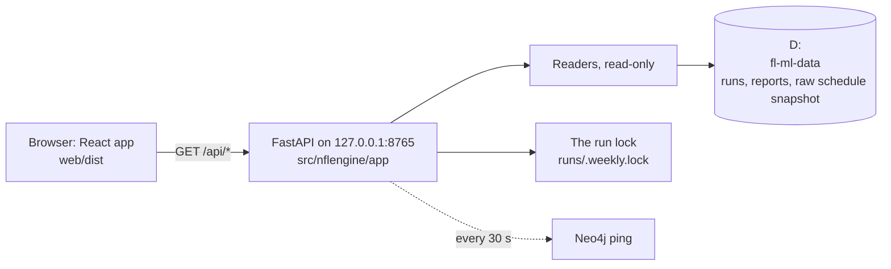

# The control room: a local web app for the weekly pipeline

The control room is a small website that runs only on this computer. On Tuesdays it will be where you press **Run**, watch the pipeline work, then read the digest and check last week's results. It also shows the MLOps side (run health, W&B runs, artifacts) and season-long views.

It's being built in four phases, CR00–CR03. The spec, the phases and the approved mockup are in [`documentation/control-room/`](../control-room/README.md). This guide explains what's built so far and how to use it. It grows with each phase.

**Built so far: CR00 (foundations).**
- The app starts with one command.
- The sidebar shows the season's weeks with their real status.
- Each week has its header and seven tabs.
- Both themes work in dark and light mode.
- The safety rules are in place and tested.

The tabs and season pages still show placeholders that say which phase fills them.

## 1. Start it

**Once, after cloning or after a web change:** build the web app. Node.js 24 and npm 11 are installed on this machine.

```powershell
npm --prefix web ci          # install the exact package versions from web/package-lock.json
npm --prefix web run build   # writes web/dist/ (about 140 KB of script, gzipped, plus the fonts)
```

**Every time:**

```powershell
uv run nfl app               # opens http://127.0.0.1:8765/ in your browser; Ctrl+C stops it
uv run nfl app --no-browser  # same, without opening a tab
uv run nfl app --port 8800   # another port (1024-65535)
```

- `/` takes you to the calendar's current week, Pipeline tab.
- Leave the terminal open while you use the app. Closing the browser tab doesn't stop anything.

| Exit code | Meaning |
|---|---|
| 0 | Stopped normally (Ctrl+C) |
| 1 | The port is already in use (is another control room running?) |
| 2 | `web/dist` is missing: run the two build commands above, or use `--dev` |

**Working on the web code:** run the API and the Vite dev server side by side. Vite reloads the page as you edit.

```powershell
uv run nfl app --dev           # API only, on 127.0.0.1:8765
npm --prefix web run dev       # the page on http://localhost:5173/ (Vite forwards /api to 8765)
```

`--rehearsal` is wired but does nothing yet. From CR02 it will point the Run button at `nfl weekly rehearse`, never the live week. While it's on, a banner says so.

## 2. What you see

**Sidebar:**
- The brand and the **gear** (appearance, §3).
- The **season's weeks**, newest first. The calendar's current week is always listed, even before it has a run folder.
- **"Before go-live"**: the weeks before the first live run (2026: weeks 1–3, which only have walk-forward rows), shown greyed out.
- Links to the season pages (Scorecard, Teams & rankings, Models, Alerts) and Health.
- A status footer:
  - **Run lock:** free / held; hover to see the command holding it;
  - **Neo4j:** up / down / checking;
  - **Data drive:** free space;
  - **Now:** the time in ET.

**A week's status** follows the pipeline's own rules (`src/nflengine/app/readers/weeks.py`):

| Badge (sidebar) | Header label | When |
|---|---|---|
| Running | Running | The weekly-run lock is held by a run of this week (`--season S --week N`, or an `--auto` run of the calendar's week) |
| Published | Published | The digest step finished `ok` **and** the report file exists (the same rule `--auto` uses to skip a published week, `weekly.already_published`) |
| Failed | Failed | A step's last status is `failed`. A "not ready" run doesn't count: the run summary's status decides, and for weeks before run summaries only the not-ready wordings of the `ready` step count |
| Incomplete | Incomplete | Steps ran but no digest was published, or the last run stopped because the week before wasn't final |
| Ready | Ready to run | The current week, and last week is final in the local schedule snapshot |
| Waiting | Waiting on week N | The current week, and last week isn't final in the local schedule snapshot |
| Waiting | Waiting on the schedule | The current week has no games in the schedule yet (the next playoff round before nflverse adds it); the run would stop with exit 3 |
| No run | No run | A past week with no run |

**"Waiting" can be out of date on a Tuesday morning.**
- The app reads the newest schedule snapshot on D:, which only refreshes when something ingests.
- `nfl weekly run --auto` refreshes it first, under the lock, before deciding.
- So "Waiting on week 4" with "1/16 final" before the Tuesday run doesn't mean the run would stop.
- CR02's pre-flight panel will handle this properly.

**The week header:**
- the season and "this week";
- the status, the slate (games and days), the calendar's tags (Thursday game, Thanksgiving, morning kickoff, international games, byes);
- **for the current week:** the countdown to the first kickoff (updated every 30 s), the kickoff time in ET, the end of the "not ready" retry window, and the Saturday injury-update button, greyed out with its reason (it works from CR02);
- **for a past week:** when it was published. Weeks from before P07's run records show "No run records" (2026 week 4).

**Tabs:** Pipeline, Digest, Games, Players, Results, MLOps, Graph. Each is a placeholder that says what it will show and which phase brings it.

## 3. Themes and modes

The gear next to "Control Room" opens **Appearance**:
- **Turf & Pylon:** field green with end-zone pylon orange. The default.
- **Playbook:** a whiteboard in light mode, a chalkboard in dark mode.
- **Mode:** System (follows Windows' light / dark setting, live), Dark or Light.

The choice is saved in this browser (`localStorage`, key `cr.appearance`) and painted before the page draws, so there's no flash of the default theme. If the browser blocks storage, the choice lasts until you close the tab.

All colours come from one set of tokens, ported unchanged from the approved mockup into `web/src/styles/tokens.css`: backgrounds, ink, accent, the three chart series colours, ok / warn / err, and the football-field colours for CR01's drive chart. The chart colours of both themes passed the colour-blindness checks in both modes (D96).

## 4. How it's wired



**Backend** (`src/nflengine/app/`, FastAPI 0.142, Starlette 1.7, uvicorn 0.54):

| File | Role |
|---|---|
| `serve.py` | `nfl app`: checks the build and the port, binds `127.0.0.1` only, opens the browser |
| `server.py` | `create_app(settings)`: the routes, the error format `{"error": {"code", "message"}}` (messages scrubbed), the built React app with client-side routes |
| `security.py` | The safety rules (§5) as plain ASGI middleware |
| `jsonsafe.py` | Every response goes through it: NaN and infinity → `null` (a browser rejects the whole response otherwise), dates as ISO strings, numpy numbers as plain numbers |
| `status.py` | A background thread that pings Neo4j every 30 s. A ping takes about 4.5 s when the container is down, too slow for every page load |
| `readers/meta.py` | The calendar's plan (`ops.calendar.plan_week`) and the lock (`ops.lock`), as plain data. Only the lock's command and start time leave the server |
| `readers/weeks.py` | The week list and the status rules in §2 |

| Endpoint | Gives |
|---|---|
| `GET /api/meta` | App version, mode (dev / rehearsal), data drive (found, free space; never its path, which comes from an environment variable), lock, Neo4j, the calendar's plan (week, deadline, retry window, slate tags, byes), `seasons.current` |
| `GET /api/weeks` | The season, the current week, the first live week, and one entry per week (status, label, detail, published time, on time, step statuses) |
| `GET /api/session` | The per-launch token (§5) |

The readers only read:
- `runs/<season>/week<NN>/` (`weekly_run.json`, `run_summary.json`, `checks.json`);
- `reports/<season>/`;
- the newest schedule snapshot (cached for 60 s);
- the lock file.

They never write to the data root.

**Frontend** (`web/`):
- **Stack:** Vite 8, React 19, TypeScript 6.
- **Routing:** React Router 7 (`/week/:season/:week/:tab`, `/season/:season/scorecard`, `/teams`, `/models`, `/alerts`, `/health`).
- **Data:** TanStack Query; `/api/meta` and `/api/weeks` refresh every 30 s and when you come back to the tab.
- **Widgets:** Radix for the gear popover and the confirm dialog (focus handling, Escape).
- **Styling:** Tailwind 4, with the mockup's tokens as colours; the mockup's component styles ported as they are (`web/src/styles/app.css`).
- **Fonts:** Barlow, Barlow Condensed and JetBrains Mono, bundled with `@fontsource`, so nothing loads from the internet.
- **Charts:** small in-house SVG components (`web/src/charts/`): a line chart with a legend and crosshair tooltip, horizontal bars with tooltips, a sparkline. They follow the project's chart rules: text in text colours, a legend for two or more series, hover and focus tooltips. CR01 and CR03 use them.

## 5. The safety rules, in plain words

The app can't be reached from other computers, and other websites open in your browser can't use it:

1. **It only listens on 127.0.0.1.** There's no `--host` option.
2. **It only answers requests addressed to `127.0.0.1:<port>` or `localhost:<port>`.** That stops a trick where a malicious site points its own domain name at your machine ("DNS rebinding").
3. **Anything that changes something needs the launch token and must come from the app's own page.** The token is a random string made each time `nfl app` starts. The page reads it from `/api/session`, which other sites can't read. In CR00 nothing changes anything yet; CR02's Run button will be the first.
4. **No cross-site access headers are ever sent.** The page can't be framed by another site either (it can't be tricked into clicking Run inside a hidden frame). The other security headers: content security policy, `nosniff`, `no-referrer`, `no-store` on API answers.
5. **Secrets stay on the server.**
   - No endpoint returns a key or an environment value.
   - Every text that reaches the browser passes through the pipeline's `scrub()`.
   - A test sets fake keys and checks that no response contains them, or anything that looks like a key.
6. **No API docs page** (`/docs`, `/openapi.json` are off), and unknown `/api/...` paths return a JSON 404.
7. **A crash never leaks.** An unexpected error is caught inside the safety layer: the console gets one scrubbed line, the browser gets `server_error` with the error's type only, and the response still carries the security headers.
8. **The status line never gets in a run's way.** Checking the lock means taking it for an instant, so the app reads the lock's note first and only checks when a run has written one (a run starting at that instant would otherwise stop with exit 4).

**Tests** (`tests/app/`, 50): Host and Origin and token checks, every state-changing method, the dev-mode origin, security headers, no CORS, the secrets scan, a missing data drive, path-traversal attempts on the static files, the week-status rules on fixture run folders (published, failed, partial, not ready vs a real `ready` failure, no slate, running from the lock, a simulation holding the lock), the lock check that doesn't probe without a note, a crash's scrubbed log and headers, no data-root path in any response, the CLI's flags, the missing-build and port-in-use paths, the 127.0.0.1 bind, and Ctrl+C as a normal stop. They never start a real server or touch D:. One integration test (`-m integration`) reads the real data root and expects 2026 week 4 to be Published.

**Web tests** (`npm --prefix web test`, Vitest, 20): formatting (ET with daylight saving, the countdown, slate tags), theme persistence and junk in storage, the chart scales, legend and tooltips, the sidebar's week rows and footer, theme switching from the gear, the week header, the seven tabs, the confirm dialog.

## 6. Troubleshooting

| What you see | What to do |
|---|---|
| "Port 8765 … is in use" | Another control room is running (check your terminals), or pass `--port` |
| "The web app isn't built yet" | `npm --prefix web ci` then `npm --prefix web run build` |
| Red banner "The data drive isn't connected" | Connect D:. The page still loads; the week list returns a `data_root_missing` error until the drive is back |
| Red banner "The control room's API isn't answering" | The `nfl app` terminal was closed or crashed: start it again |
| Neo4j "down" in the footer, Health "Check" | Normal when Docker Desktop isn't running. The weekly run starts Neo4j by itself. "checking" shows for the first few seconds after start-up |
| Week shows "Waiting" on Tuesday | The local schedule snapshot is from before Monday night's game (§2). The run refreshes it |
| The page looks unstyled after a code change | Rebuild (`npm --prefix web run build`) and reload |

## 7. Changing it safely

- **Design changes start with the mockup** (`documentation/control-room/mockup/`, republished to the same link), then the spec, then the code. Keep `web/src/styles/` in step with the mockup's `styles.css`.
- **Adding data to the page:**
  1. write a reader under `src/nflengine/app/readers/` that only reads, uses `ensure_data_root()` (never a hard-coded `D:/`) and scrubs free text;
  2. add the endpoint in `server.py`;
  3. add tests on fixture folders (`tests/app/app_helpers.py` builds a fake data root, a pinned Tuesday clock and the schedule fixture);
  4. add the endpoint to the secrets scan in `test_app_security.py`.
- **Adding a screen:** a component under `web/src/components/` or a page under `web/src/pages/`, its route in `routes.tsx`, and a Vitest test with the fake API (`web/src/test/utils.tsx`).
- **Reviews:** CR00 had a Sol review (8 findings, all fixed, D98). Each CR phase gets one before its close.
- **Gates before a commit:** `uv run pytest`, `uv run ruff check`, and in `web/`: `npm run lint`, `npm run typecheck`, `npm test`, `npm run build`.
- **Never** add an endpoint that takes a file path or a command, never send a key or an environment value to the browser, and never make the server listen on anything but 127.0.0.1 (README §5).

## 8. Limits and what's next

- **CR01:** every week tab from the real files. That includes the three pipeline views (drive chart, pipeline map, timeline) for finished runs, picked per week with "Surprise me".
- **CR02:** the Run button (`nfl weekly run --auto --expect-week N`), pre-flight checks, the live view and log, resume after a failure, the Saturday injury update, notifications. It ends with the first real Tuesday run from the app.
- **CR03:** MLOps (Health · W&B runs · Artifacts) and the season pages.
- **Not planned:** remote access, user accounts, scheduling (runs stay manual, D71).
