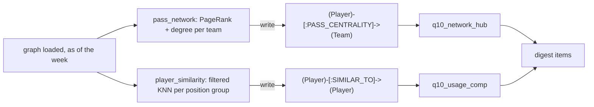

# Graph Data Science guide (Neo4j GDS)

**What this is:** a plain-language guide to the Graph Data Science (GDS) part of the knowledge graph, built in P08: what GDS is, the four ideas you need (projection, PageRank, degree, nearest neighbors), the two jobs the weekly build runs, and a **Neo4j Browser walkthrough you can repeat** (project → stream → write → query → drop), with the real results from the live 2026 graph.

**Related docs:** the graph itself is in the [knowledge graph guide](knowledge-graph.md) (start there if Neo4j is new); the spec is [05 → Q10](../05-knowledge-graph.md#q10-graph-data-science). Agents use the `neo4j-graph` skill. The code is `src/nflengine/graph/gds.py` (the jobs), `graph/tables_extra.py` (the usage profiles) and the two queries `graph/queries/q10_*.cypher`.

---

## 1. GDS in five minutes

Cypher answers questions about **specific paths**: "who did Kirk Cousins throw to in 2023?". Graph Data Science answers questions about **the whole shape** of a network: "who is the center of this passing game?", "which players' usage looks alike?". It's a plugin (installed in our Docker image next to APOC) that runs graph algorithms in memory.

### The projection: a working copy in memory

GDS never runs on the database directly. You first **project** a graph: copy the nodes and relationships you care about into an in-memory graph with a name, keeping only the properties the algorithm needs (for example a `targets` weight). Then you run algorithms on that copy, as many times as you like, and **drop** it when you're done.

```text
database (Neo4j on disk)  --gds.graph.project-->  in-memory graph 'kc-2025'  --algorithms-->  results
```

Why a copy? Algorithms like PageRank visit every node dozens of times; a compact in-memory structure makes that fast, and the database isn't touched while they run. The cost is memory: a projection lives in Neo4j's heap (ours is 2 GB) until it's dropped. Our projections are tiny (a team's passing network is ~20 nodes; all 32 teams together ~1,000 nodes), so memory is never close, but **always drop** what you project.

There are two ways to project:
- **Native**: `gds.graph.project('g', 'Player', 'THREW_TO')` copies whole labels and types. Simple, but our `THREW_TO` holds every season, so it would mix 2018 and 2026.
- **Cypher aggregation** (what we use): write a normal `MATCH` that finds exactly the edges you want, then hand each row to `gds.graph.project(name, source, target, {...})`. That's how we keep only one season's targets, weight them, and give each team its own relationship type.

### Execution modes: stream, write, mutate, stats

Every algorithm comes in modes that differ only in **where the result goes**:

| Mode | Result goes to | Use it for |
|---|---|---|
| `stream` | rows returned to you | looking at results; our pipeline (it writes them itself) |
| `write` | a property (or relationship) written back to the **database** | keeping a result for Cypher queries later |
| `mutate` | a property added to the **in-memory projection** only | chaining algorithms without touching the database |
| `stats` | a summary row (counts, timings, distribution) | sanity checks |

Add `.estimate` (e.g. `gds.pageRank.stream.estimate`) to see how much memory a run needs before running it.

### PageRank: who the network flows through

PageRank scores a node by how much "attention" flows into it: a node is important if important nodes point to it. It was invented to rank web pages by links. Run on a passing network (QB ↔ receiver, weighted by targets), it says **who the passing game runs through**.

An honest caveat that you'll see in the walkthrough: our passing networks are nearly **star-shaped** (QBs in the middle, receivers around them, almost no receiver-to-receiver edges). On a star, PageRank ends up close to **weighted degree** (a receiver's share of targets). It isn't a deep secret the algorithm uncovers; it's a principled way to rank who the offense has gone through, which also handles several QBs (a receiver favored by the starter and the backup gets credit from both).

### Degree centrality: the simple count

Degree centrality counts a node's relationships; weighted degree sums their weights. For a receiver here it's simply **his targets this season**. It's the baseline to compare PageRank with.

### Similarity: node similarity vs k-nearest neighbors

Two families:
- **Node similarity** (`gds.nodeSimilarity`): two nodes are alike when they're **connected to the same neighbors** (Jaccard: shared neighbors / all neighbors). Example: two receivers are similar if they caught passes from the same QBs.
- **K-nearest neighbors, KNN** (`gds.knn`): two nodes are alike when their **property vectors** are close. Each node carries a list of numbers (a "vector"); KNN finds each node's `topK` closest others (cosine or Euclidean). We use this: each player-season has a **usage vector** (target share, air-yards share, depth of target, red-zone share, snap share, yards per team pass), and KNN finds the past seasons whose usage looks most like this season's.

**Filtered KNN** (`gds.knn.filtered`) restricts which nodes are compared: `sourceNodeFilter` = whose neighbors to find (this season's profiles), `targetNodeFilter` = who may be a neighbor (past seasons only). KNN is approximate (it samples), so we fix `randomSeed` and `concurrency: 1` to get the same answer every run.

Similarity is always worded as a **comparison, never a prediction**: "his usage so far looks like Stefon Diggs's 2020" says how he's being used, not what his season will be.

## 2. How it's wired into the weekly build

The build order (doc 05) is: **load → count check → GDS jobs → query library → `graph_results.json`**. The jobs live in `src/nflengine/graph/gds.py` and run inside `nfl graph build` and the weekly `graph` step.



**Job 1, `pass_network`:**
1. One Cypher-aggregation projection of this season's `THREW_TO` edges (only targets the build can see, so it's as-of safe), undirected, weight = targets, with **one relationship type per team** (`KC`, `SF`, ...). A player traded mid-season is one node with edges of two types.
2. Per team: `gds.degree.stream` and `gds.pageRank.stream` with `relationshipTypes: [team]`, so each run sees one team's network only. The receivers' PageRank is turned into a **share** (his part of the team's receiver PageRank; QBs left out) and a **rank**; rank 1 is the team's **hub**.
3. **This week's network:** the pass catchers who won't play this week (the library's Q0 rules: listed Out / Doubtful, on a reserve list, or ruled out of the last game before the report) are left out of a second projection, and PageRank is run again for those teams: who leads the network without them.
4. Results are written with plain Cypher as `(Player)-[:PASS_CENTRALITY {season, week, team_id, role, pagerank, degree, share, rank, hub_id, out_this_week, share_this_week, rank_this_week}]->(Team)`. (Stream + our own write, not `gds.pageRank.write`, because a traded player has a different share on each team: a relationship to the team holds that; a node property couldn't.)

**Job 2, `player_similarity`:**
1. The build loads one `UsageProfile` node per WR / TE / RB season (regular season, visible plays only; ≥ 8 games and 40 opportunities for a past season, ≥ 3 games and 12 for this season), with the raw shares and a `vector` of z-scores (each feature standardized within its position group over 2018 → now).
2. Per group: a node-only projection of the profiles, labeled `Current` (this season) or `Past`; `gds.knn.filtered.stream` with Euclidean distance (`similarity = 1 / (1 + distance)`), `topK: 10`, `sourceNodeFilter: 'Current'`, `targetNodeFilter: 'Past'`.
3. The player's own past seasons are dropped and the 3 closest other players' seasons are written as `(Player)-[:SIMILAR_TO {season, other_season, other_team, group, score, rank, basis, week}]->(Player)`.

**Fail-soft:** each job runs on its own. If GDS is missing, a call fails or memory runs out, the job is recorded as `failed` (with only the error type and Neo4j status code, never server text), its projections are dropped, and the build carries on: the two Q10 queries just return nothing that week. The record is in `graph_results.json` → `gds` (status, version, seconds, rows written, each team's hub) and in W&B (`gds/status`, `gds/seconds`, `gds/<job>/seconds`, `gds/<job>/written`, the `gds_hubs` table).

**Timings (HDD):** 6-12 seconds for both jobs in the 2025 backtests (weeks 5-14; `pass_network` 5-11 s, `player_similarity` ~1 s) and 5.5 s on the live 2026 week-4 graph (a build of 126 s in all; wipe and load times swing by ±20 s from run to run, so the GDS share is the number to watch).

**A memory lesson learned the hard way:** a first version gave every *team-receiver pair* its own relationship type (~1,000 types) so that any receiver could be removed per run. Projecting that ran the 2 GB heap out of memory (`Neo.TransientError.General.OutOfMemoryError`; Neo4j recovered on its own). Each relationship type gets its own adjacency structures in GDS: keep the number of types small (we use one per team).

## 3. The digest items

| Query | Fires when | Example (real, backtests) |
|---|---|---|
| `q10_network_hub` | a pass catcher in his team's top 3 by PageRank share (≥ 15%) won't play this week | "Justin Jefferson (Vikings WR), the center of the Vikings' passing network, is on a reserve list and missed the team's last game." → "... T.J. Hockenson leads that network" without him (2023 week 7, a golden test); "Ja'Marr Chase (Bengals), the center of their passing network this season (25% PageRank share), won't play; Tee Higgins leads it without him." (2025 week 13, *More from the graph*) |
| `q10_usage_comp` | a pass catcher / RB with a real role whose closest match (at or above the week's median score in his group) is another player's top-10 season | "Puka Nacua (Rams WR), in his first two seasons, is being used much like Stefon Diggs was in 2020, the most productive season by a WR that year." (2023 week 7, a golden test); "Harold Fannin Jr. (Browns TE): usage this season closest to Evan Engram's 2022 (766 receiving yards, 4th-most among tight ends); a comparison, not a projection." (2025 week 14, *More from the graph*) |

Both carry a note in code: the network one says PageRank mostly follows targets and shows who the passing game has gone through, not who will be targeted this week; the comparison one says it's a comparison of usage so far, not a projection.

## 4. Walkthrough in Neo4j Browser (repeat it yourself)

Open http://localhost:7474 (login as in the [knowledge graph guide](knowledge-graph.md#3-opening-it-what-youll-see-in-neo4j-browser)). Everything below was run on **the live 2026 week-4 graph on 2026-10-04**; "You should see" is what it returned. The demo uses the Chiefs' complete **2025** season (a full season reads better than three games of 2026); swap in any team code and season. Demo projections are named `demo-*` so they never clash with the pipeline's `nfl-*` ones, and every step that writes is undone at the end.

### Part A: passing-network PageRank (project → stream → write → query → drop)

**A1. Look at the raw network first** (Table view; return `q, t, r` instead to draw it):
```cypher
MATCH (q:Player)-[t:THREW_TO {season: 2025}]->(r:Player)
WHERE t.team_id = 'KC'
RETURN q.name AS passer, r.name AS receiver, t.targets AS targets
ORDER BY targets DESC LIMIT 8
```
You should see Mahomes → Travis Kelce 89 targets, Rashee Rice 77, Xavier Worthy 67, Marquise Brown 62, Tyquan Thornton 37, JuJu Smith-Schuster 36, Noah Gray 31, Brashard Smith 26. Drawn, it's a star with Mahomes in the middle and a second, smaller star around the backup.

**A2. Project it** (a Cypher-aggregation projection, undirected, weighted by targets):
```cypher
MATCH (q:Player)-[t:THREW_TO {season: 2025}]->(r:Player)
WHERE t.team_id = 'KC'
WITH gds.graph.project('demo-pass', q, r,
       {relationshipProperties: {targets: toFloat(t.targets)}},
       {undirectedRelationshipTypes: ['*']}) AS g
RETURN g.graphName AS graph, g.nodeCount AS nodes, g.relationshipCount AS relationships
```
You should see `demo-pass`, **21 nodes, 72 relationships** (36 passer-receiver pairs, each stored both ways because it's undirected).

**A3. Check it's there and what it costs:**
```cypher
CALL gds.graph.list('demo-pass') YIELD graphName, nodeCount, relationshipCount, memoryUsage
RETURN graphName, nodeCount, relationshipCount, memoryUsage
```
```cypher
CALL gds.pageRank.stream.estimate('demo-pass', {relationshipWeightProperty: 'targets'})
YIELD requiredMemory RETURN requiredMemory
```
You should see `memoryUsage` **36 MiB** (mostly fixed overhead) and PageRank's `requiredMemory` **1336 Bytes**. Projections live in the 2 GB heap until dropped.

**A4. Stream PageRank** (results come back as rows; nothing is written):
```cypher
CALL gds.pageRank.stream('demo-pass', {relationshipWeightProperty: 'targets'})
YIELD nodeId, score
RETURN gds.util.asNode(nodeId).name AS player, gds.util.asNode(nodeId).position AS pos,
       round(score, 3) AS pagerank
ORDER BY pagerank DESC LIMIT 8
```
You should see Mahomes 7.864 (the hub of any QB-receiver star), then **Travis Kelce 1.794**, Rashee Rice 1.246, Marquise Brown 1.240, Xavier Worthy 1.183, Chris Oladokun (QB) 1.034, JuJu Smith-Schuster 0.817, Noah Gray 0.699.

**A5. Compare with weighted degree** (just the targets):
```cypher
CALL gds.degree.stream('demo-pass', {relationshipWeightProperty: 'targets'})
YIELD nodeId, score
RETURN gds.util.asNode(nodeId).name AS player, score AS targets
ORDER BY targets DESC LIMIT 8
```
You should see Mahomes 474, Kelce 108, Rice 78, Brown 74, Worthy 73, Oladokun 52, Smith-Schuster 45, Gray 37. Kelce's 108 is more than Mahomes's 89 because the backup's targets count too.

**What to look for:** the order is the same as targets, with small differences that come from *who* threw them (Brown, 74 targets, sits right next to Rice, 78, because more of Brown's came from Mahomes, the high-PageRank QB). That's the honest headline about PageRank on a passing network: it mostly agrees with target share and is a principled tie-breaker, not a hidden truth. **Does the center match what you saw watching the 2025 Chiefs?** Kelce as the hub at 36, ahead of Rice, is the kind of thing to check against your memory.

**A6. The other modes.** `stats` summarizes without returning rows:
```cypher
CALL gds.pageRank.stats('demo-pass', {relationshipWeightProperty: 'targets'})
YIELD ranIterations, didConverge, centralityDistribution
RETURN ranIterations, didConverge, centralityDistribution.max AS max,
       centralityDistribution.mean AS mean
```
You should see `ranIterations` 20, **`didConverge` false**, max 7.86, mean 0.96. The default stops after 20 iterations; the pipeline uses `maxIterations: 40, tolerance: 1e-7` (the ranking doesn't change, the last decimals do).

`mutate` adds the score to the **in-memory graph only**, to chain another algorithm on it; read it back with `gds.graph.nodeProperty.stream`:
```cypher
CALL gds.pageRank.mutate('demo-pass', {relationshipWeightProperty: 'targets', mutateProperty: 'pr'})
YIELD nodePropertiesWritten RETURN nodePropertiesWritten
```
```cypher
CALL gds.graph.nodeProperty.stream('demo-pass', 'pr')
YIELD nodeId, propertyValue
RETURN gds.util.asNode(nodeId).name AS player, round(propertyValue, 3) AS pr
ORDER BY pr DESC LIMIT 3
```
You should see 21 written, then Mahomes 7.864, Kelce 1.794, Rice 1.246.

**A7. Write it to the database, then query it with plain Cypher:**
```cypher
CALL gds.pageRank.write('demo-pass',
  {relationshipWeightProperty: 'targets', writeProperty: 'demo_pagerank'})
YIELD nodePropertiesWritten, ranIterations RETURN nodePropertiesWritten, ranIterations
```
```cypher
MATCH (p:Player) WHERE p.demo_pagerank IS NOT NULL
RETURN p.name AS player, round(p.demo_pagerank, 3) AS pagerank ORDER BY pagerank DESC LIMIT 5
```
You should see 21 properties written (20 iterations), then the same top five as A4. Now the score is an ordinary node property any query can use.

**A8. Clean up** (drop the projection, remove the demo property):
```cypher
CALL gds.graph.drop('demo-pass') YIELD graphName RETURN graphName
```
```cypher
MATCH (p:Player) WHERE p.demo_pagerank IS NOT NULL REMOVE p.demo_pagerank RETURN count(p) AS cleaned
```
You should see `demo-pass`, then 21 cleaned.

**A9. What the pipeline wrote for this week** (every team, this season so far):
```cypher
MATCH (p:Player)-[c:PASS_CENTRALITY]->(t:Team {team_id: 'KC'})
WHERE c.role = 'receiver'
RETURN c.season AS season, p.name AS receiver, c.rank AS rank, round(c.share, 3) AS share,
       c.degree AS targets, c.out_this_week AS out, c.rank_this_week AS rank_this_week
ORDER BY rank LIMIT 6
```
You should see 2026 after three games: Kelce rank 1 (17.0% share, 18 targets), Kenneth Walker III 2 (17.0%, 18), Rice 3 (16.2%, 17), Worthy 4 (14.6%, 15), Thornton 5, Gray 6; nobody out, so no `rank_this_week`. For a team with someone out try `'PHI'`: DeVonta Smith (listed out, hamstring) is rank 1, and the build's this-week network says who leads without him. That's the `network_hub` item, which on the week-4 graph now ranks second among the non-obvious stories (strength 0.84).

### Part B: player similarity with KNN (project → stream → write → query → drop)

**B1. The inputs: usage profiles** (one node per player-season, built by the pipeline):
```cypher
MATCH (u:UsageProfile {group: 'WR', current: true})
RETURN u.name AS player, u.team_id AS team, u.games AS games,
       round(u.target_share, 3) AS target_share, round(u.adot, 1) AS adot,
       round(u.rz_share, 3) AS rz_share, round(u.snap_share, 3) AS snaps
ORDER BY target_share DESC LIMIT 5
```
You should see Jaxon Smith-Njigba (SEA, 3 games) 37.5% of targets, 9.7-yard aDOT, 50% of red-zone targets, 81% of snaps; Amon-Ra St. Brown 32.1%; DeVonta Smith 30.7% (12.0 aDOT); Parker Washington 28.8% (14.3); Chris Olave 27.5% (13.1). Each node also has `vector`: the same features as z-scores within WRs, the numbers KNN compares.

**B2. Project the WR profiles** (nodes only, no relationships; this season labeled `Current`, earlier seasons `Past`):
```cypher
MATCH (u:UsageProfile {group: 'WR'})
WITH gds.graph.project('demo-usage', u, null, {
       sourceNodeLabels: CASE WHEN u.current THEN ['Current'] ELSE ['Past'] END,
       targetNodeLabels: NULL,
       sourceNodeProperties: {vector: u.vector},
       targetNodeProperties: NULL}) AS g
RETURN g.graphName AS graph, g.nodeCount AS nodes
```
You should see **839 nodes**. (With `sourceNodeLabels` you must also pass `targetNodeLabels: NULL`; without it GDS refuses the call.)

**B3. Stream filtered KNN for one player:**
```cypher
CALL gds.knn.filtered.stream('demo-usage', {
  nodeProperties: {vector: 'EUCLIDEAN'}, topK: 5,
  sourceNodeFilter: 'Current', targetNodeFilter: 'Past',
  randomSeed: 42, concurrency: 1, sampleRate: 1.0, deltaThreshold: 0.0})
YIELD node1, node2, similarity
WITH gds.util.asNode(node1) AS a, gds.util.asNode(node2) AS b, similarity
WHERE a.name = 'Jaxon Smith-Njigba'
RETURN b.name AS looks_like, b.season AS season, b.team_id AS team, b.yds_rank AS yds_rank,
       round(similarity, 3) AS similarity
ORDER BY similarity DESC
```
You should see Tyreek Hill 2023 (that year's #1 in receiving yards) 0.252, Davante Adams 2020 0.252, **Jaxon Smith-Njigba 2025** 0.233, DeAndre Hopkins 2018 0.232, Michael Thomas 2019 0.215.

**What to look for:** two lessons. (1) The scores are low: three games into 2026 JSN's shares are so extreme (z-scores above 3) that no past season is close; the matches are the biggest volume seasons on record, which is the right shape, but "how close" is weak. The digest only uses a match at or above that week's median score in its group. (2) **His own 2025 season shows up**: the pipeline drops a player's own seasons before writing `SIMILAR_TO`. Does "used like Tyreek Hill's 2023" match what you see in Seattle's games?

**B4. Write and query** (top 1 per current profile, as a new relationship type):
```cypher
CALL gds.knn.filtered.write('demo-usage', {
  nodeProperties: {vector: 'EUCLIDEAN'}, topK: 1,
  sourceNodeFilter: 'Current', targetNodeFilter: 'Past',
  randomSeed: 42, concurrency: 1, sampleRate: 1.0, deltaThreshold: 0.0,
  writeRelationshipType: 'DEMO_SIMILAR', writeProperty: 'score'})
YIELD relationshipsWritten RETURN relationshipsWritten
```
```cypher
MATCH (a:UsageProfile)-[s:DEMO_SIMILAR]->(b:UsageProfile)
RETURN a.name AS player, b.name AS looks_like, b.season AS season, round(s.score, 3) AS score
ORDER BY score DESC LIMIT 5
```
You should see 60 relationships written, then Devaughn Vele ~ Nelson Agholor 2018 (0.780), rookie **Tetairoa McMillan ~ DK Metcalf 2019** (0.771), George Pickens ~ DeVante Parker 2021, Rashod Bateman ~ DK Metcalf 2019, Matthew Golden ~ Amari Cooper 2022 (0.629 each).

**B5. Clean up:**
```cypher
CALL gds.graph.drop('demo-usage') YIELD graphName RETURN graphName
```
```cypher
MATCH ()-[s:DEMO_SIMILAR]->() DELETE s RETURN count(s) AS deleted
```
You should see `demo-usage`, then 60 deleted.

**B6. What the pipeline wrote** (rank-1 matches to a top-5 season, all groups):
```cypher
MATCH (p:Player)-[s:SIMILAR_TO {rank: 1}]->(o:Player)
MATCH (o)-[:HAS_PROFILE]->(ou:UsageProfile {season: s.other_season})
WHERE ou.yds_rank <= 5
RETURN p.name AS player, s.group AS grp, o.name AS looks_like, s.other_season AS season,
       ou.yds_rank AS yds_rank, s.score AS score
ORDER BY score DESC LIMIT 8
```
You should see Christian McCaffrey ~ Alvin Kamara 2018 (0.785), Parker Washington ~ Julio Jones 2018 (0.756), D'Andre Swift ~ Josh Jacobs 2024 (0.747), James Cook ~ Derrick Henry 2022, Kyren Williams ~ Josh Jacobs 2024, CeeDee Lamb ~ Justin Jefferson 2020, Chris Olave ~ Julio Jones 2018, rookie Harold Fannin Jr. ~ Travis Kelce 2024 (0.587).

### Part C (optional): node similarity, and why we don't use it here

Node similarity compares **neighbors**, not numbers. Receivers who caught passes from the same QBs (Chiefs, 2024-2025, at least 5 targets):
```cypher
MATCH (q:Player)-[t:THREW_TO]->(r:Player)
WHERE t.team_id = 'KC' AND t.season >= 2024 AND t.targets >= 5
WITH gds.graph.project('demo-shared', r, q) AS g
RETURN g.nodeCount AS nodes, g.relationshipCount AS rels
```
```cypher
CALL gds.nodeSimilarity.stream('demo-shared', {topK: 1})
YIELD node1, node2, similarity
RETURN gds.util.asNode(node1).name AS receiver, gds.util.asNode(node2).name AS shares_qbs_with,
       round(similarity, 2) AS jaccard
ORDER BY jaccard DESC, receiver LIMIT 6
```
```cypher
CALL gds.graph.drop('demo-shared') YIELD graphName RETURN graphName
```
You should see 22 nodes and 38 relationships, then Jaccard **1.0** for everyone (Brashard Smith ~ JuJu Smith-Schuster, Isiah Pacheco ~ JuJu Smith-Schuster, ...): on one team almost every receiver catches from the same two QBs, so shared neighbors can't tell them apart. That's why the pipeline uses KNN on usage numbers instead.

## 5. Operating it

| What | How |
|---|---|
| See what the jobs did in a build | `graph_results.json` → `gds` (status, version, seconds, per job: `written`, `teams`, `out`, every team's hub); the W&B `track1-graph` / `build` run: `gds/status`, `gds/seconds`, `gds/pass_network/seconds`, `gds/pass_network/written`, `gds/player_similarity/...`, table `gds_hubs` |
| Leftover projections after a crash | `CALL gds.graph.list()`; the next build drops every `nfl-*` one first, or `CALL gds.graph.drop('<name>', false)` |
| Turn a knob | `graph/gds.py`: `PAGERANK` (damping 0.85, 40 iterations), `KNN` (topK 10, seed 42), `SIMILAR_TOP` (3); `graph/tables_extra.py`: `USAGE_FEATURES`, the sample floors; `graph/queries/__init__.py`: `q10_network_hub` (`min_share` 0.15, `max_rank` 3) and `q10_usage_comp` (`max_rank` 10, role floors) |
| Change the usage features | edit `RECEIVER_FEATURES` / `RB_FEATURES` in `tables_extra.py` (each must be a profile column); the vector and `basis` follow; then `uv run pytest tests/graph/test_graph_advanced.py` |
| Tests | `tests/graph/test_graph_advanced.py` (no Neo4j: GDS calls with a fake driver, fail-soft, wording); `tests/graph/test_graph_integration.py` (real GDS: Jefferson's network 2023 w7, Puka Nacua ~ Diggs 2020, a server-side GDS error is fail-soft) |

## 6. Limits and what's next

- **PageRank ≈ targets** on these star-shaped networks (§1). It adds a consistent ranking and a "this week's network" re-run, not hidden structure. A richer network (receivers linked by shared drives or formations) would need play-level data the graph doesn't hold.
- **Season totals drift** when a star misses weeks: his share falls behind teammates who kept playing (2025: by week 6 Malik Nabers was the Giants' 2nd node, Jake Ferguson had passed CeeDee Lamb), which is why the hub story takes any of the team's top 3 who won't play, not only the current rank 1.
- **Similarity scores aren't comparable across groups or weeks** (Euclidean on z-scores: an extreme profile has no close neighbor). The digest uses each week's median per group as the bar.
- **Early weeks are thin:** three games make a usage profile; the comparison says "so far" and the item is low confidence under four games.
- **In the digest so far:** in 2025 backtests (weeks 5-14) the GDS items reach *More from the graph*, not the prose: Ja'Marr Chase out of the Bengals' network (week 13), Harold Fannin Jr. ~ Evan Engram 2022 (week 14). The strongest P05 stories (0.85-1.0) still win the two prose slots. On the 2026 week-4 graph, DeVonta Smith's hub story (0.84) would take the second prose slot.
- **Next:** community detection on the coaching and player-movement graph (doc 05) once the coaching seed exists; Track 2 (Big Data Bowl) movement profiles could join the usage vectors.
