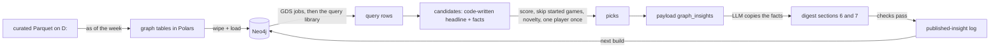

# Knowledge graph guide (Neo4j)

**What this is:** a plain-language guide to the project's knowledge graph: what Neo4j is, what our graph contains, how to look at it in Neo4j Browser, what each query in the library asks, and how its answers end up in the weekly digest. Built in P05; P08 added former teammates, style matchups, referee crews, the coaching tree and Graph Data Science.

**Graph Data Science** (PageRank on passing networks, nearest-neighbor player similarity, and a Neo4j Browser walkthrough you can repeat) has its own guide: [graph-data-science.md](graph-data-science.md).

**Related docs:** the design spec is [05 Knowledge graph](../05-knowledge-graph.md) (schema tables, the "As built in P05" section, findings). Decisions D58–D62 are in the [decisions log](../10-decisions-log.md). The W&B side is in the [W&B guide](weights-and-biases.md). How the LLM writes the two graph sections is in the [LLM writer guide](llm-digest-writer.md). Agents working on the code use the `neo4j-graph` skill (`.claude/skills/neo4j-graph/SKILL.md`).

---

## 1. Neo4j in two minutes

Neo4j is a **graph database**. Instead of tables with rows, it stores:

- **Nodes**: things. Each has a **label** that says what kind of thing it is (`Player`, `Team`, `Game`) and **properties** (`name: "Nick Bosa"`, `position: "DE"`).
- **Relationships**: arrows between two nodes. Each has a **type** that says how they're connected (`PLAYED_FOR`, `THREW_TO`) and properties of its own (`season: 2025`, `targets: 62`).

You ask questions in **Cypher**, a query language that draws the pattern you're looking for with ASCII art:

```cypher
MATCH (p:Player)-[:PLAYED_FOR]->(t:Team {team_id: 'SF'})
RETURN p.name
```

"Find every player who played for San Francisco." The parentheses are nodes, the arrow is a relationship.

**Why a graph at all?** Most of the project's questions are table questions, and DuckDB answers them. The graph is for questions that need **several hops**: "which players on this week's team used to play for this week's opponent" (player → old team → this game ← current team), "when this starter missed games before, who on his team took his snaps" (starter → games he missed → teammates who played them), "which receivers already have history with the backup QB" (backup QB → targets → receivers → current team). In SQL those need chains of self-joins. In Cypher they're one pattern. Design rule (doc 05): **a question belongs in the graph only if it needs relationships**.

## 2. How it runs here

| Thing | Value |
|---|---|
| Software | Neo4j 5.26 Community in Docker (container `nfl-neo4j`), with the APOC and Graph Data Science plugins (GDS is used from P08) |
| Where the data lives | `D:/nfl-ml-data/neo4j/data` (bind-mounted, so it's on the D: drive, not Docker's C: storage) |
| Ports | **7474** = Neo4j Browser (the web UI), **7687** = Bolt (what our Python code and the Browser use to talk to the database) |
| Start / stop | `docker compose up -d` / `docker compose stop neo4j` (from the repo root). `uv run nfl doctor` reports whether it's up |
| Login | user `neo4j`, password = `NEO4J_PASSWORD` from your env file (the code reads it from there; it's never written anywhere else) |

**The graph is rebuilt from scratch every run.** The source of truth is the curated Parquet on D:. `nfl graph build` (and the weekly `graph` step) deletes everything, applies the constraints and indexes, loads every node and relationship again, checks the counts, runs the query library and writes the results to `graph_results.json`. Measured: about **1.5 minutes** on the HDD for the whole thing. Because nothing is updated in place, the graph can never drift from the data.

**The graph is built "as of" a week.** A build for 2026 week 4 contains results only from games before week 4: week-4 games are there as nodes (so queries can find this week's opponent) but with no scores, no stats, no appearances. A *backtest* build for a past week contains only what a Tuesday run of that week could have seen (no injury report for that week yet, no depth chart published after Tuesday, PFR stats a week behind). That's what keeps the graph sections of backtest digests honest. The exact rule per data source is in [05 → As built in P05](../05-knowledge-graph.md#as-built-in-p05) and D58.

## 3. Opening it: what you'll see in Neo4j Browser

1. Make sure the container is up (`uv run nfl doctor` shows `neo4j OK`).
2. Open **http://localhost:7474** in a browser. You get a connect screen: Connect URL `neo4j://localhost:7687`, authentication "Username / Password", user `neo4j`, your `NEO4J_PASSWORD`.
3. After connecting you see three areas:
   - **Left sidebar (database icon at the top left):** the database's **node labels** (Player, Team, Game, ...), **relationship types** (PLAYED_FOR, THREW_TO, ...) and **property keys**, each as a clickable chip. Clicking a label chip runs a ready-made query that shows 25 nodes of that label.
   - **The editor bar at the top:** a one-line box with a `$` prompt where you type Cypher (or paste a query from §8) and press the run button or Ctrl+Enter. It grows when you paste multiple lines.
   - **Result frames below it:** every query you run adds a frame, newest on top. A frame has view buttons on its left edge: **Graph** (the picture), **Table** (rows), **Text** and **Code** (the raw response).

**The Graph view is a force-directed graph, and it's in the same place as everything else**, inside the result frame of the query you ran. There's no separate screen for it. Nodes are circles colored by label, relationships are arrows with their type written on them, and the layout settles on its own like springs. You can:
- drag nodes around;
- click a node or a relationship to see its properties (in the panel at the side or bottom of the frame);
- double-click a node to pull in its neighbors (expand), and right-click / use the small ring menu to hide it;
- click a label chip in the frame's legend to change that label's color, size and which property is used as its caption (for example show `name` on Player circles).

**Can you see all 588,000 relationships at once? No, and you wouldn't want to.** The Browser draws in your web page, so it caps what it renders: by default it draws the first **300 nodes** of a result and expands at most **100 neighbors** of a node (settings `initialNodeDisplay` and `maxNeighbours`, changeable with `:config`, for example `:config initialNodeDisplay: 1000`). Anything past that shows a "not all nodes are displayed" note, and a few thousand nodes already turns into an unreadable hairball that makes the page sluggish. The right way to look at a big graph is in slices:
- **The whole graph's shape** in one picture: `CALL db.schema.visualization()` draws one circle per label and one arrow per relationship type (about 10 circles and 15 arrows). That's the map of all 588k relationships.
- **The whole graph's size**: a count query (§8) returns the totals per label and type as a table.
- **A slice you care about**: one QB's passing network, one player's career, one game and everyone in it, one team's season of TeamWeek ratings. §8 has ready-made queries for each.

(Neo4j's other visual tool, Bloom, isn't part of the Community Docker image; Graph Data Science in P08 is how we'll summarize the whole network: centrality, similarity, communities.)

## 4. What's in the graph

A week-4 2026 build holds about **15.5k nodes and 588k relationships**, covering the 2018 season through the current week.

### Nodes

| Label | How many (2026 w4) | One node is | Key | Useful properties |
|---|---|---|---|---|
| `Player` | 7,079 | a player who appears in any relationship since 2018 | `player_id` (GSIS) | `name`, `position`, `position_group`, `college`, `rookie_season`, `draft_year`; QBs also `scramble_rate` and `dropbacks` (its sample) |
| `Team` | 32 | a franchise (relocations follow the franchise: OAK → LV) | `team_id` | `name`, `nickname`, `conference`, `division` |
| `Game` | 2,291 | a regular-season or playoff game, 2018 → this week | `game_id` | `season`, `week`, `game_type`, `kickoff`, `home_team`, `away_team`, scores (null for this week), `roof`, `surface`, `temp`, `wind`; this week's games also `home_qb_expected` / `away_qb_expected` and their `*_qb_source` |
| `TeamWeek` | 5,664 | one team's ratings as of one week | `key` ("KC:2026:4") | `off_epa`, `def_epa`, `net`, pass / rush splits, `elo`, `trend_delta`, `trend_dir`, `perf_vs_expected`, `prior_weight` (how much of the rating is still last season's prior: 1.0 in week 1, about 0.5 in week 4) |
| `GamePrediction` | 32 | the game model's prediction for a game (both variants) | `key` | `home_win_prob`, `expected_margin`, predicted points, `is_primary`, `confidence` |
| `Coach` | 86 | a head coach | `coach_id` (name slug) | `name` |
| `Official` | 294 | a game official | `official_id` | `name` |
| `Venue` | 44 | a stadium (international games resolved to the real stadium) | `stadium_id` | `name`, `roof`, `surface` |
| `PublishedInsight` | 3 after week 4 | a graph item a digest already published (novelty) | `key` | `insight_id`, `type`, `season`, `week`, `entities` |
| `UsageProfile` (P08) | ~1,850 | one WR / TE / RB season with enough volume (regular season, visible plays) | `key` (`<player_id>:<season>`) | `group`, `season`, `team_id`, `current` (this season), `games`, `targets`, `carries`, `rec_yds`, `scrimmage_yds`, `target_share`, `air_yards_share`, `adot`, `rz_share`, `snap_share`, `yards_per_team_att`, `carry_share`, `yards_per_team_play`, `yds_rank` (in its group and season), `vector` (z-scores, the GDS input) |
| `PlayerProjection` | one per player × game × target this week (0 right after a build, until the `player` step runs) | a player model projection for this week's game (P06) | `key` (`player_id\|game_id\|rec_yds-wrte\|model version`) | `target_label`, `p10`, `p50`, `p90`, `mean`, `baseline`, `outperformance`, `outperf_z`, `confidence`, `top_drivers`, `is_main` |

### Relationships

| Type | How many | Reads as | Properties |
|---|---|---|---|
| `(Player)-[:APPEARED_IN]->(Game)` | 209,733 | he played in that game | `team_id`, snaps (`off_snaps`, `def_snaps`, `st_snaps`, `snap_pct`), box score (`targets`, `rec`, `rec_yds`, `carries`, `rush_yds`, `pass_att`, `pass_yds`, TDs, INTs, `epa`), defense (`sacks`, `qb_hits`, `pressures`, `tackles`), QB `dropbacks` and `qb_started`, a few Next Gen Stats |
| `(Player)-[:DEPTH_CHART]->(Team)` | 253,704 | he was listed on that team's depth chart that week | `season`, `week`, `position` (slot), `rank` |
| `(Player)-[:ON_INJURY_REPORT]->(Game)` | 46,365 | he was on the injury report for that game | `status` (Out / Doubtful / Questionable / null), `practice_status`, `body_part` |
| `(Player)-[:PLAYED_FOR]->(Team)` | 27,292 | he was on that team's roster during a season | `season`, `first_week`, `last_week`, `roster_weeks` (the actual weeks), `status_last` (RES = on IR / reserve), `games` |
| `(Official)-[:OFFICIATED]->(Game)` | 16,154 | he worked that game | `role` (Referee, Umpire, ...) |
| `(Player)-[:THREW_TO]->(Player)` | 7,803 | a passer targeted a receiver | `season`, `targets`, `completions`, `yards`, `tds`, `epa`, `games_together` |
| `(Team)-[:PLAYED_IN]->(Game)` | 4,582 | the team played that game | `home`, `points`, `points_allowed`, `margin`, `result` (W/L/T), `epa_per_play`, `epa_allowed`, `epa_margin`, `success_rate`, `penalties`, `st_epa` (net special-teams EPA, above an average team) and `st_plays` |
| `(Coach)-[:COACHED_IN]->(Game)` | 4,582 | he was a head coach in that game | `team_id` |
| `(Team)-[:HAS_WEEK]->(TeamWeek)` | 5,664 | the team's rating for that week | |
| `(TeamWeek)-[:NEXT]->(TeamWeek)` | 5,632 | the same team's next week (a chain through time) | |
| `(Player)-[:DRAFTED_BY]->(Team)` | 3,601 | the team drafted him | `year`, `round`, `pick` |
| `(Game)-[:AT]->(Venue)` | 2,291 | where the game was played | |
| `(Player)-[:TRADED_TO]->(Team)` | 545 | he was traded to that team (draft-pick trades excluded) | `date`, `from_team` |
| `(Coach)-[:HEAD_COACH_OF]->(Team)` | 302 | head coach of the team that season | `season`, `games` |
| `(Game)-[:HAS_PREDICTION]->(GamePrediction)` | 32 | this week's predictions | |
| `(Player)-[:HAS_PROFILE]->(UsageProfile)` (P08) | ~1,850 | his usage in that season | |
| `(Coach)-[:COORDINATOR_OF]->(Team)` (P08) | 1,684 | coordinator that season (coaching seed from Wikipedia, D86) | `season`, `role` (OC / DC / ST) |
| `(Coach)-[:WORKED_UNDER]->(Coach)` (P08) | 771 | a coordinator and his head coach (coaching seed) | `seasons`, `teams`, `roles` |
| `(Player)-[:PASS_CENTRALITY]->(Team)` (P08, GDS) | ~500 (this season) | his place in the team's passing network this season | `pagerank`, `degree` (targets), `share`, `rank`, `role` (passer / receiver), `hub_id`, `out_this_week`, `share_this_week`, `rank_this_week` |
| `(Player)-[:SIMILAR_TO]->(Player)` (P08, GDS) | ~900 | his usage this season is close to the other player's in `other_season` | `season`, `other_season`, `other_team`, `group`, `score`, `rank` (1-3), `basis` |
| `(Player)-[:HAS_PROJECTION]->(PlayerProjection)` | one per projection | the player model projected him this week (P06) | |
| `(PlayerProjection)-[:FOR_GAME]->(Game)` | one per projection | the game the projection is for | |

**Player projections are written after the build**, by the weekly `player` step (`graph/projections.py`; idempotent, fail-soft). The build wipes everything first, so right after `nfl graph build` there are none until the step runs again. They aren't part of the build's count check. What the numbers mean is in the [player projections guide](player-projections.md).

The two big ones are `DEPTH_CHART` (one row per player per team per week per slot) and `APPEARED_IN` (one per player per game). They're also the slowest to load (about 22 seconds each).

**Added in P08 on existing relationships:** `APPEARED_IN.scrambles`, `air_yards`, `air_att` (a QB's scrambles and intended air yards per game, for Q7); `PLAYED_IN.pa_rate` and `pa_dropbacks` (FTN play-action share of the offense's charted dropbacks; FTN is about a week late, so a Tuesday graph has none for last week); `OFFICIATED` now also holds this week's crew in a live run when the data has it (it never does on a Tuesday: crews are published weeks after their games). `PASS_CENTRALITY` and `SIMILAR_TO` are written by the GDS jobs after the count check, so they aren't in it.

## 5. The query library: what each query asks

Each query is a `.cypher` file in `src/nflengine/graph/queries/`. They all take the season and week, run read-only, and return rows that already contain every number (the LLM never computes anything) plus an `insight_type`, a `strength` score from 0 to 1 used for ranking, and the `sample_size` behind the claim. Every query runs in **under a second** on the full graph (the requirement is 2 s). You can run any of them yourself: `uv run nfl graph query q2_injury_ripple --season 2026 --week 4`.

### Q1: Revenge game (player vs former team) → *Non-obvious insights*

**The question:** which players this week face a team they played for recently?

**The walk:**
```text
(player)-[:PLAYED_FOR {this season}]->(his team)-[:PLAYED_IN]->(this week's game)<-[:PLAYED_IN]-(opponent)
(player)-[:PLAYED_FOR {last 2 seasons}]->(opponent)
```
It keeps players with at least 4 games for the opponent in the last 2 seasons (or earlier this season, for a mid-season move), who are still on their team, who aren't ruled out this week, and who play real snaps (at least 50% on average this season). Two optional extra hops add a fact when they exist: `(player)-[:DRAFTED_BY]->(opponent)` and `(player)-[:TRADED_TO {from_team: opponent}]->(his team)`.

**Strength** grows with games played for the old team, current snap share, how recent the old stint was, and a draft or trade link.

**Real example (2026 week 4):** "Kaden Elliss (Saints LB) faces the Falcons, his former team. Kaden Elliss played 34 games for the Falcons in 2024 and 2025. This season Kaden Elliss has played 100% of the Saints' defensive snaps in the 3 games he played." The digest never invents a motive ("revenge", "wants to prove"): it states the connection.

### Q2: Injury ripple → *Matchup / risk to watch*

**The question:** a regular starter won't play this week. When he missed games before, what happened to the team, and who took over his work?

**The walk:**
```text
(starter)-[:ON_INJURY_REPORT {Out/Doubtful}]->(this week's game)        or he's on IR / missed last game
(starter)-[:PLAYED_FOR]->(team)-[:PLAYED_IN]->(past games)            the last 2 seasons, from his first start
(starter)-[:APPEARED_IN]->(past game)?                                 split: games he started vs games he missed
(teammate)-[:APPEARED_IN]->(those same games)                          whose usage jumped without him
```
- **"Won't play"** is said exactly as the data knows it: *listed Out / Doubtful for this week* (when the report exists, e.g. a Saturday run), *on a reserve list and missed the last game*, or *ruled out of the last game and didn't play* (a Tuesday, before the report).
- **"Regular starter":** at least 2 games this season with half the snaps or more, the latest within 3 weeks. Any position except QB (QB changes are Q3's).
- **With / without:** the team's regular-season games over the last 2 seasons while he was on the roster, counted from his first start in that window (games before he was a starter would be a backup's games, not missed starts). The team's offense EPA per play (or the defense's EPA allowed, for a defender) in games he started vs games he missed.
- **Who stepped in:** the teammate in the same position group with the biggest usage jump in those games (targets for WR/TE, carries + targets for RB, snap share otherwise). The depth chart's next man is added as information, because the chart format changed in 2025 and "rank + 1" isn't reliable at WR or CB.

**Strength** grows with his snap share, how much the team changed without him (weighted by how many such games there are) and, for skill players, how big the teammate's jump was. A team that did **better** without him counts at 40%: that's a curiosity, not a risk, so a "worse without him" story usually takes the Matchup / risk slot.

**Real examples (2026 week 4 candidates):** "Nick Bosa (49ers DE) is listed out for this week (knee). In 18 games without Nick Bosa since the start of the 2024 season, the 49ers defense allowed +0.11 EPA per play, against -0.03 EPA per play in 16 games he started: worse without him." And "DeVonta Smith (Eagles WR) is listed out ... about the same either way. Johnny Wilson had 2.7 targets per game in 3 games without DeVonta Smith, against 0.5 targets per game in 13 games with him." The words "worse / better without him" are written by code from the numbers, so the LLM never has to interpret a sign (for a defense, more EPA allowed is worse).

### Q3: QB change → *Matchup / risk to watch*

**The question:** is a different QB expected to start than the one who usually has, and which receivers already have history with him?

**The walk:**
```text
(this week's game).home_qb_expected / away_qb_expected  -> (expected QB)
(main starter)-[:APPEARED_IN {qb_started}]->(this season's games)   most starts this season
(receivers on the team now)<-[:THREW_TO {this season}]-(main starter)
(receivers on the team now)<-[:THREW_TO {any season}]-(expected QB)
(main starter)-[:ON_INJURY_REPORT]->(this week's game)              the reason, when the report has it
```
The expected QB is the same one the game model used. A live run gets him from the schedule, the depth chart or the injury report; a Tuesday has only "who started the last game". So the item says how sure it is: **confirmed** ("Jalon Daniels is expected to start at QB for the Buccaneers this week; Baker Mayfield is listed out for this week (thumb).") or **not yet confirmed** ("Kirk Cousins could start at QB for the Falcons this week (he started their last game), but it isn't confirmed yet."; ranked lower). The second form exists because a fact-check of a 2025 backtest caught the first form being wrong after a one-game fill-in.

**Facts:** the main starter's starts this season, the new QB's starts (this season and since 2018, or "never started an NFL game"), and the top receivers' targets from each QB ("Emeka Egbuka has 20 targets from Baker Mayfield this season; he has none from Jalon Daniels"). A low-confidence note says what is uncertain: the new QB's thin history with these receivers, not the start itself.

**In the digest:** every QB change is flagged in the game table's QBs column (⚠ plus a one-line note under the table), so for the *Matchup / risk* prose slot a QB change counts at 80% of its strength and a strong non-QB story usually wins it (D63).

### Q4: Common opponents → *Non-obvious insights*

**The question:** this week's two teams both already played some other team this season. How did each do against it?

**The walk:**
```text
(team A)-[:PLAYED_IN]->(this week's game)<-[:PLAYED_IN]-(team B)
(team A)-[:PLAYED_IN]->(earlier game)<-[:PLAYED_IN]-(team C)<-[:PLAYED_IN]-...-(team B)
(this week's game)-[:HAS_PREDICTION]->(the game model's prediction)
```
For every shared opponent C it compares A's and B's point margins (and EPA margins) against C, averages across shared opponents, and checks whether that edge points the other way from the game model's favorite (which makes it more interesting).

**Real example (2026 week 4):** "The Buccaneers and the Packers have both already played the Vikings this season. The Buccaneers lost to the Vikings by 7 in week 3; the Packers lost to the Vikings by 17 in week 1. Against those common opponents, the Buccaneers have been 10.0 points per game better than the Packers on average. The game model still favors the Packers." Always low confidence: it's a handful of games.

### Q8: Trend mismatch → *Non-obvious insights* (or *Matchup / risk* when nothing else qualifies)

**The question:** is a team trending up meeting a team trending down?

**The walk:**
```text
(team)-[:HAS_WEEK]->(this week's TeamWeek)<-[:NEXT*3]-(the TeamWeek 3 weeks earlier)
```
This uses the `NEXT` chain to walk back three weeks through each team's ratings. The change is this week's net rating minus the one three weeks earlier (the same number as the P02 trend), and "up" / "down" is P02's band call. Needs week 4 or later.

**Real example (2026 week 4):** "The Panthers are trending up and the Lions are trending down going into this game. The Panthers' net rating is up 0.04 EPA per play over the last 3 weeks; the Lions' net rating is down 0.05 EPA per play over the last 3 weeks. Descriptive: trends don't predict the next game on their own." (P02 showed trends add nothing beyond the rating, D47, so this is always framed as descriptive.)

### Q5: Head coach vs a former team → *Non-obvious insights*

**The question:** is this week's head coach facing a team he used to coach?

**The walk:**
```text
(coach)-[:COACHED_IN]->(this week's game)<-[:PLAYED_IN]-(opponent)
(coach)-[:HEAD_COACH_OF {earlier season}]->(opponent)
(coach)-[:COACHED_IN {team_id: opponent}]->(old games)<-[:PLAYED_IN]-(opponent)   his record with them
```
It returns his seasons there and his regular-season and playoff record with them (from 2018, the graph's first season: a stint that started earlier says "from 2018 on"), and whether this is the first meeting since he left. Strength grows with recency and tenure. Rare (most weeks have none); found in past weeks: Sean Payton vs the Saints (2024 week 7), Mike Vrabel vs the Titans (2025 week 7), Doug Pederson vs the Eagles, Dan Quinn vs the Falcons.

### Q11: Unit mismatch → *Non-obvious insights* (or *More from the graph*)

**The question:** in which games does one team's offense unit meet a defense unit at the opposite end of the league?

**The walk:** each week-4 `Game` → both teams' `TeamWeek` for this week → the four unit matchups (each team's pass offense against the other's pass defense, and the same for the run). A game qualifies when one unit is in the league's top 8 and the other in the bottom 8; the game's single most extreme matchup is kept, with both units' league ranks and ratings (relative to the league average; a defense's number is EPA allowed, so lower is better).

**Real example (2026 week 4):** "The Chargers' run offense, 7th-worst in the league (-0.05 EPA per rush), meets the Seahawks' run defense, the league's strongest (-0.11 EPA per rush allowed)." Early in the season the ratings still lean on last season (`prior_weight` above 0.4), so the item is marked low confidence and stays in *More from the graph* rather than the prose. This is a team-unit story, not a player one: *Players to watch* covers individual players against weak defenses.

### Q12: Special-teams edge → *Non-obvious insights* (or *More from the graph*)

**The question:** which games pit a strong special-teams unit against a weak one?

**How special-teams EPA is counted** (`PLAYED_IN.st_epa`): every kickoff, punt, field goal and extra point, from each team's side (nflverse gives the EPA to `posteam`, which is the *receiving* team on a kickoff and the kicking team otherwise), first centered on the league average for that season and play type (a kickoff is worth about +0.25 EPA to the receiver since the 2024 rule change, so raw numbers would punish teams that kick off a lot). So `st_epa` is "points of expected value above an average team", and the two sides of a game always sum to zero. It counts both sides: a team's number goes up when the opponent misses a field goal against it.

**The walk:** both teams' `PLAYED_IN.st_epa` over their games this season before this week (at least 3 each); the gap, shrunk toward zero for small samples, must be at least 2 EPA per game.

**Real example (2026 week 4):** "The Vikings have gained 3.5 EPA per game on special teams this season; the Dolphins have lost 3.5 EPA per game." Season totals look right: 2025's best were SEA, SF and HOU, the worst NO, ARI and LV. Low confidence under 6 games.

### Q6: Former teammates on opposite sides → *Non-obvious insights* (P08)

**The question:** does this week's expected starting QB face a receiver he used to throw to?

**The walk:**
```text
(this week's game).home_qb_expected / away_qb_expected -> (QB)
(QB)-[:THREW_TO {any earlier season, or this season with another team}]->(receiver)
(receiver)-[:PLAYED_FOR {this season}]->(the opponent)
```
It sums their history (targets, catches, yards, TDs, seasons and the team it was for), needs at least 40 targets, and keeps receivers still on the opponent (not on a reserve list, not ruled out) who have played for it this season; his target share there is his role now. **Strength** grows with the history, how recent it is, and his role.

**Real example (golden test, 2024 week 14):** "Kirk Cousins (Falcons QB) faces Justin Jefferson (Vikings WR), a receiver he used to throw to. Kirk Cousins targeted Justin Jefferson 600+ times for the Vikings in 2020, 2021, 2022 and 2023 ..." Others found: Josh Allen vs Stefon Diggs (2025 week 5), Geno Smith vs Tyler Lockett (2025 week 6), Trevor Lawrence vs Christian Kirk (2025 week 10: 290 targets, 2,392 yards).

### Q7: Style matchups → *Non-obvious insights* (P08)

**The question:** this week's QB (or offense) has a style at the league's top end. How has his opponent's defense done against that style, compared with other opponents and with every defense?

Three styles, two queries:
- `q7_style_matchup`, QB styles from `APPEARED_IN` per game: **scrambling** (scrambles per dropback) and **deep passing** (intended air yards per pass attempt). The QB is rated over this season and last (≥ 150 dropbacks).
- `q7_play_action` (its own type, `play_action`), team style from FTN: play-action share of dropbacks this season (≥ 3 charted games).

**The cut** is the league's 75th percentile over the three completed seasons before this one (as of the week). **The comparison:** the defense's EPA per play allowed in its games since two seasons ago against offenses with that style (that season) vs against the rest, minus the same split for all defenses: `gap > 0` means it did worse than usual against that style. Needs ≥ 4 games against the style, ≥ 8 others and a gap of at least 0.05.

**Real example (2025 week 10):** "Jayden Daniels (Commanders QB) is one of the league's most frequent scramblers, and the Lions defense has fared worse than usual against scrambling QBs in recent seasons. Jayden Daniels has scrambled on 12.7% of his dropbacks this season and last (946 dropbacks); the quarter of QBs who scramble most do so on 6.8% or more. Since the start of the 2023 season the Lions defense allowed +0.10 EPA per play in 15 games against scrambling QBs, against -0.09 EPA per play in 31 games against other QBs. Over the same span all defenses allowed +0.04 EPA per play against scrambling QBs and -0.02 EPA per play against other QBs." Always worded as descriptive: opponents differ in many other ways.

### Q9: Officiating crew → *Non-obvious insights* (P08; quiet for now)

**The question:** does this week's referee's crew call more (or fewer) penalties than average, or lean on home or visiting teams?

**The walk:** `(Official)-[:OFFICIATED {role: Referee}]->(this week's game)`, then his games over this season and the 2 before: penalties and penalty yards per game (both teams) and the home-minus-away penalty split (neutral sites left out), against the league over the same span. It fires only on a clear gap (1.5 penalties per game, or a split 1 penalty away from the league's) over at least 10 games, and its strength stays at 0.5 or below (penalties are noisy).

**Why it's quiet:** nflverse publishes a game's crew after the game, weeks late (on 2026-10-04 the officials table had 2026 week 1 only). A Tuesday run never knows this week's referee, so the query returns nothing until a week's crews are in the data (a live run would use them; a backtest never does, by rule). The integration test checks it by adding a real crew (Alex Kemp for Falcons at Vikings, 2024 week 14) the way a run that had it would see it.

### Q5b: Coaching tree → *Non-obvious insights* (P08; coaching seed from Wikipedia, D86)

Head-coach reunions (above) come from the schedules. Coordinators and coaching trees come from **`config/coaching_seed.csv`**, one row per coach, team, season and role (`coach,team,season,role,head_coach`; the template with comments is `config/coaching_seed.example.csv`). OC / DC / ST rows become `COORDINATOR_OF`; every row becomes `WORKED_UNDER` the team's head coach that season (from the schedules, or the `head_coach` column for seasons before 2018). With no file, nothing is loaded and the query returns nothing.

**Where the file comes from (D86).** `uv run nfl graph coaching-seed` builds it from English Wikipedia:

- seasons up to last season: each team-season article ("2021 Los Angeles Rams season") and its `{{NFL final staff}}` template, one line per job ("* Offensive coordinator – [[Name]]"); older articles without one fall back to the infobox (`coach`, `off_coach`, `def_coach`);
- the current season: the team's staff template ("Template:Kansas City Chiefs staff"), since a season article gets its final staff only after the season.

It reads pages through the MediaWiki API with a descriptive user agent, about one request a second, and caches them under `D:/nfl-ml-data/cache/http/wikipedia_staff/` (704 pages for 32 teams × 2006–2026; about 12 minutes the first time, seconds from the cache). `--refresh` re-fetches only the current season's staff pages, so run `uv run nfl graph coaching-seed --refresh` each preseason and after a mid-season coordinator change. Options: `--first` (default 2006), `--last` (default `seasons.current`), `--out`.

What it keeps: **offensive, defensive and special teams coordinators** (co-coordinators count; assistant coordinators and position coaches don't: each row is also a `WORKED_UNDER` edge to that season's head coach, and with every assistant in the file almost any two head coaches would share a mentor). Notes in a staff line are dropped ("Ken Dorsey; fired after Week 10" → Ken Dorsey). The command prints a **name check**: a seed name that looks like an nflverse head coach's but slugs differently would split one coach into two nodes. Known fixes live in `NAME_FIXES` in `graph/coaching_seed.py` (Richard → Rich Bisaccia); "Jim Johnson" (the Eagles' DC) vs "Jimmy Johnson" is a real difference and stays. The current file: **1,684 rows, 411 coaches, 615 team-seasons** (550 staff templates, 65 infoboxes, 57 pages with no coordinators, mostly 2006–2010 articles), spot-checked against 20 well-known staffs (Spagnuolo KC 2019, Saleh SF 2019, Morris LA 2021, ...). Fix a wrong row by editing the CSV; a rebuild overwrites hand edits, so put lasting fixes in `NAME_FIXES` or the parser.

**Two patterns:** a coordinator this season facing the head coach he used to work under, and two head coaches 1-2 `WORKED_UNDER` hops apart (`shortestPath((h1)-[:WORKED_UNDER*1..2]-(h2))`: one worked under the other, both worked under the same mentor, or one coach worked under both). Tested with a seed made for the test: for Falcons at Vikings (2024 week 14), Kevin O'Connell and Raheem Morris both worked under Sean McVay with the Rams.

**What it finds with the real seed** (live week-4 graph, 2026-10-04): 1,684 `COORDINATOR_OF` and 771 `WORKED_UNDER` edges; about 3–9 linked games a week in 2024–2025 (93 and 76 rows over the two seasons, about a quarter of them coordinator vs old boss; slightly high, since that graph also holds later seasons' edges) and 12 rows in 2026 weeks 1–4. Real rows:

| Week | Kind | Row |
|---|---|---|
| 2026 w4 | head_coach_tree | Ben Johnson (Bears) and Aaron Glenn (Jets): both coordinators under Dan Campbell in Detroit (2022–2024, 2021–2024); strength 0.70 |
| 2026 w1 | coordinator_vs_boss | Raheem Morris, the 49ers' DC, faces Sean McVay, whom he worked under with the Rams (2021–2023); 0.736 |
| 2026 w1 | head_coach_tree | Kevin O'Connell (Vikings) and Matt LaFleur (Packers): both OCs under McVay (2020–2021, 2017); 0.597 |
| 2026 w1 | head_coach_tree | John Harbaugh (Giants) and Brian Schottenheimer (Cowboys) through Rex Ryan (Harbaugh's DC in 2008, Schottenheimer's boss with the Jets 2009–2010); 0.515 |

The week-4 row became a candidate (83 instead of 82) and wasn't picked over the stronger items; the published week-4 digest didn't change.

**A bug found while building it:** the first build loaded only 406 `WORKED_UNDER` edges. A blank `head_coach` written as `""` was read as a coach named "", which beat the schedules' head coach, so every 2018+ row lost its boss. The reader now treats blanks as null (`graph/tables_extra.py`), the writer leaves them empty, and a test seed row uses `""`.

Try it in Neo4j Browser:

```cypher
// who worked under Andy Reid, and when
MATCH (c:Coach)-[w:WORKED_UNDER]->(:Coach {coach_id: 'andy-reid'})
RETURN c.name, w.seasons, w.teams, w.roles ORDER BY w.seasons[0];

// this season's coordinators of one team
MATCH (c:Coach)-[r:COORDINATOR_OF {season: 2026}]->(:Team {team_id: 'DET'})
RETURN c.name, r.role;
```

### Q10: Graph Data Science stories → *Non-obvious insights* (P08)

Two queries read what the GDS jobs wrote (how they work: [graph-data-science.md](graph-data-science.md)):
- **`q10_network_hub`:** a pass catcher in his team's top 3 by PageRank share of this season's passing network (≥ 15%) won't play this week; who leads the network without him (PageRank re-run on this week's network). "Justin Jefferson (Vikings WR), the center of the Vikings' passing network, is on a reserve list and missed the team's last game ... T.J. Hockenson leads that network" (2023 week 7).
- **`q10_usage_comp`:** a player with a real role whose usage this season is closest (KNN) to another player's top-10 season. "Puka Nacua (Rams WR), in his first two seasons, is being used much like Stefon Diggs was in 2020, the most productive season by a WR that year." Always a comparison, never a projection; one story per player (novelty doesn't let a new match repeat it within 3 weeks).

### Q0: Starters out (data, not an insight)

The same "won't play" rules as Q2 (listed Out / Doubtful this week, on a reserve list, or missed the last game before the report is out), for every regular starter including QBs, with no history needed. It feeds the digest's code-written **Starters out this week** list (up to 3 per team, QBs first).

## 6. From query rows to the digest



1. **Candidates.** Every query row becomes a digest item whose words are written by code (`src/nflengine/graph/insights.py`): a headline without numbers, then facts that are complete, time-scoped sentences with their numbers, each tagged with the team or player that owns those numbers. A typical week has 40–70 candidates.
2. **Picks.** Ranked by strength (+0.1 for a followed team), skipping games that have already kicked off (a live digest also skips games starting within 90 minutes, because the LLM can take a while), skipping anything published in the last 3 weeks, and using each player at most once. One item for *Matchup / risk to watch* (an injury ripple, or a QB change at 80% weight), one or two for *Non-obvious insights* (revenge, common opponents, trend mismatch, coach vs former team, unit mismatch, special teams, and from P08 former teammates, style matchups, play action, referee crews, the coaching tree and the two GDS stories), from different games. The P08 types use the same strength scale; most land between 0.4 and 0.8, so the strongest P05 stories (0.8-1.0) still usually win, and the new ones show up when they're strong (former teammates often make *More from the graph*).
3. **More from the graph.** The strong stories that didn't fit the prose (strength ≥ 0.7, no QB changes, at most 2 of a kind and 2 per game, 6 in all) are listed by code after the Non-obvious prose, one line each (each item's `brief`). Before this list, 6–14 strong stories a week were simply dropped.
4. **Novelty survives the weekly wipe** because what was published is kept in `runs/published_insights.parquet` on D: and reloaded as `PublishedInsight` nodes on every build. Proof from the 2025 weeks 5–9 backtests: nothing repeated within 3 weeks, and the filter held back James Conner's injury ripple in week 6, the Barkley vs Giants rematch in week 8 and Joe Flacco's start in weeks 8–9.
5. **The LLM** (GLM via OpenRouter) writes the two sections from the picked items only, copying the fact texts. The digest's automated checks verify every number came from the payload and is attached to its owner. An independent fact-check of the first GLM digests recomputed every graph number from the raw data: all correct.

## 7. What it looks like in the digest

The digest is a Markdown file (`D:/nfl-ml-data/reports/<season>/week<NN>-digest.md`, also saved inside the W&B `digest` artifact). **There is no chart or picture of the graph in it.** "Graph" here means the network of connections in Neo4j, not a plot. What you get is two short text sections near the end, each starting with the game they're about. The 2026 week-4 digest:

> ## Matchup / risk to watch
>
> Packers at Buccaneers: Jalon Daniels is expected to start at QB for the Buccaneers this week; Baker Mayfield is listed out for this week (thumb). Baker Mayfield started 3 of the Buccaneers' 3 games this season; Jalon Daniels hasn't started a game for the Buccaneers this season; he has never started an NFL game. Emeka Egbuka has 20 targets from Baker Mayfield this season; he has none from Jalon Daniels. The low-confidence part is the receivers' history with Daniels: a small sample — Jalon Daniels has 2 career targets to the Buccaneers' current receivers, so their history together says little.
>
> ## Non-obvious insights
>
> Kaden Elliss (Saints LB) faces the Falcons, his former team, in Falcons at Saints: Kaden Elliss played 34 games for the Falcons in 2024 and 2025, and this season Kaden Elliss has played 100% of the Saints' defensive snaps in the 3 games he played. In Lions at Panthers, the Panthers are trending up and the Lions are trending down going into this game: ...

Since D63 the graph also feeds three code-written parts (no LLM involved):
- the game table's **QBs (away / home)** column, with ⚠ and a note under the table for every QB change ("Jalon Daniels starts in place of Baker Mayfield (out: thumb)");
- **Starters out this week** under the table (Q0);
- **More from the graph** after the Non-obvious prose: up to 6 one-line stories, for example "**Browns at Patriots**: The Patriots' run offense, 2nd-worst in the league (-0.09 EPA per rush), meets the Browns' run defense, 3rd-strongest (-0.05 EPA per rush allowed)."

The footer adds a line such as `Knowledge graph: rebuilt for this run (Neo4j); 3 insights used`. If Neo4j is down when the digest runs, the two sections are left out, a banner at the top says why ("Graph sections skipped this week: the knowledge graph couldn't be rebuilt (ServiceUnavailable: Neo4j unreachable)"), and the footer says `unavailable`. The rest of the digest is unaffected.

The **pictures** of the graph's work are in W&B (each build is a `track1-graph` run: a load-time curve, a bar chart of node and relationship counts, a bar chart of query times, tables of all candidates and the picks, and a `graph-results` artifact with the full `graph_results.json`). See the [W&B guide](weights-and-biases.md).

## 8. Queries to try in Neo4j Browser

Paste one into the editor bar and run it. Switch the frame between Graph and Table to see both.

```cypher
// 1. The map of the whole graph (one circle per label, one arrow per relationship type)
CALL db.schema.visualization()
```

```cypher
// 2. How big is everything (Table view)
MATCH (n) RETURN labels(n)[0] AS label, count(*) AS nodes ORDER BY nodes DESC
```
```cypher
MATCH ()-[r]->() RETURN type(r) AS type, count(*) AS relationships ORDER BY relationships DESC
```

```cypher
// 3. A QB's passing network in 2025 (thicker = more targets in the Table view)
MATCH (q:Player {name: 'Patrick Mahomes'})-[t:THREW_TO {season: 2025}]->(r:Player)
RETURN q, t, r
```

```cypher
// 4. A player's career path across teams
MATCH (p:Player {name: 'Saquon Barkley'})-[r:PLAYED_FOR]->(t:Team)
RETURN p, r, t
```

```cypher
// 5. This week's revenge connections, drawn (who faces a former team)
MATCH (g:Game {season: 2026, week: 4})<-[:PLAYED_IN]-(t:Team),
      (g)<-[:PLAYED_IN]-(opp:Team),
      (p:Player)-[:PLAYED_FOR {season: 2026}]->(t),
      (p)-[old:PLAYED_FOR]->(opp)
WHERE opp <> t AND old.season >= 2024 AND old.games >= 4
RETURN p, t, opp, g LIMIT 50
```

```cypher
// 6. An injury ripple by hand: Nick Bosa's 2025-26 games with and without him
MATCH (s:Player {name: 'Nick Bosa'})-[:PLAYED_FOR]->(t:Team {team_id: 'SF'})-[pi:PLAYED_IN]->(g:Game)
WHERE g.season >= 2024 AND g.completed AND g.game_type = 'REG'
OPTIONAL MATCH (s)-[a:APPEARED_IN]->(g)
RETURN g.season, g.week, a IS NOT NULL AS played, pi.epa_allowed ORDER BY g.season, g.week
```

```cypher
// 7. One team's rating through the season, walking the NEXT chain
MATCH (t:Team {team_id: 'DET'})-[:HAS_WEEK]->(tw:TeamWeek {season: 2026})
RETURN tw.week, round(tw.net, 3) AS net, tw.trend_dir ORDER BY tw.week
```

```cypher
// 8. Everything around one game (teams, coaches, officials, venue, prediction)
MATCH (g:Game {game_id: '2026_04_GB_TB'})-[r]-(x) RETURN g, r, x
```

```cypher
// 9. What the digest has already published (novelty)
MATCH (pi:PublishedInsight) RETURN pi.season, pi.week, pi.type, pi.insight_id
ORDER BY pi.season DESC, pi.week DESC
```

```cypher
// 10. A team's projections this week, main stats first (Table view)
MATCH (p:Player)-[:HAS_PROJECTION]->(pp:PlayerProjection {season: 2026, week: 5})
WHERE pp.team = 'LA'
RETURN p.name, pp.target_label, round(pp.p50, 1) AS projection, pp.p10, pp.p90,
       round(pp.baseline, 1) AS baseline, pp.confidence, pp.top_drivers[0] AS driver
ORDER BY pp.is_main DESC, pp.outperf_z DESC
```

```cypher
// 11. One player's projection next to his last 4 games (receiving yards)
MATCH (p:Player {name: 'Puka Nacua'})-[:HAS_PROJECTION]->(pp:PlayerProjection {season: 2026, week: 5, target: 'rec_yds'})-[:FOR_GAME]->(next:Game)
MATCH (p)-[a:APPEARED_IN]->(g:Game) WHERE g.completed
WITH p, pp, next, g, a ORDER BY g.season DESC, g.week DESC
RETURN p.name, next.game_id, pp.p50, pp.p10, pp.p90, pp.baseline,
       collect(a.rec_yds)[0..4] AS last_4_games
```

```cypher
// 12. Constraints and indexes (or run :schema)
SHOW CONSTRAINTS
```

Tip: in the Graph view, click the `Player` chip in the frame's legend and set its caption to `name`, so circles show names instead of ids.

## 9. Commands and files

| What | Command / path |
|---|---|
| Rebuild for a week (live, as of now) | `uv run nfl graph build --season 2026 --week N` |
| Rebuild as a past week's Tuesday saw it | `uv run nfl graph build --season 2025 --week 8 --backtest` |
| Run one query against the current graph | `uv run nfl graph query q1_revenge --season 2026 --week N` |
| Inside the weekly run | `uv run nfl weekly run ...` (the `graph` step between `game` and `digest`; fail-soft) |
| A digest's graph sections | `uv run nfl digest ... --graph auto\|build\|read\|off` |
| The build's full record | `D:/nfl-ml-data/runs/<season>/week<NN>/graph_results.json` (counts, timings, every query's rows, all candidates, the picks); backtests under `runs/digest-backtests/` |
| What was published | `D:/nfl-ml-data/runs/published_insights.parquet` (backtests keep their own) |
| Tests | `uv run pytest tests/graph` (no Neo4j); `uv run pytest -m integration tests/graph/test_graph_integration.py` (~15 min, rebuilds the graph for four past "golden" weeks: Saquon Barkley vs the Giants 2024 w7, Justin Jefferson on IR 2023 w7 (also the GDS hub and Puka Nacua's usage comparison), Jake Browning for Joe Burrow 2023 w13, Kirk Cousins vs Justin Jefferson 2024 w14 (also Q7, Q9, the coaching tree and GDS fail-soft)) |
| Code | `src/nflengine/graph/` (`tables.py`, `tables_extra.py`, `load.py`, `schema.cypher`, `queries/`, `insights.py`, `insights_extra.py`, `insights_advanced.py`, `gds.py`, `published.py`, `build.py`, `projections.py`), `src/nflengine/digest/graph_sections.py` |
| Head-coach fixes (P10) | `config/head_coach_fixes.csv`: hand-checked corrections to nflverse's head coaches (`season, team, from_week, coach, source`), applied when the graph loads the games (`graph/tables_extra.apply_coach_fixes`, D92). nflverse carried last season's coach into 2026 for ATL / ARI / BUF and misspelt LV's; add a row when a coach changes mid-season; tests `tests/graph/test_coach_fixes.py` |
| Coaching seed | `config/coaching_seed.csv` (built by `uv run nfl graph coaching-seed [--refresh]` from Wikipedia, D86; template `config/coaching_seed.example.csv`; page cache `D:/nfl-ml-data/cache/http/wikipedia_staff/`); tests `uv run pytest tests/graph/test_coaching_seed.py` |
| Player projections | written by the weekly `player` step after the build (`nfl weekly run`); tests `uv run pytest tests/graph/test_projections.py` |

## 10. Limits and what comes next

- **Strength scores are hand-set heuristics**, tuned by reading real weeks, not learned. They rank items within a week; they're not probabilities.
- **Samples are small.** A starter usually missed only a few games; a QB change usually has little shared history. The items say so (`confidence: low` plus a note on what's uncertain), and the LLM is told to keep that wording.
- **"As of Tuesday" is conservative.** A Tuesday backtest can't see this week's injury report, so its QB changes are always "not confirmed yet". The Saturday injury update (P07) is where these sections get sharper.
- **Q1 looks back 2 seasons**, so "played 17 games for the Seahawks in 2023" is exact but isn't his whole career with them.
- **P06** recomputes Q2 and Q3 in Polars as player-model features (vacated targets, history with the new QB), so every past week has them, and fills `PlayerProjection` nodes every week. **P08** added Graph Data Science (passing-network centrality, player similarity) and queries Q5 (coaching tree), Q6, Q7 and Q9.
- **Q9 waits for data:** referee crews arrive weeks after their games, so no Tuesday digest can use them. Community detection on the coaching / movement graph (doc 05) is still for later.
- **The coaching seed is only as good as Wikipedia** and covers coordinators only: a mid-season change lists both coaches for that season, 57 older team-season pages have no coordinators, and the current season needs a `--refresh` when a staff changes.
