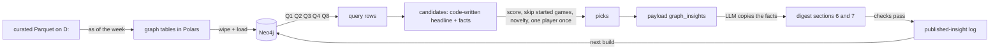

# Knowledge graph guide (Neo4j)

**What this is:** a plain-language guide to the project's knowledge graph: what Neo4j is, what our graph contains, how to look at it in Neo4j Browser, what each query in the library asks, and how its answers end up in the weekly digest. Built in P05.

**Related docs:** the design spec is [05 Knowledge graph](../05-knowledge-graph.md) (schema tables, the "As built in P05" section, findings). Decisions D58–D62 are in the [decisions log](../10-decisions-log.md). The W&B side is in the [W&B guide](weights-and-biases.md). How the LLM writes the two graph sections is in the [LLM writer guide](llm-digest-writer.md). Agents working on the code use the `neo4j-graph` skill (`.claude/skills/neo4j-graph/SKILL.md`).

---

## 1. Neo4j in two minutes

Neo4j is a **graph database**. Instead of tables with rows, it stores:

- **Nodes**: things. Each has a **label** that says what kind of thing it is (`Player`, `Team`, `Game`) and **properties** (`name: "Nick Bosa"`, `position: "DE"`).
- **Relationships**: arrows between two nodes. Each has a **type** that says how they're connected (`PLAYED_FOR`, `THREW_TO`) and properties of its own (`season: 2025`, `targets: 62`).

You ask questions in **Cypher**, a query language that draws the pattern you're looking for with ASCII art:

```cypher
MATCH (p:Player)-[:PLAYED_FOR]->(t:Team {team_id: 'SF'})
RETURN p.name
```

"Find every player who played for San Francisco." The parentheses are nodes, the arrow is a relationship.

**Why a graph at all?** Most of the project's questions are table questions, and DuckDB answers them. The graph is for questions that need **several hops**: "which players on this week's team used to play for this week's opponent" (player → old team → this game ← current team), "when this starter missed games before, who on his team took his snaps" (starter → games he missed → teammates who played them), "which receivers already have history with the backup QB" (backup QB → targets → receivers → current team). In SQL those need chains of self-joins. In Cypher they're one pattern. Design rule (doc 05): **a question belongs in the graph only if it needs relationships**.

## 2. How it runs here

| Thing | Value |
|---|---|
| Software | Neo4j 5.26 Community in Docker (container `nfl-neo4j`), with the APOC and Graph Data Science plugins (GDS is used from P08) |
| Where the data lives | `D:/nfl-ml-data/neo4j/data` (bind-mounted, so it's on the D: drive, not Docker's C: storage) |
| Ports | **7474** = Neo4j Browser (the web UI), **7687** = Bolt (what our Python code and the Browser use to talk to the database) |
| Start / stop | `docker compose up -d` / `docker compose stop neo4j` (from the repo root). `uv run nfl doctor` reports whether it's up |
| Login | user `neo4j`, password = `NEO4J_PASSWORD` from your env file (the code reads it from there; it's never written anywhere else) |

**The graph is rebuilt from scratch every run.** The source of truth is the curated Parquet on D:. `nfl graph build` (and the weekly `graph` step) deletes everything, applies the constraints and indexes, loads every node and relationship again, checks the counts, runs the query library and writes the results to `graph_results.json`. Measured: about **1.5 minutes** on the HDD for the whole thing. Because nothing is updated in place, the graph can never drift from the data.

**The graph is built "as of" a week.** A build for 2026 week 4 contains results only from games before week 4: week-4 games are there as nodes (so queries can find this week's opponent) but with no scores, no stats, no appearances. A *backtest* build for a past week contains only what a Tuesday run of that week could have seen (no injury report for that week yet, no depth chart published after Tuesday, PFR stats a week behind). That's what keeps the graph sections of backtest digests honest. The exact rule per data source is in [05 → As built in P05](../05-knowledge-graph.md#as-built-in-p05) and D58.

## 3. Opening it: what you'll see in Neo4j Browser

1. Make sure the container is up (`uv run nfl doctor` shows `neo4j OK`).
2. Open **http://localhost:7474** in a browser. You get a connect screen: Connect URL `neo4j://localhost:7687`, authentication "Username / Password", user `neo4j`, your `NEO4J_PASSWORD`.
3. After connecting you see three areas:
   - **Left sidebar (database icon at the top left):** the database's **node labels** (Player, Team, Game, ...), **relationship types** (PLAYED_FOR, THREW_TO, ...) and **property keys**, each as a clickable chip. Clicking a label chip runs a ready-made query that shows 25 nodes of that label.
   - **The editor bar at the top:** a one-line box with a `$` prompt where you type Cypher (or paste a query from §8) and press the run button or Ctrl+Enter. It grows when you paste multiple lines.
   - **Result frames below it:** every query you run adds a frame, newest on top. A frame has view buttons on its left edge: **Graph** (the picture), **Table** (rows), **Text** and **Code** (the raw response).

**The Graph view is a force-directed graph, and it's in the same place as everything else**, inside the result frame of the query you ran. There's no separate screen for it. Nodes are circles colored by label, relationships are arrows with their type written on them, and the layout settles on its own like springs. You can:
- drag nodes around;
- click a node or a relationship to see its properties (in the panel at the side or bottom of the frame);
- double-click a node to pull in its neighbors (expand), and right-click / use the small ring menu to hide it;
- click a label chip in the frame's legend to change that label's color, size and which property is used as its caption (for example show `name` on Player circles).

**Can you see all 588,000 relationships at once? No, and you wouldn't want to.** The Browser draws in your web page, so it caps what it renders: by default it draws the first **300 nodes** of a result and expands at most **100 neighbors** of a node (settings `initialNodeDisplay` and `maxNeighbours`, changeable with `:config`, for example `:config initialNodeDisplay: 1000`). Anything past that shows a "not all nodes are displayed" note, and a few thousand nodes already turns into an unreadable hairball that makes the page sluggish. The right way to look at a big graph is in slices:
- **The whole graph's shape** in one picture: `CALL db.schema.visualization()` draws one circle per label and one arrow per relationship type (about 10 circles and 15 arrows). That's the map of all 588k relationships.
- **The whole graph's size**: a count query (§8) returns the totals per label and type as a table.
- **A slice you care about**: one QB's passing network, one player's career, one game and everyone in it, one team's season of TeamWeek ratings. §8 has ready-made queries for each.

(Neo4j's other visual tool, Bloom, isn't part of the Community Docker image; Graph Data Science in P08 is how we'll summarize the whole network: centrality, similarity, communities.)

## 4. What's in the graph

A week-4 2026 build holds about **15.5k nodes and 588k relationships**, covering the 2018 season through the current week.

### Nodes

| Label | How many (2026 w4) | One node is | Key | Useful properties |
|---|---|---|---|---|
| `Player` | 7,079 | a player who appears in any relationship since 2018 | `player_id` (GSIS) | `name`, `position`, `position_group`, `college`, `rookie_season`, `draft_year`; QBs also `scramble_rate` and `dropbacks` (its sample) |
| `Team` | 32 | a franchise (relocations follow the franchise: OAK → LV) | `team_id` | `name`, `nickname`, `conference`, `division` |
| `Game` | 2,291 | a regular-season or playoff game, 2018 → this week | `game_id` | `season`, `week`, `game_type`, `kickoff`, `home_team`, `away_team`, scores (null for this week), `roof`, `surface`, `temp`, `wind`; this week's games also `home_qb_expected` / `away_qb_expected` and their `*_qb_source` |
| `TeamWeek` | 5,664 | one team's ratings as of one week | `key` ("KC:2026:4") | `off_epa`, `def_epa`, `net`, pass / rush splits, `elo`, `trend_delta`, `trend_dir`, `perf_vs_expected` |
| `GamePrediction` | 32 | the game model's prediction for a game (both variants) | `key` | `home_win_prob`, `expected_margin`, predicted points, `is_primary`, `confidence` |
| `Coach` | 86 | a head coach | `coach_id` (name slug) | `name` |
| `Official` | 294 | a game official | `official_id` | `name` |
| `Venue` | 44 | a stadium (international games resolved to the real stadium) | `stadium_id` | `name`, `roof`, `surface` |
| `PublishedInsight` | 3 after week 4 | a graph item a digest already published (novelty) | `key` | `insight_id`, `type`, `season`, `week`, `entities` |
| `PlayerProjection` | 0 | reserved for the player model (P06) | `key` | |

### Relationships

| Type | How many | Reads as | Properties |
|---|---|---|---|
| `(Player)-[:APPEARED_IN]->(Game)` | 209,733 | he played in that game | `team_id`, snaps (`off_snaps`, `def_snaps`, `st_snaps`, `snap_pct`), box score (`targets`, `rec`, `rec_yds`, `carries`, `rush_yds`, `pass_att`, `pass_yds`, TDs, INTs, `epa`), defense (`sacks`, `qb_hits`, `pressures`, `tackles`), QB `dropbacks` and `qb_started`, a few Next Gen Stats |
| `(Player)-[:DEPTH_CHART]->(Team)` | 253,704 | he was listed on that team's depth chart that week | `season`, `week`, `position` (slot), `rank` |
| `(Player)-[:ON_INJURY_REPORT]->(Game)` | 46,365 | he was on the injury report for that game | `status` (Out / Doubtful / Questionable / null), `practice_status`, `body_part` |
| `(Player)-[:PLAYED_FOR]->(Team)` | 27,292 | he was on that team's roster during a season | `season`, `first_week`, `last_week`, `roster_weeks` (the actual weeks), `status_last` (RES = on IR / reserve), `games` |
| `(Official)-[:OFFICIATED]->(Game)` | 16,154 | he worked that game | `role` (Referee, Umpire, ...) |
| `(Player)-[:THREW_TO]->(Player)` | 7,803 | a passer targeted a receiver | `season`, `targets`, `completions`, `yards`, `tds`, `epa`, `games_together` |
| `(Team)-[:PLAYED_IN]->(Game)` | 4,582 | the team played that game | `home`, `points`, `points_allowed`, `margin`, `result` (W/L/T), `epa_per_play`, `epa_allowed`, `epa_margin`, `success_rate`, `penalties` |
| `(Coach)-[:COACHED_IN]->(Game)` | 4,582 | he was a head coach in that game | `team_id` |
| `(Team)-[:HAS_WEEK]->(TeamWeek)` | 5,664 | the team's rating for that week | |
| `(TeamWeek)-[:NEXT]->(TeamWeek)` | 5,632 | the same team's next week (a chain through time) | |
| `(Player)-[:DRAFTED_BY]->(Team)` | 3,601 | the team drafted him | `year`, `round`, `pick` |
| `(Game)-[:AT]->(Venue)` | 2,291 | where the game was played | |
| `(Player)-[:TRADED_TO]->(Team)` | 545 | he was traded to that team (draft-pick trades excluded) | `date`, `from_team` |
| `(Coach)-[:HEAD_COACH_OF]->(Team)` | 302 | head coach of the team that season | `season`, `games` |
| `(Game)-[:HAS_PREDICTION]->(GamePrediction)` | 32 | this week's predictions | |

The two big ones are `DEPTH_CHART` (one row per player per team per week per slot) and `APPEARED_IN` (one per player per game). They're also the slowest to load (about 22 seconds each).

## 5. The query library: what each query asks

Each query is a `.cypher` file in `src/nflengine/graph/queries/`. They all take the season and week, run read-only, and return rows that already contain every number (the LLM never computes anything) plus an `insight_type`, a `strength` score from 0 to 1 used for ranking, and the `sample_size` behind the claim. All five run in **under a second** on the full graph (the requirement is 2 s). You can run any of them yourself: `uv run nfl graph query q2_injury_ripple --season 2026 --week 4`.

### Q1: Revenge game (player vs former team) → *Non-obvious insights*

**The question:** which players this week face a team they played for recently?

**The walk:**
```text
(player)-[:PLAYED_FOR {this season}]->(his team)-[:PLAYED_IN]->(this week's game)<-[:PLAYED_IN]-(opponent)
(player)-[:PLAYED_FOR {last 2 seasons}]->(opponent)
```
It keeps players with at least 4 games for the opponent in the last 2 seasons (or earlier this season, for a mid-season move), who are still on their team, who aren't ruled out this week, and who play real snaps (at least 50% on average this season). Two optional extra hops add a fact when they exist: `(player)-[:DRAFTED_BY]->(opponent)` and `(player)-[:TRADED_TO {from_team: opponent}]->(his team)`.

**Strength** grows with games played for the old team, current snap share, how recent the old stint was, and a draft or trade link.

**Real example (2026 week 4):** "Kaden Elliss (Saints LB) faces the Falcons, his former team. Kaden Elliss played 34 games for the Falcons in 2024 and 2025. This season Kaden Elliss has played 100% of the Saints' defensive snaps in the 3 games he played." The digest never invents a motive ("revenge", "wants to prove"): it states the connection.

### Q2: Injury ripple → *Matchup / risk to watch*

**The question:** a regular starter won't play this week. When he missed games before, what happened to the team, and who took over his work?

**The walk:**
```text
(starter)-[:ON_INJURY_REPORT {Out/Doubtful}]->(this week's game)        or he's on IR / missed last game
(starter)-[:PLAYED_FOR]->(team)-[:PLAYED_IN]->(past games)            the last 2 seasons, from his first start
(starter)-[:APPEARED_IN]->(past game)?                                 split: games he started vs games he missed
(teammate)-[:APPEARED_IN]->(those same games)                          whose usage jumped without him
```
- **"Won't play"** is said exactly as the data knows it: *listed Out / Doubtful for this week* (when the report exists, e.g. a Saturday run), *on a reserve list and missed the last game*, or *ruled out of the last game and didn't play* (a Tuesday, before the report).
- **"Regular starter":** at least 2 games this season with half the snaps or more, the latest within 3 weeks. Any position except QB (QB changes are Q3's).
- **With / without:** the team's regular-season games over the last 2 seasons while he was on the roster, counted from his first start in that window (games before he was a starter would be a backup's games, not missed starts). The team's offense EPA per play (or the defense's EPA allowed, for a defender) in games he started vs games he missed.
- **Who stepped in:** the teammate in the same position group with the biggest usage jump in those games (targets for WR/TE, carries + targets for RB, snap share otherwise). The depth chart's next man is added as information, because the chart format changed in 2025 and "rank + 1" isn't reliable at WR or CB.

**Strength** grows with his snap share, how much the team changed without him (weighted by how many such games there are) and, for skill players, how big the teammate's jump was.

**Real examples (2026 week 4 candidates):** "Nick Bosa (49ers DE) is listed out for this week (knee). In 18 games without Nick Bosa since the start of the 2024 season, the 49ers defense allowed +0.11 EPA per play, against -0.03 EPA per play in 16 games he started: worse without him." And "DeVonta Smith (Eagles WR) is listed out ... about the same either way. Johnny Wilson had 2.7 targets per game in 3 games without DeVonta Smith, against 0.5 targets per game in 13 games with him." The words "worse / better without him" are written by code from the numbers, so the LLM never has to interpret a sign (for a defense, more EPA allowed is worse).

### Q3: QB change → *Matchup / risk to watch*

**The question:** is a different QB expected to start than the one who usually has, and which receivers already have history with him?

**The walk:**
```text
(this week's game).home_qb_expected / away_qb_expected  -> (expected QB)
(main starter)-[:APPEARED_IN {qb_started}]->(this season's games)   most starts this season
(receivers on the team now)<-[:THREW_TO {this season}]-(main starter)
(receivers on the team now)<-[:THREW_TO {any season}]-(expected QB)
(main starter)-[:ON_INJURY_REPORT]->(this week's game)              the reason, when the report has it
```
The expected QB is the same one the game model used. A live run gets him from the schedule, the depth chart or the injury report; a Tuesday has only "who started the last game". So the item says how sure it is: **confirmed** ("Jalon Daniels is expected to start at QB for the Buccaneers this week; Baker Mayfield is listed out for this week (thumb).") or **not yet confirmed** ("Kirk Cousins could start at QB for the Falcons this week (he started their last game), but it isn't confirmed yet."; ranked lower). The second form exists because a fact-check of a 2025 backtest caught the first form being wrong after a one-game fill-in.

**Facts:** the main starter's starts this season, the new QB's starts (this season and since 2018, or "never started an NFL game"), and the top receivers' targets from each QB ("Emeka Egbuka has 20 targets from Baker Mayfield this season; he has none from Jalon Daniels"). A low-confidence note says what is uncertain: the new QB's thin history with these receivers, not the start itself.

### Q4: Common opponents → *Non-obvious insights*

**The question:** this week's two teams both already played some other team this season. How did each do against it?

**The walk:**
```text
(team A)-[:PLAYED_IN]->(this week's game)<-[:PLAYED_IN]-(team B)
(team A)-[:PLAYED_IN]->(earlier game)<-[:PLAYED_IN]-(team C)<-[:PLAYED_IN]-...-(team B)
(this week's game)-[:HAS_PREDICTION]->(the game model's prediction)
```
For every shared opponent C it compares A's and B's point margins (and EPA margins) against C, averages across shared opponents, and checks whether that edge points the other way from the game model's favorite (which makes it more interesting).

**Real example (2026 week 4):** "The Buccaneers and the Packers have both already played the Vikings this season. The Buccaneers lost to the Vikings by 7 in week 3; the Packers lost to the Vikings by 17 in week 1. Against those common opponents, the Buccaneers have been 10.0 points per game better than the Packers on average. The game model still favors the Packers." Always low confidence: it's a handful of games.

### Q8: Trend mismatch → *Non-obvious insights* (or *Matchup / risk* when nothing else qualifies)

**The question:** is a team trending up meeting a team trending down?

**The walk:**
```text
(team)-[:HAS_WEEK]->(this week's TeamWeek)<-[:NEXT*3]-(the TeamWeek 3 weeks earlier)
```
This uses the `NEXT` chain to walk back three weeks through each team's ratings. The change is this week's net rating minus the one three weeks earlier (the same number as the P02 trend), and "up" / "down" is P02's band call. Needs week 4 or later.

**Real example (2026 week 4):** "The Panthers are trending up and the Lions are trending down going into this game. The Panthers' net rating is up 0.04 EPA per play over the last 3 weeks; the Lions' net rating is down 0.05 EPA per play over the last 3 weeks. Descriptive: trends don't predict the next game on their own." (P02 showed trends add nothing beyond the rating, D47, so this is always framed as descriptive.)

Q5 (coaching connections), Q6 (former teammates on opposite sides), Q7 (style matchups) and Q9 (officiating crews) are sketched in doc 05 and come in P08, with the Graph Data Science jobs (Q10).

## 6. From query rows to the digest



1. **Candidates.** Every query row becomes a digest item whose words are written by code (`src/nflengine/graph/insights.py`): a headline without numbers, then facts that are complete, time-scoped sentences with their numbers, each tagged with the team or player that owns those numbers. A typical week has 40–70 candidates.
2. **Picks.** Ranked by strength (+0.1 for a followed team), skipping games that have already kicked off (a live digest also skips games starting within 90 minutes, because the LLM can take a while), skipping anything published in the last 3 weeks, and using each player at most once. One item for *Matchup / risk to watch* (an injury ripple or QB change), one or two for *Non-obvious insights* (revenge, common opponents, trend mismatch), from different games.
3. **Novelty survives the weekly wipe** because what was published is kept in `runs/published_insights.parquet` on D: and reloaded as `PublishedInsight` nodes on every build. Proof from the 2025 weeks 5–9 backtests: nothing repeated within 3 weeks, and the filter held back James Conner's injury ripple in week 6, the Barkley vs Giants rematch in week 8 and Joe Flacco's start in weeks 8–9.
4. **The LLM** (GLM via OpenRouter) writes the two sections from the picked items only, copying the fact texts. The digest's automated checks verify every number came from the payload and is attached to its owner. An independent fact-check of the first GLM digests recomputed every graph number from the raw data: all correct.

## 7. What it looks like in the digest

The digest is a Markdown file (`D:/nfl-ml-data/reports/<season>/week<NN>-digest.md`, also saved inside the W&B `digest` artifact). **There is no chart or picture of the graph in it.** "Graph" here means the network of connections in Neo4j, not a plot. What you get is two short text sections near the end, each starting with the game they're about. The 2026 week-4 digest:

> ## Matchup / risk to watch
>
> Packers at Buccaneers: Jalon Daniels is expected to start at QB for the Buccaneers this week; Baker Mayfield is listed out for this week (thumb). Baker Mayfield started 3 of the Buccaneers' 3 games this season; Jalon Daniels hasn't started a game for the Buccaneers this season; he has never started an NFL game. Emeka Egbuka has 20 targets from Baker Mayfield this season; he has none from Jalon Daniels. The low-confidence part is the receivers' history with Daniels: a small sample — Jalon Daniels has 2 career targets to the Buccaneers' current receivers, so their history together says little.
>
> ## Non-obvious insights
>
> Kaden Elliss (Saints LB) faces the Falcons, his former team, in Falcons at Saints: Kaden Elliss played 34 games for the Falcons in 2024 and 2025, and this season Kaden Elliss has played 100% of the Saints' defensive snaps in the 3 games he played. In Lions at Panthers, the Panthers are trending up and the Lions are trending down going into this game: ...

The footer adds a line such as `Knowledge graph: rebuilt for this run (Neo4j); 3 insights used`. If Neo4j is down when the digest runs, the two sections are left out, a banner at the top says why ("Graph sections skipped this week: the knowledge graph couldn't be rebuilt (ServiceUnavailable: Neo4j unreachable)"), and the footer says `unavailable`. The rest of the digest is unaffected.

The **pictures** of the graph's work are in W&B (each build is a `track1-graph` run: a load-time curve, a bar chart of node and relationship counts, a bar chart of query times, tables of all candidates and the picks, and a `graph-results` artifact with the full `graph_results.json`). See the [W&B guide](weights-and-biases.md).

## 8. Queries to try in Neo4j Browser

Paste one into the editor bar and run it. Switch the frame between Graph and Table to see both.

```cypher
// 1. The map of the whole graph (one circle per label, one arrow per relationship type)
CALL db.schema.visualization()
```

```cypher
// 2. How big is everything (Table view)
MATCH (n) RETURN labels(n)[0] AS label, count(*) AS nodes ORDER BY nodes DESC
```
```cypher
MATCH ()-[r]->() RETURN type(r) AS type, count(*) AS relationships ORDER BY relationships DESC
```

```cypher
// 3. A QB's passing network in 2025 (thicker = more targets in the Table view)
MATCH (q:Player {name: 'Patrick Mahomes'})-[t:THREW_TO {season: 2025}]->(r:Player)
RETURN q, t, r
```

```cypher
// 4. A player's career path across teams
MATCH (p:Player {name: 'Saquon Barkley'})-[r:PLAYED_FOR]->(t:Team)
RETURN p, r, t
```

```cypher
// 5. This week's revenge connections, drawn (who faces a former team)
MATCH (g:Game {season: 2026, week: 4})<-[:PLAYED_IN]-(t:Team),
      (g)<-[:PLAYED_IN]-(opp:Team),
      (p:Player)-[:PLAYED_FOR {season: 2026}]->(t),
      (p)-[old:PLAYED_FOR]->(opp)
WHERE opp <> t AND old.season >= 2024 AND old.games >= 4
RETURN p, t, opp, g LIMIT 50
```

```cypher
// 6. An injury ripple by hand: Nick Bosa's 2025-26 games with and without him
MATCH (s:Player {name: 'Nick Bosa'})-[:PLAYED_FOR]->(t:Team {team_id: 'SF'})-[pi:PLAYED_IN]->(g:Game)
WHERE g.season >= 2024 AND g.completed AND g.game_type = 'REG'
OPTIONAL MATCH (s)-[a:APPEARED_IN]->(g)
RETURN g.season, g.week, a IS NOT NULL AS played, pi.epa_allowed ORDER BY g.season, g.week
```

```cypher
// 7. One team's rating through the season, walking the NEXT chain
MATCH (t:Team {team_id: 'DET'})-[:HAS_WEEK]->(tw:TeamWeek {season: 2026})
RETURN tw.week, round(tw.net, 3) AS net, tw.trend_dir ORDER BY tw.week
```

```cypher
// 8. Everything around one game (teams, coaches, officials, venue, prediction)
MATCH (g:Game {game_id: '2026_04_GB_TB'})-[r]-(x) RETURN g, r, x
```

```cypher
// 9. What the digest has already published (novelty)
MATCH (pi:PublishedInsight) RETURN pi.season, pi.week, pi.type, pi.insight_id
ORDER BY pi.season DESC, pi.week DESC
```

```cypher
// 10. Constraints and indexes (or run :schema)
SHOW CONSTRAINTS
```

Tip: in the Graph view, click the `Player` chip in the frame's legend and set its caption to `name`, so circles show names instead of ids.

## 9. Commands and files

| What | Command / path |
|---|---|
| Rebuild for a week (live, as of now) | `uv run nfl graph build --season 2026 --week N` |
| Rebuild as a past week's Tuesday saw it | `uv run nfl graph build --season 2025 --week 8 --backtest` |
| Run one query against the current graph | `uv run nfl graph query q1_revenge --season 2026 --week N` |
| Inside the weekly run | `uv run nfl weekly run ...` (the `graph` step between `game` and `digest`; fail-soft) |
| A digest's graph sections | `uv run nfl digest ... --graph auto\|build\|read\|off` |
| The build's full record | `D:/nfl-ml-data/runs/<season>/week<NN>/graph_results.json` (counts, timings, every query's rows, all candidates, the picks); backtests under `runs/digest-backtests/` |
| What was published | `D:/nfl-ml-data/runs/published_insights.parquet` (backtests keep their own) |
| Tests | `uv run pytest tests/graph` (no Neo4j); `uv run pytest -m integration tests/graph/test_graph_integration.py` (~7 min, rebuilds the graph for three past "golden" weeks: Saquon Barkley vs the Giants 2024 w7, Justin Jefferson on IR 2023 w7, Jake Browning for Joe Burrow 2023 w13) |
| Code | `src/nflengine/graph/` (`tables.py`, `load.py`, `schema.cypher`, `queries/`, `insights.py`, `published.py`, `build.py`), `src/nflengine/digest/graph_sections.py` |

## 10. Limits and what comes next

- **Strength scores are hand-set heuristics**, tuned by reading real weeks, not learned. They rank items within a week; they're not probabilities.
- **Samples are small.** A starter usually missed only a few games; a QB change usually has little shared history. The items say so (`confidence: low` plus a note on what's uncertain), and the LLM is told to keep that wording.
- **"As of Tuesday" is conservative.** A Tuesday backtest can't see this week's injury report, so its QB changes are always "not confirmed yet". The Saturday injury update (P07) is where these sections get sharper.
- **Q1 looks back 2 seasons**, so "played 17 games for the Seahawks in 2023" is exact but isn't his whole career with them.
- **P06** will read Q2 and Q3 rows from `graph_results.json` as player-model features (vacated targets, history with the new QB) and fill `PlayerProjection` nodes. **P08** adds Graph Data Science (passing-network centrality, player similarity) and queries Q5–Q7 and Q9.
