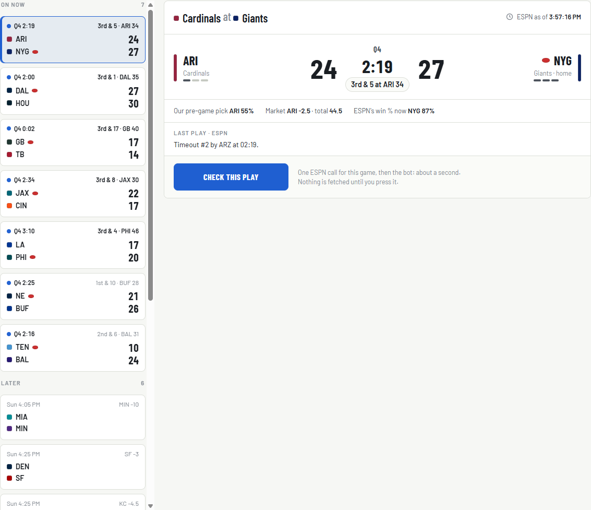
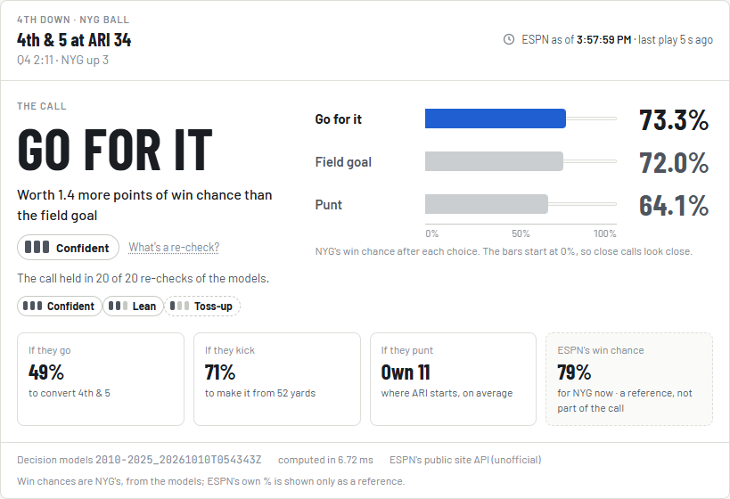
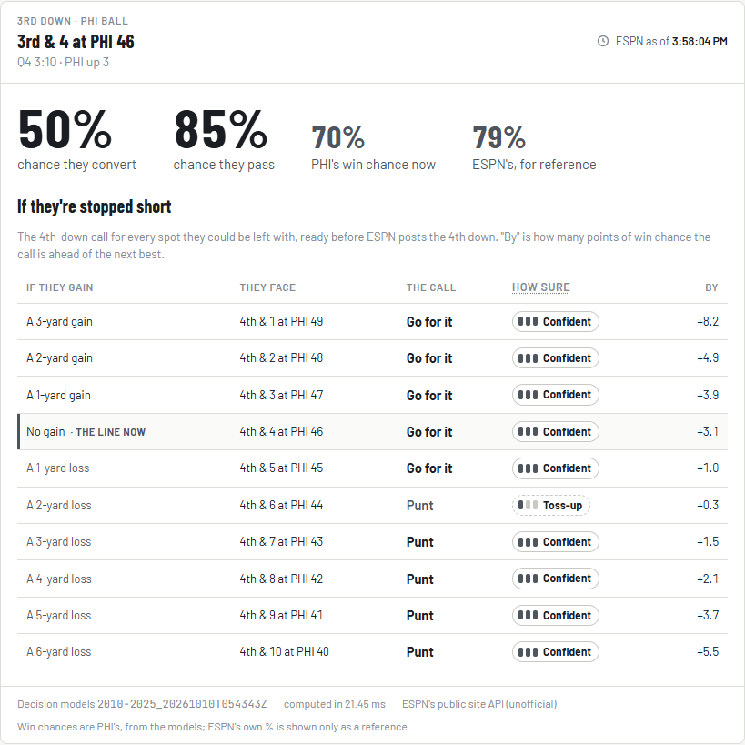
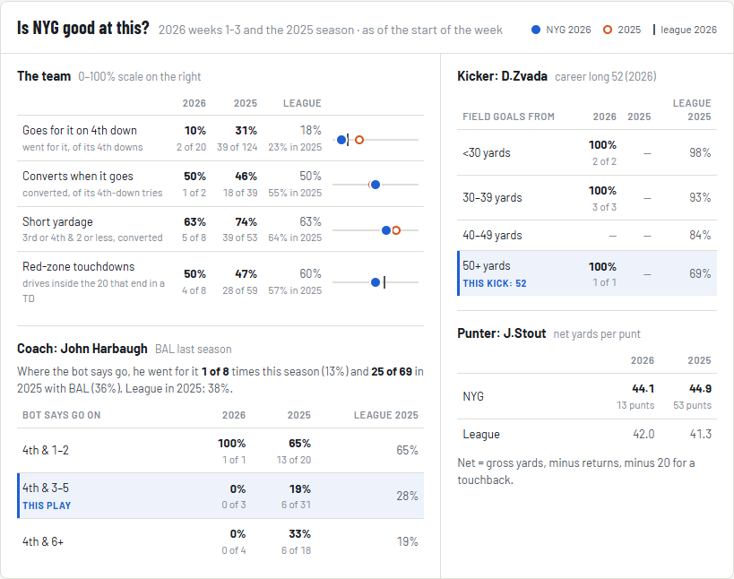

# Live decisions guide: the 3rd- and 4th-down bot

**What this is:** a plain-language guide to the live 3rd- and 4th-down bot: what a "4th-down model" is, the six models behind it, how one call is computed (worked through on a real 2025 4th down), what the confidence labels mean (LD00); then the live ESPN feed: where the data comes from, how a game state is read from it, how fresh it is, replaying a game and the parity check against nflverse (§7–8, LD01); the control room's **Game day** tab: the game list, Check this play, the 4th- and 3rd-down cards, "Is this team good at this?", trying it on a replayed game (§9, LD02); and the commands. LD03 adds the weekly decision review.

**Related docs:** the spec is the [live-decisions README](../live-decisions/README.md) and the phase files ([LD00](../live-decisions/LD00-decision-models.md), [LD01](../live-decisions/LD01-live-feed.md), [LD02](../live-decisions/LD02-game-day-tab.md)). The results are in the [model card](../model_cards/live-decision-models.md). Decisions: D107 (the no-touch rule), D109 (the bot's rules), D113 (as built), D114 (the ship decision), D116 (the live feed as built), D117 (the Sol review's fixes), D118 (the Game day tab as built), D119 (its review fixes) in the [decisions log](../10-decisions-log.md). The W&B side is in the [W&B guide §6.7](weights-and-biases.md). Agents use the `live-decisions` skill.

---

## 1. What a 4th-down model is, in plain words

On 4th down a team has three choices: **go for it**, **kick a field goal** or **punt**. A 4th-down model doesn't guess what the coach *will* do; it asks *which choice gives the team the best chance to win*, and answers in **win probability** (WP): the chance the team with the ball wins the game from here.

It works backwards from what can happen after each choice:

- **Go for it:** sometimes they convert (a first down where the play ends, or a touchdown), sometimes they don't (the other team takes over right there).
- **Field goal:** it's good (+3, then a kickoff), or it misses (the other team takes over at the spot of the kick).
- **Punt:** the other team takes over wherever the punt and the return leave them.

Each of those futures is a game situation with its own win probability. Weight each by how likely it is, add them up, and you get **the win probability after each choice**. The call is the biggest number; the **gap** between the best and the next best says how much the choice matters.

> Example (a real 2025 call, §4): Atlanta up 7 on the Rams with 7:34 left, 4th & 1 at the Rams' 49. The coach punted. The bot: **go 76.4%**, punt 69.9%, a 67-yard field goal 61.8%: go, by 6.5 points, Confident.

Two honest caveats:
- The models describe an **average team** in that spot (with the pre-game point spread as its strength). LD02's "Is this team good at this?" panel adds the team's own record next to the call.
- Many calls are **close**. When the options are within 1 win-probability point, the bot says **Toss-up** instead of pretending to know (Brill, Yurko & Wyner found 44% of 2018–22 4th downs were that close; our backtest: 46% of 2014–2025 4th downs).

## 2. The six models

All six are new (the no-touch rule, D107: the production game, player and team models are never touched). They are trained on every regular-season and playoff play of 2010–2025 and live in `src/nflengine/live/models.py`.

| Model | Answers | How | Compared against |
|---|---|---|---|
| **Win probability** (`wp`) | the chance the team with the ball wins, from any snap | a logistic regression on smooth terms (spread, score, both faded by time; field position late in the game), then LightGBM trees boosted from it; it can only rise with the score and with the pre-game spread | nflfastR's `vegas_wp` |
| **Yards gained** (`gain`) | on a 3rd or 4th down, the chance of every gain from −10 to +65 yards and of a touchdown (77 outcomes) | LightGBM multiclass on down, distance, yard line, spread, total, the offense's implied points, era, roof | the conversion rate by distance and era |
| **Field goal** (`fg`) | the chance the kick is good | a logistic regression: distance (bent at 30, 40, 50 and 60 yards), era, indoors, wind, cold | a logistic on distance only |
| **Punt** (`punt`) | where the other team's first snap comes after a punt from any yard line (or a return touchdown, or a muff the kicking team recovers) | what really happened after 2010–2025 punts from that yard line and its neighbours | the season's real punts |
| **Kickoff** (`kickoff`) | where a team starts after receiving a kickoff after a score | what really happened, per **kickoff era** (touchback at the 20 to 2015, the 25 to 2023, the 30 in 2024, the 35 since 2025) | the season's real kickoffs |
| **Pass** (`pass`) | the chance the offense drops back to pass | LightGBM on the situation + our own win probability + the spread | nflfastR's `xpass` |

Plus two small tables: the **extra-point rate** (95.9% from the last three seasons) and the **two-point rate** (about 48%).

**Why boost the win-probability model from a logistic regression?** Every snap of a game shares one label (who won), so a tree model fitted from scratch learns each game's noise. On the seasons kept aside for tuning (fit 2010–12, test 2013) the boosted model scored a Brier of 0.1529 vs 0.1586 for trees alone, and its calibration error halved (model card → Tuning).

## 3. How a call is computed

`live/decide.py` turns a game state into a call. A **game state** is from the offense's side: season, score difference, game and half seconds left, down, distance, yards to the goal, both teams' timeouts, home / away / neutral, who gets the second-half kickoff, the pre-game spread and total (from the offense's side), roof and weather.

1. **Every future becomes a first down for someone.** Converting: our first down where the play ends. Stopped: their first down at the spot. A field goal: +3, then their first down after the kickoff (from the kickoff model). A touchdown, ours or a return touchdown against us, gets the try at the era's extra-point rate (95.9%: +7, else +6). A miss: their first down at the spot of the kick (8 yards behind the line) or their 20. A punt: their first down where the punt model says.
2. **Football's rules come first.** Each play takes 6 seconds. If time runs out in the second half, the score decides (a tie is 0.5; a regular-season overtime that ends tied too). A tied **playoff** overtime period goes on into a new 15-minute period. If the first half ends, the second-half kickoff goes to whoever receives it, and both teams get their 3 timeouts back. A team with the lead and a first down that can **kneel out the clock** wins (the clock needed is 6 s + 40 s for each of the other team's missing timeouts, up to three kneels).
3. **The win-probability model scores the rest**, all in one batch (a few hundred states), from the side of the team with the ball.
4. **Weight and add:** go = Σ P(gain) × WP(after); field goal = P(make) × WP(after a make) + P(miss) × WP(after a miss); punt = Σ P(spot) × WP(after).
5. **The call** is the largest; the **gap** is best minus second best.

## 4. A real 2025 4th down, worked through

**2025 week 17, Rams at Falcons.** Atlanta (at home, a 7.5-point underdog before the game) leads 7 points, 7:34 left in the 4th quarter, 4th & 1 at the Rams' 49. The coach punted: 38 yards, fair catch at the Rams' 11. Atlanta won by 3.

The state the bot sees: `season 2025, score_diff +7, game_seconds 454, half_seconds 454, down 4, ydstogo 1, yardline_100 49, timeouts 3 / 3, home +1, spread −7.5, total 48.5, roof dome`. Win probability right now: **74.7%**.

| Choice | What can happen | Win probability after |
|---|---|---|
| **Go for it** | converts 69.5% of the time (a first down about 6.6 yards on, average; a touchdown 0.8%): WP **83.5%**. Stopped 30.5% (0.7 yards lost, average): the Rams' ball near midfield, WP **60.3%** | 0.695 × 83.5% + 0.305 × 60.3% = **76.4%** |
| **Field goal** | a 67-yard try is good 19.5% of the time: +3 then a kickoff, WP 81.0%. A miss gives the Rams the ball at their 43: WP 57.2% | 0.195 × 81.0% + 0.805 × 57.2% = **61.8%** |
| **Punt** | the Rams start at their own 13 on average: inside their 10 30% of the time, at their 10–19 45%, a touchback (their 20) 17%, past their 20 7%; a return touchdown 0.1%, a muff the Falcons keep 0.7% | **69.9%** |

**The call: go, by 6.5 points** (76.4 vs 69.9), **Confident**: the gap is over 5 points, so no bootstrap refit could flip it (§5). The punt keeps a 7-point lead with the Rams 87 yards away; converting keeps the ball and burns clock with a 7-point lead. The cost of the punt by the bot's numbers: 6.5 points of win probability. (The game is in the shipped models' training data, so this shows the arithmetic, not a forecast; the backtest's fold that never saw 2025 said the same: go 76.7%, punt 69.9%, a 6.8-point gap.)

Reproduce it: `uv run nfl live call --state '{"season": 2025, "score_diff": 7, "game_seconds": 454, "half_seconds": 454, "down": 4, "ydstogo": 1, "yardline_100": 49, "home": 1, "spread": -7.5, "total": 48.5, "roof": "dome"}'`.

## 5. The confidence labels

| Label | Meaning |
|---|---|
| **Confident** | the best choice also wins in at least 90% of the bootstrap refits (below), or the gap is at least 5 points |
| **Lean** | it wins in 60–90% of them |
| **Toss-up** | it wins in fewer than 60%, or the gap is under 1 win-probability point |

**The bootstrap, in plain words:** the yards-gained and field-goal models are refit 20 times, each time on a resampled copy of the training data (some plays twice, some not at all). If the call still comes out the same with every refit, the data really support it; if it flips, the evidence is thin.

**The 5-point gate:** a call more than 5 points wide never flipped in any refit on 1,498 real 2025 4th downs (D113), so wide calls skip the bootstrap (it keeps the 3rd-down check under 20 ms). Every `nfl live train` re-checks this on about 400 real 4th downs and refuses to promote if it fails.

**What the labels look like in practice** (every 2025 4th down, 3,995, with the shipped models): **Confident 55%**, **Toss-up 44%**, **Lean 0.3%**; 92% of calls are within 5 points and get the bootstrap; a call takes 4.6 ms (median). "Lean" is rare: the refits move the conversion and field-goal chances by fractions of a point, so a call either clears 1 point comfortably or it doesn't.

## 6. The 3rd-down check

On a 3rd down the bot answers three things:
- **the chance they convert** (from the yards-gained model);
- **the chance they pass** (the pass model);
- **if they're stopped short:** for every gain from −10 yards to one short of the line to gain, the 4th-down call they'd face (4th & 1 … 4th & N from where they'd be), with its gap and label. It's ready before the 4th-down snap, because ESPN's feed can trail the broadcast (README §2).

## 7. The live feed (LD01)

### 7.1 Where the data comes from

The bot reads **ESPN's public site API**: the JSON behind espn.com's scoreboards. It's free and needs no key, but it's **unofficial**: Disney's terms bar automated access and ESPN can change or block it without notice. Rishi accepted both for personal, low-volume use (D109). `api.nfl.com` needs a token; the licensed feed (Sportradar) is paid.

Three endpoints, all under `https://site.api.espn.com/apis/site/v2/sports/football/nfl/` (measured 2026-10-10):

| Endpoint | What it holds | Size (JSON / gzipped on the wire) | ESPN caches it for |
|---|---|---|---|
| `scoreboard` (`?dates=2026&seasontype=2&week=5`) | the week's games: status, score, clock, and for a game in progress the `situation` of the **next snap** | 270 KB / ~22 KB | 6 s |
| `scoreboard/{event}` | one game, same fields: **the call behind a check** | 18 KB / ~3.4 KB | 1 s |
| `summary?event={event}` | every play so far: its start and end state, clock, score, text and `wallclock` (the snap time), ESPN's own win probability per play | 600 KB / ~50 KB | 3 s |

Answers took 45–170 ms. The `event` is ESPN's game id (TB at DAL, 2026 week 5 = `401872980`); `nfl live games` lists them, and curated `espn_scoreboard` maps each to our `game_id`.

**The client** (`live/espn.py`) is deliberately polite and narrow:
- it only ever calls `https://site.api.espn.com`; any other host, `http://`, a port or a redirect is refused before anything is sent (there are no credentials to send);
- a 5 s timeout; at most **one request per game every 2 s** (the game and its summary share that clock) and 0.5 s between any two requests; a fixed User-Agent naming the project; gzip;
- after an error it waits 2 s, then 4, 8 … up to 60 s before asking again;
- it **fails soft**: every answer is kept with its fetch time, so when ESPN doesn't answer you get the last good answer, marked stale, with the reason ("ESPN didn't answer (HTTP 503); showing its answer from 14 s ago"). Only with no earlier answer does a check fail outright.

ESPN's play text is data: it's shown as plain text, never as markup (the terminal escapes it; the app will run it through `clean()`).

### 7.2 From ESPN's JSON to a game state

`live/state.py` turns ESPN's `situation` into the `GameState` of §3. The rules, each checked on 2026 data:

| State field | From | The catch |
|---|---|---|
| offense, defense | `situation.possession` (an ESPN team id) | codes go through `normalize_team` (ESPN's WSH → WAS, LAR → LA) |
| yards to the goal | `situation.yardLine` + who has the ball | `yardLine` counts from **ESPN's home team's** goal line: `100 − yardLine` when the offense is ESPN's home team, else `yardLine`. ESPN's own `yardsToEndzone` is never read: it's mirrored on home punts and 0 on timeouts |
| down, distance | `down`, `distance` | goal to go: the distance is the yards to the goal ("3rd & Goal at LA 2"); `down = -1` means **no snap is pending** (a TV timeout before a kickoff or a try) |
| clock | `status.period`, `status.clock` | game seconds = (4 − quarter) × 900 + clock; in overtime both clocks are the OT clock (nflverse's way) |
| score difference | the two competitors' scores | from the offense's side |
| timeouts | `homeTimeouts`, `awayTimeouts` | the summary has none; replays count "Timeout #N by TEAM" rows instead (§8) |
| home (+1 / 0 / −1) | our schedule (`games.neutral_site`) | ESPN's home team at a neutral site can differ from nflverse's: the yard line uses ESPN's, `home` and the spread's sign use ours |
| spread, total | curated `lines`, **pre-game only** | nflverse's schedule line (closing for a played game), else the median across the Odds API's books, else ESPN's DraftKings line, counting only rows saved before kickoff day. Never ESPN's live line: it would leak the score into the "pre-game strength" input |
| roof | `games.roof` | nflverse fills it at retractable-roof stadiums only after the game, so until then the stadium's usual roof (AT&T Stadium: closed in 109 of 112 games), then ESPN's `venue.indoor` |
| wind, temperature | `games.wind` / `temp` for a played game, else the pre-game forecast (`weather_forecasts`) | outdoors only; the field-goal model uses them |
| who gets the 2nd-half kickoff | the summary's first kickoff | the team that didn't receive the opening kickoff (first half only) |

What it says instead of a state: "the game hasn't started", "the game is over", "halftime: the second half starts with a kickoff", or "between plays: no snap pending (a try, a kickoff or a TV timeout)". When the scoreboard shows `down = -1` mid-drive, the next snap is read from the summary's last real play **up to the scoreboard's last play** (the two answers are separate requests; a summary that hasn't caught up yet isn't used).

**A real one** (ESPN's scoreboard archived at 15:41 ET on 2026-10-04): the Eagles lead the Rams 20–10, 7:31 left, **4th & Goal at the Rams' 2**. ESPN's situation: `down 4, distance 2, yardLine 98, possession "21"` (PHI, ESPN's home team), `homeTimeouts 2, awayTimeouts 3`. The parser: yards to goal = 100 − 98 = **2**; PHI at home (+1); the pre-game line had the Rams by 3.5, so the spread from PHI's side is **−3.5**; total 42.5; outdoors, wind 9 mph.

```text
LA 10 at PHI 20 · 7:31 - 4th Quarter
PHI ball, 4th & Goal at LA 2 · timeouts LA 3, PHI 2
Call: Field goal (Toss-up), 0.3 win-probability points over the next best
  Go for it    93.0% win probability for PHI
  Field goal   93.2% win probability for PHI <
  Punt         88.4% win probability for PHI
  convert 46% · field goal from 20 yd 99% · after a punt they start at their own 13 · now 94.9%
```

ESPN's own win probability for PHI at that moment was 94%; ours 94.9%. (Jalen Hurts had just been stopped for no gain on 3rd down.)

### 7.3 How fresh it is, and what "as of" means

Three clocks matter on a game night:

| | Seconds | Source |
|---|---|---|
| From a 3rd-down snap to the next 4th-down snap | median **42** (p10 36, p90 51) | 2026 week 4, 219 pairs (README §2) |
| ESPN's feed behind the snap | seen at 8, 12, 30 and 84 in archived snapshots; **measured live on Sunday 2026-10-11 (README §2 has the numbers)** | `nfl live latency` |
| Your TV behind the field (Super Bowl LX) | antenna ~19, cable 38, Peacock 48, YouTube TV / Hulu 53, NFL+ 62 | [The Desk](https://thedesk.net/2026/02/stats-perform-phenix-latency-super-bowl-lx/) |

On a stream the feed usually beats the picture; on cable or an antenna it sometimes won't. That's why a **3rd-down check already carries the 4th-down call for every distance** they could be left with (§6): check on 3rd down and the answer is ready before the 4th-down snap reaches ESPN.

**"As of"** on every answer: when ESPN answered ("as of 15:41:52, ESPN answered 1 s ago") and, when the summary was read, when the last play was snapped. If the last play on screen isn't the one you just watched, the feed hasn't caught up: wait a few seconds and check again.

### 7.4 Measuring the lag

`uv run nfl live latency --event <id> --minutes 200` watches one game: it asks for the game every 2 s and the summary every 20 s, and logs to `{NFL_DATA_ROOT}/live/latency/<event>.jsonl` the first time each play appears. At the end (or a minute after the final) it prints, per play:
- **lag** = first seen − its snap (`wallclock`). This includes the play itself (a few seconds) and up to 2 s of our own polling.
- **lead** = the next snap − first seen: how long the new situation was visible before the next play started. A positive lead on a 4th down means a check could have run in time.

Before kickoff it checks every 30 s. Start it a few minutes before kickoff (the console shows each play as it lands); `Ctrl+C` stops it and still writes the report (marked interrupted). Penalties before the snap (a false start, a delay of game) are logged but aren't counted as snaps, so they never pose as the "next snap".

## 8. Replaying a game, and the parity check

**Replay** (`live/replay.py`) steps through a game's summary as if it were live: each play's `start` is the situation it was snapped from. It rebuilds what the summary lacks:
- **timeouts** from the "Timeout #N by TEAM" rows (3 per half; 2 in a regular-season overtime; 3 per two-period half in playoff overtime), plus a timeout lost on a challenge ("Indianapolis challenged …, and the play was Upheld");
- **the score before each play**, moved only by scoring plays (ESPN puts a stray 0–0 on some timeout and two-minute-warning rows);
- **the snap clock of a scoring play**: ESPN gives a touchdown or a made field goal the clock *at the score*, so the snap clock is estimated from the previous snap and the real time between the two (every other play's clock is the snap clock, the same as nflverse's);
- **who received the opening kickoff**.

ESPN's play ids are the event id followed by nflverse's `play_id` (`40187298040` = event 401872980, play 40), which is how a replay lines up with nflverse.

`uv run nfl live replay --event 401872980` prints every 3rd and 4th down of TB at DAL with the bot's call next to what happened (3rd downs: the chance to convert and to pass; 4th downs: the call, the win probability after each choice, `=` when the coach did the same, `x` when not). TB at DAL: 34 3rd and 4th downs; the bot matched the coach on 7 of 11 4th downs. A finished game's summary is kept under `live/summaries/` (ESPN is asked once; `--refresh` asks again).

**The parity check** (`nfl live parity --season 2026 --weeks 1-5`) replays every finished 2026 game and compares each 3rd / 4th-down start state with nflverse's play-by-play: offense, down, distance, yards to goal, score difference, quarter, clock (within 5 s) and both teams' timeouts.

**Result (2026 weeks 1–5, run 2026-10-10): 2,745 of 2,788 states equal, 98.5%** (the target was 98%; a state found on one side only counts as not equal, so a feed that loses plays can't pass; of the 2,785 both sides have, 98.6%). 65 games: weeks 1–4 against curated `plays`, Thursday's TB at DAL against nflverse's newest file, read through nflreadpy (its download cache under `cache/nflreadpy`, like the ingest; nothing goes to curated data) (38 / 38). The offense, the down, the quarter and the score never differed. The 40 that did:

| Why | States | What happened |
|---|---|---|
| The clock of a scoring play | 14 | ESPN gives a touchdown the clock at the score; the estimate of the snap clock is still more than 5 s off (a punt-return touchdown: 523 vs 540 s) |
| The two feeds logged timeouts differently | 12 | ESPN's short-form text for one play left out "Indianapolis challenged … Upheld" (IND keeps a timeout for the rest of the half); nflverse corrected a CIN delay of game to "declined" and dropped the timeout ESPN still lists |
| nflverse charges a lost challenge one play early | 8 | nflverse counts the timeout in the challenged play's own start state; the replay charges it after the play, which is when it was lost |
| The spot differs by a yard | 6 | e.g. ESPN 3rd & 5 at the 10, nflverse 3rd & 4 at the 11 (ESPN's own text says "to ARZ 11"); a 4th & 9 vs 4th & 10 after a delay of game |

Three plays were on one side only: a fake field goal ESPN typed "End Period", a declined penalty ESPN doesn't list, and a 3rd & 1 run ESPN never moved the chains on. Overtime (12 states), goal to go (148 / 153), pre-snap penalties (243 / 244) and both neutral sites (Melbourne 33 / 33, Rio 39 / 39) all matched. Before three replay fixes found by this check (stray scores on timeout rows, challenge timeouts, the scoring-play clock) it stood at 92.4%.

**The decision replay:** the same engine scored the same 4th downs twice, once from ESPN's replayed state and once from nflverse's (as the LD00 backtest does), on five games: SF at LA (Melbourne), BAL at DAL (Rio) and the three overtime games. **The calls agree on 73 of 73.** The two states are identical on 55 (identical calls and win probabilities, as they must be); the other 18 differ by a few seconds of an estimated scoring-play clock or, twice, by the timeout ESPN's short-form text lost. The largest win-probability difference anywhere is 0.08 points.

## 9. The Game day tab (LD02)

The control room's **Game day** tab is the bot on a game night: pick the game you're watching, press **Check this play** on a 3rd or 4th down, and the call is on screen in about a second. The look was approved as a mockup first ([live mockup](https://claude.ai/artifact/QpALHDapDHPhLTHLNCQDsW); source in `documentation/live-decisions/mockup/`).

### 9.1 Open it

`uv run nfl app`, open the current week, click **Game day** (the last tab, after Graph).

- **Which week is "live":** Game day follows the games, not the Tuesday calendar. A week stays Game day's week until 6 h after its last kickoff, so Monday night's game is still on week N's tab even though the calendar moved to week N+1 at that kickoff. Another week's tab says where Game day is ("Game day is on week 5").
- **Before the first kickoff:** the week's slate (kickoff, market line, our pre-game pick) and "Game day opens at the first kickoff".
- **A past week:** "Decision review: coming in LD03" and the finals. **A future week:** its slate. Neither asks ESPN.



### 9.2 The game list and the panel

On the left, every game of the week: **on now** (a live dot, quarter and clock, down & distance; a 3rd or 4th down in bold), **later** (kickoff and the line) and **final**. The list refreshes every 30 s while the tab is open and the browser tab is visible; **Refresh** asks again now (the server re-asks ESPN when its copy is over 10 s old).

Pick a game: the panel shows the score with who has the ball, the clock, both teams' timeouts (the three bars under each team), ESPN's situation ("4th & 5 at ARI 34"), our pre-game pick and the market line (the pre-game line the bot uses), ESPN's own win % now, and ESPN's last-play text.

### 9.3 Check this play: the 4th-down card

The button makes **one** ESPN call for that game, then runs the bot: about a second in all (ESPN ~100 ms; the bot 6 ms on a 4th down, 22 ms on a 3rd down with its confidence re-checks). Two exceptions: the first check after `nfl app` starts loads the models (~1 s), and the first check of a game in the **first half** also reads ESPN's play log once, to know who received the opening kickoff (the second-half kickoff matters to the win chance), so it takes ~2 s.

A real one (2026 week 4, Sunday 3:57 PM ET, replayed): **NYG ball, 4th & 5 at ARI 34, 2:11 left, NYG up 3.**

| On the card | What it means |
|---|---|
| **GO FOR IT** | the call: the choice with the highest win chance |
| Go for it **73.3%** · Field goal **72.0%** · Punt **64.1%** | NYG's chance to win after each choice. The bars run from 0 to 100%, so close calls look close |
| "Worth 1.4 more points of win chance than the field goal" | the gap to the next best, in win-probability points |
| **Confident** · "The call held in 20 of 20 re-checks" | how sure the bot is (below) |
| If they go: **49%** to convert · If they kick: **71%** from 52 yards · If they punt: ARI starts at its own **11** | the odds behind the call |
| ESPN's win chance 79% | ESPN's own number, a reference only: it isn't used |

The coach kicked the field goal (it was good). The bot preferred going for it, but by only 1.4 points: a close call it was sure about, since every re-check agreed.

**How sure:** the bot re-scores the call with its 20 bootstrap refits of the yards-gained and field-goal models (LD00, §5). **Confident** = the call held in at least 18 of 20, or it's more than 5 points clear; **Lean** = 12 to 17 of 20; **Toss-up** = under 12 of 20, or the options are under 1 point apart. Lean is rare: week 4 had 139 Confident, 98 Toss-up and no Lean 4th downs.

**A toss-up reads differently:** the big line says **TOSS-UP**, the leading choice comes under it ("Field goal by 0.3 points over going for it": PHI, 4th & Goal at LA 2, 7:31 left, up 10: field goal 93.25%, go 92.96%), and the options within a point share a half-strength colour, so no bar claims the win. Either choice is defensible.

**Why there's no "win chance now" on a 4th-down card:** the win-probability model's read of a 4th-down state is a smooth average; the call works out what each choice leads to. On 2025's 3,997 4th downs the two agree on average (+0.06 points), but in a late, close game they can differ by several points (NYG above: 80.6% vs the best choice's 73.3%), which would read as if every choice lost ground. The 3rd-down card does show it.



### 9.4 The 3rd-down card and the if-stopped table

**PHI ball, 3rd & 4 at PHI 46, 3:10 left, PHI up 3:** a **50%** chance they convert, **85%** they pass, PHI's win chance now **70%**. Under it, **If they're stopped short**: the 4th-down call for every spot they could be left with, 4th & 1 to 4th & 10 (or to the distance itself, if longer), shortest first. Here: go for it on 4th & 1 to 4th & 5 (+8.2 down to +1.0 points), a toss-up punt at 4th & 6, then punt. The "no gain" row (4th & 4 at PHI 46) is marked: that's where they'd be if the play goes nowhere.

The table exists because ESPN can trail your TV (§7.3): **check on 3rd down**, and the 4th-down answer is already on screen when the 4th-down snap comes, whatever ESPN shows.



### 9.5 "As of", ESPN behind, and the TV delay

Every answer carries a stamp: **"ESPN as of 3:57:45 PM · last play 35 s ago"**. "As of" is when ESPN answered. "Last play" is timed from the play's snap when the server has ESPN's play log for the game (it reads it in the background after a check, at most every 30 s per game), otherwise from when the app first saw that play appear in the list (shown only if the app watched it appear). Focus the stamp to see which.

- **"ESPN may be behind":** when the last play is over **55 s** old (snaps come ~40 s apart: 3rd to 4th down, median 42 s, p90 51 s), the card says so: "ESPN still shows 3rd & 5 at ARI 34, and its last entry (a timeout) was logged 78 s ago. If your TV is past this snap, the 4th down hasn't posted yet: the if-stopped table below has it", and the table's "no gain" row is marked as the likely one. It's a hint: a timeout or a review stops the clock too.
- **On cable or an antenna** your picture can run ahead of ESPN (an antenna was ~19 s behind the field at Super Bowl LX, cable 38 s, streams 48–62 s); on a stream ESPN usually leads. Either way, check on 3rd down.
- **No new play:** a second check with the same last play and situation says "No new play since your last check (5 s ago)" (a commercial, a review).
- **ESPN didn't answer:** "ESPN didn't answer (HTTP 503). Showing the last good answer, from 3:57:50 PM." With no earlier answer for that game the card says ESPN didn't answer and offers Try again; after errors the app waits 2 s, then 4, 8 … up to 60 s before asking ESPN again. If the list itself fails, it shows the schedule's games with the error.
- **Not a 3rd or 4th down:** "2nd & 5: checks are for 3rd and 4th downs." Between plays (a try or a kickoff next) and at halftime it says so too.

### 9.6 Is this team good at this?

Under the call, the offense's record **as of the start of the week** (this season's games before the week, and all of last season, regular season and playoffs), each with the league beside it. PHI at week 4 (2026 weeks 1–3 and 2025):

| Row | Definition | PHI 2026 · 2025 · league 2026 |
|---|---|---|
| Goes for it on 4th down | runs and passes / 4th downs decided (runs, passes, field goals, punts) | 17% (3 of 18) · 20% · 18% |
| Converts when it goes | converted / went for it | 33% (1 of 3) · 56% · 50% |
| Short yardage | 3rd or 4th & 2 or less: converted / runs and passes | 71% (5 of 7) · 60% · 63% |
| Red-zone touchdowns | drives that reached the 20 and ended in a touchdown | 67% (6 of 9) · 70% · 60% |
| Coach: where the bot says go | Nick Sirianni went for it 2 of 10 times this season (20%), 24 of 54 in 2025 (44%); league 2025: 38%. By distance (1–2 / 3–5 / 6+), this play's band highlighted | |
| Kicker | J. Elliott's makes by distance (under 30 / 30–39 / 40–49 / 50+) this season and last, the league's, this kick's band highlighted; his career long (61, 2023) | |
| Punter | B. Mann's net yards per punt: 43.1 (13 punts) · 42.9 (76) · league 42.0 | net = (gross yards − return yards − 20 per touchback) / punts |

- **The coach** comes from nflverse's schedule with `config/head_coach_fixes.csv` applied (nflverse still listed some 2026 hires under last season's coach); his "last season" follows him, so John Harbaugh's 2025 numbers are Baltimore's. A first-year head coach has no last season.
- **The coach's go rate where the bot says go:** every decided 4th down of both seasons is scored by the bot (no re-checks), and the row counts how often the coach went where the bot said go. The bot is more aggressive than coaches (§13), so these rates look low: league 38% in 2025.
- **The kicker / punter** is the team's newest one before the week; his numbers are his own (any team).
- **Small samples:** early in a season "this season" is a handful of plays ("1 of 3"); the counts are always shown.

Built per week from curated plays (~5 s: 4,881 4th downs at week 5) and kept in `{NFL_DATA_ROOT}/cache/control-room/live/context/<season>-wNN.json`; it's rebuilt when the plays, the schedule, the coach fixes or the promoted models change, and started in the background the first time the tab opens that week.



### 9.7 How it's wired

| Endpoint | What it does | ESPN calls |
|---|---|---|
| `GET /api/live/{season}/{week}/games[?refresh=1]` | the week's games, Game day's week (`live_week`), the phase (before / live / between / final / past / future), whether the models are there | one `scoreboard` call, kept 30 s (Refresh: re-asked when over 10 s old); none for a past or future week |
| `GET /api/live/{season}/{week}/games/{event}/call` | a check: the fresh state, then the 4th-down call or the 3rd-down check, with "as of", the repeat and "behind" notes | one `scoreboard/{event}`; the play log at once only in the first half (once per game) or when ESPN shows no down (`down = -1`), else in the background after the check (at most every 30 s per game) |
| `GET /api/live/{season}/{week}/games/{event}/context?offense=XXX` | "Is this team good at this?" | none |

- **Code:** `src/nflengine/app/readers/live.py` (`LiveService`: one shared ESPN client for every browser tab, the models loaded once, curated game facts per season, the play logs, what each game looked like at its last check), `src/nflengine/live/context.py` (the team context and its cache), the routes in `app/server.py`; the web tab in `web/src/pages/week/GameDayTab.tsx` + `gameday/`.
- **Safety (README §5):** ESPN is only ever `https://site.api.espn.com`, through LD01's client (2 s per game, 0.5 s between requests, back-off, no redirects); a check is a GET and changes nothing; every string from ESPN is cleaned (control characters out, credential-shaped text masked, capped) and shown as text, never HTML; team codes and ids must look like codes and ids; another website's page can't set off a check (a cross-site browser request is refused); the event must be in that week's ESPN scoreboard. **What it writes:** only the team-context cache.

### 9.8 Trying it outside game times: `--live-replay`

```powershell
uv run nfl app --live-replay 401872966 --replay-at 2026-10-04T15:57:15   # ARI at NYG's week, from 3:57:15 PM ET
uv run nfl app --live-replay 401872980 --replay-speed 4 --replay-lag 30   # TB at DAL, 4x, ESPN 30 s behind
```

Game day then serves that game's **week** from the saved ESPN play logs (`live/summaries/`, saved by `nfl live replay` / `parity`) as if it were live, on the replay's clock: ESPN's three answers are rebuilt from the play log at each moment (the next snap's down, distance, spot, clock, score and timeouts; a play shows up `--replay-lag` seconds after its snap), through the same client and parser as a real game. Nothing is fetched from ESPN; a banner says it's a replay. `--replay-at` is an ISO time (no zone = US Eastern); the default is just before the game's first snap. Checked on all 65 saved 2026 games: just before each of 9,510 snaps is posted, the live parser reads the state LD01's replay builds for it in 99.7% (9,482; the rest: a few plays whose start ESPN logged after a clock stop, and timeouts logged within a second of the snap, which the feed rightly hasn't posted yet).

### 9.9 Limits

- **ESPN's timing is the weak link:** the feed trails the snap by seconds to over a minute (§7.3); "last play N s ago" is exact only once the server has the play log (from the second check of a game, or the first in the first half).
- **A replay can't show ESPN's own lag pattern:** it uses one fixed lag, and the try point arrives with the touchdown.
- **The team context is descriptive**, not an input to the call (the models know the spread, not the roster: §14).
- **New models need an app restart:** the app keeps the bundle it loaded until `nfl app` restarts.
- **Finished weeks** get the decision review (§10).

## 10. The decision review (LD03)

Once a week's games are final and Tuesday's weekly run has brought its plays into the curated data, the week's **Game day** tab turns into a **decision review**: every 4th down of the week, what the coach did, what the bot would have done, and how much win probability the coach's choice gained or cost. A **This week / Season** switch next to it shows the season so far: which coaches go for it when the numbers say go, and whether the bot's own numbers held up on real plays.

It's built from **nflverse's play-by-play** (the curated `plays`), not from ESPN: the same states every time, so a review is reproducible. The bot is the promoted LD00 bundle, read only.

### 10.1 Open it

- **In the control room:** `uv run nfl app`, pick a past week in the sidebar, open **Game day**. The review's header has a **‹ Week N−1 · Week N+1 ›** stepper (the sidebar lists only the weeks the weekly run published: the stepper reaches 2026 weeks 1–3, and `/week/2025/<N>/game-day` opens last season), the **This week / Season** switch, the models' version and whether the season is out of sample. The first open of a week the CLI hasn't reviewed builds it (about a second per week; the first time a season is opened its plays are read from D:, which can take 10–15 s on a cold disk), then it's kept.
- **The week being played,** once every game is final: the Game day tab says so and offers **Open the decision review**, which works once Tuesday's run has brought the week's plays in ("Ready after Tuesday's run" until then).
- **In a terminal** (the Tuesday routine, after the weekly run; runbook → Tuesday):

```powershell
uv run nfl live review --season 2026 --week 5 --wandb   # the week just played, + its W&B run
uv run nfl live review --season 2025 --weeks 1-22       # a range (no W&B without --wandb)
```

  It prints the week's line (decisions, coaches' go-for-its vs the bot's, agreement, toss-ups, wins given up), the boldest and costliest calls, and the season's leaderboard top and bottom five. It isn't a weekly-run step (D107: the weekly run stays as it is), and there's no control-room button for it (Rishi, 2026-10-10): the tab builds a missing week by itself; only the W&B run needs the command.

### 10.2 Which 4th downs count

A **decision** is a 4th-down snap the coach chose a play for (LD01's rules, the phase file's pitfall):

| Case | Counts as | 2025 |
|---|---|---|
| A run or pass | **go** | 931 |
| A field goal / a punt | **fg** / **punt** | 3,066 |
| A **fake** punt or field goal (`(Punt formation)` typed run or pass) | **go** | 13 (in the 931) |
| An **aborted** snap in punt or field-goal formation (a fumbled snap) | the kick: it was a botched kick, not a fake | 1 |
| A play **wiped out by a penalty after the snap** that wasn't replayed (roughing the kicker, a defensive penalty on a go) | the call in the play's text | 57 |
| A wiped-out play whose down **was replayed** (an offensive holding on a punt: punt again from 10 yards back) | not a decision: the replayed snap is | 44 |
| A penalty **before** the snap (false start, delay of game, encroachment), a kneel, a spike | never | 188 + 4 |

So 2025 has **4,054 decisions** (LD00's backtest, which used only the typed plays, had 3,997). 2026 weeks 1–4 have 897 (206, 226, 222, 243).

### 10.3 Reading a row: the week's costliest call

2026 week 4, Green Bay at Tampa Bay, 1st quarter, 10:27, 0–0. **4th & 2 at TB 44.** The bot's win probabilities for Green Bay after each choice:

| Option | Win probability |
|---|---|
| **Go for it** (57% to convert) | **67.8%** |
| Field goal (61 yards) | 64.3% |
| Punt | 62.9% |

Matt LaFleur punted (30 yards, out of bounds at the TB 14). The bot's best was go, by 3.5 points over the field goal, **Confident**. The row shows:
- **edge** = the coach's option minus the best other option = 62.9 − 67.8 = **−4.9 points**: the call cost 4.9 points of win probability. When the coach picks the bot's best, the edge is positive (it's the gap to the next option: what the call gained);
- **cost** = the bot's best minus the coach's option = 4.9 points (0 when they agree). Summed over a team's decisions, costs are **expected wins given up** against the bot (100 points = one win);
- the **result** ("TB ball at own 14") is what happened, and it doesn't change the grade: a good call can fail and a bad one can work.

Every row also carries the label (Confident / Lean / Toss-up, §5), the three option WPs (on hover or when opened), the chance to convert, and tags for fakes and wiped-out plays. nflverse's play text is shown as text.

### 10.4 The highlights

- **Costliest call:** the largest cost of the week (above: 4.9 points), and the **five costliest** below it. In week 4 all five were kicks where the bot said go: GB (4.9), NE 4th & 4 at its own 42 in the 4th (4.7), LV's 48-yard field goal on 4th & 2 at KC 30 (4.5), LA 4th & 2 at its own 35 (4.3), CLE 4th & 1 at its own 25 (3.5).
- **Boldest call:** the longest shot a coach chose when kicking was still a real option: of the go-for-its that counted (not wiped out), in a game still in doubt (the bot's win chance before the snap between 10% and 90%) and where kicking was within 5 points of going (so a desperate 4th & 13 down 6 at 1:29 is forced, not bold), the one with the lowest chance to convert. Week 4: **Tampa Bay, 4th & 11 at GB 47, down 3 with 1:34 left** (27% to convert; the bot agreed: going 17.9% against punting 15.3%, Confident; stopped for no gain). Weeks 1–3: LAC 4th & 18 at its own 23 with 4:17 left (15%; the bot said punt), GB 4th & 10 at midfield with 0:02 left (34%; the bot said a field goal), CAR 4th & 16 at its own 16 (14%; the bot said punt).

### 10.5 The season: who goes for it

The **coach leaderboard** ranks head coaches (nflverse's, with `config/head_coach_fixes.csv`, so interim coaches get their own rows) by how often they went for it in **go spots**: 4th downs where the bot says go and isn't calling it a toss-up (Confident or Lean). Beside it: the go spots, how many he went in, his overall go rate, how often he went where the bot says kick (**kick spots**: the bot says field goal or punt, Confident or Lean), the expected wins he gave up (split into **timid**, kicking in go spots, and **bold**, going in kick spots; the rest is toss-ups and field goal against punt) and how often he agreed with the bot. The league's row sits at the bottom.

**2025 (the whole season, in-sample, below):** coaches went for it in **47%** of 1,250 go spots and in **0.7%** of 1,001 kick spots; they gave up **19.5 expected wins** against the bot: 15.1 by kicking in go spots, 0.2 by going in kick spots, the rest on toss-ups and field goal against punt; the bot and the coach agreed on 62% of 4,054 decisions. Top: Matt LaFleur (GB, 71% of 31 go spots), Dave Canales (CAR, 69% of 45), Shane Steichen (IND, 66%), Nick Sirianni (PHI, 64%), Sean McVay (LA, 63%), Sean McDermott (BUF, 62%), Dan Campbell (DET, 57%). Bottom: Brian Callahan (TEN, 2 of 7 go spots before Mike McCoy took over as interim coach), DeMeco Ryans (HOU, 30% of 46), Jim Harbaugh (LAC, 31%), Sean Payton (DEN, 32%), Mike Tomlin (PIT, 33%). **2026 through week 4:** Ben Johnson (CHI, 8 of 12) on top; Sean Payton (0 of 11) and Liam Coen (0 of 5) at the bottom. Four weeks is a small sample: a coach has 5–12 go spots.

**Against published rankings (LD03's sanity check, 2026-10-10):** the closest public table with every 2025 head coach is FTN's **Aggressiveness Index** (published 2026-01-29; it compares each coach's go-for-its in qualifying 4th downs with what coaches historically did in those spots, not with a model). Rank correlation (Spearman) with our ranking: **0.66** over all 34 coaches, **0.71** without the four split-season coaches (Daboll / Kafka at NYG, Callahan / McCoy at TEN), 0.74 for coaches with at least 25 go spots. Five of the ten names in each top 10 are the same (LaFleur, McDermott, Campbell, Sirianni, Steichen), six of ten in the bottom 10, and three of the bottom five (Ryans, Jim Harbaugh, Callahan). The one model-based number we could read: a report of rbsdm.com's "went for it when the model says go" puts **LaFleur first at 72.7%** (league 51.6%); ours has him first at 71.0% (league 47.4%) (secondary source, not verified on rbsdm itself). The biggest gaps are small samples (interim coaches McCoy 8th here vs 28th, Kafka 11th vs 1st) and the definitions: Sean Payton faced 50 go spots and went in 16 (31st here), while FTN, which rewards going more often than coaches used to, has him 17th. **Verdict:** the same coaches sit near the top and the bottom; the order in the middle (ranks 9–29 span 37–54%) is within the noise of ~35 go spots per coach.

**How to read "wins given up":** as a ranking, not a bill. The bot is aggressive (§14): it says go on about 55% of 4th downs, coaches on 19–24%, so nearly every coach "gives up" wins by kicking; who gives up the most, and where, is the useful part.

### 10.6 The season: is the bot right?

Three checks on real plays, through the week the tab shows:

- **Win probability:** the bot's WP on every snap of the season's finished games against who won, in 10 bins, next to nflfastR's `vegas_wp` on the same snaps. Points on the diagonal = calibrated. 2026 weeks 1–4 (the first out-of-sample season): Brier 0.1680 vs `vegas_wp` 0.1659, calibration error 0.035 vs 0.026, on 9,368 snaps of 64 games. That's noisy: the snaps of one game rise and fall together, so 64 games is a small sample; it needs about four weeks before it says much, and a season to be sure (the backtest's held-out seasons: 0.0048, model card).
- **Conversion:** the bot's chance to convert against what happened, by distance (1 … 10+), on **3rd downs** and on **attempted 4th downs** (real attempts only: no first down handed over by a penalty before the snap, no kick wiped out by roughing, no fumbled kick-formation snap). 2025: 3rd downs converted 41.8% vs the bot's 42.8% (7,376 snaps); attempted 4th downs 56.4% vs 55.3% (957). 2026 weeks 1–4: 41.6% vs 42.3% (1,644) and 57.0% vs 54.4% (172). The attempted 4th downs look like the bot is too cautious, but it's **selection bias**: coaches go when they like the spot, so the spots they choose convert more often than an average one. The 3rd downs (no choice involved) are the fair test. The other side of the same coin: on the 4th downs coaches don't try, the bot's chances are probably too high, which is where its aggressiveness comes from (§14).
- **Field goals:** made vs the bot's make chance by distance band (2025: 85.6% made vs 84.6% predicted on all tries).

**2025 is in-sample:** the promoted models were trained on 2010–2025, so their calibration on 2025 flatters them (WP Brier 0.1586 vs `vegas_wp` 0.1593, error 0.015 vs 0.019); the tab and the W&B run say so. The honest out-of-sample checks are LD00's leave-one-season-out backtest and 2026 from here on.

### 10.7 The W&B run

`nfl live review --wandb` logs one **`decision-review`** run per week (group `live-decisions`, tags `season:S`, `week:NN`, `ld03`, `in-sample` for a training season): the week's decisions table, the five costliest, the season's leaderboard, the calibration chart, the conversion chart, the field-goal table, the go rate by week, and scalars `week/*` and `season/*`. The W&B guide §6.8 has every panel and what to look for. `--smoke` sends a check run to the group `live-decisions-smoke`.

### 10.8 How it's wired

| Piece | What |
|---|---|
| `src/nflengine/live/review.py` | the rules (`decisions_frame`, `outcome`), the scoring (`score_decisions`: edge, cost), `highlights`, `leaderboard`, `calibration`, `season_tables`, the files, `ReviewStore`, `run_review` and `log_wandb` |
| `nfl live review` | writes `live/<S>/week<NN>/decision_review.parquet` (one row per decision) + `.json` (its stamp) and `live/<S>/season_review.parquet` (the leaderboard) + `.json` (every season table) |
| `GET /api/live/{season}/{week}/review` | the week's review: `status` ok / `no_plays` (the week's plays aren't curated yet: they come with Tuesday's run) / `no_models` |
| `GET /api/live/{season}/season-review?through=N` | the season through week N (clamped to the newest week with plays) |

- **Stamps:** a stored review is used only while its stamp matches: the review's schema (2 since the Sol review), the model version, a hash of that week's (or the season's) curated play rows with what `games` adds to them (the neutral site, the kickoff), and a hash of the coach fixes; a week's JSON also carries a hash of its rows, so a parquet from another write never pairs with it. A Tuesday curate rewrites the season's plays file but leaves earlier weeks' rows alone, so their reviews stay valid; a correction to a past play (or a coach fix, or a schedule fix) rebuilds just what it touches. `nfl live review` stops with an error when it can't write a file.
- **What the app writes:** a week the CLI hasn't stored is built and kept in memory and under `cache/control-room/live/review/` (written in the background: small writes on D: take seconds here), never under `live/`. It never asks ESPN.
- **Shared engine:** a build scores 4th downs in chunks under the engine's lock, so a live Game day check never waits long behind it, and the season's calibration runs under the same lock (LightGBM's thread settings are process-wide). A season is built with one bundle throughout. **A newly promoted bundle reaches the app after `nfl app` restarts** (as for checks, §9.9); then every stored review is rebuilt on its next open.

### 10.9 Limits

- **The bot's view, not the truth:** a cost is measured against the bot, which is aggressive (§14); a toss-up "disagreement" costs under a point by definition.
- **The coach is the head coach**, even when a coordinator calls the plays.
- **Wiped-out plays** whose down was replayed aren't decisions; when it wasn't, the call comes from the play's text (a fake punt wiped out by a penalty reads as a go only if the text shows the run or pass).
- **In-sample 2025** (§10.6); **small samples** early in a season.

## 11. Commands

```bash
uv run nfl live backtest                 # leave-one-season-out, 2014-2025 (W&B live-backtest), ~3 min
uv run nfl live backtest --ratings       # research: the yards-gained model with team ratings (not shipped)
uv run nfl live train --promote          # fit 2010-2025, run the checks, log + promote live-decision-models
uv run nfl live call --state '{"season": 2025, "score_diff": 0, "game_seconds": 2400, "half_seconds": 600, "down": 4, "ydstogo": 1, "yardline_100": 40}'
uv run nfl live call --state '...' --no-bootstrap   # skip the confidence label
uv run nfl live games                    # this week's games from ESPN (event ids, status, score, down & distance)
uv run nfl live games --week 4           # another week of seasons.current
uv run nfl live call --event 401872981   # a game right now: its next snap, and the call on a 3rd / 4th down
uv run nfl live call --event 401872981 --json
uv run nfl live replay --event 401872980 # every 3rd / 4th down of a game, the bot next to the coach
uv run nfl live replay --event 401872980 --downs 4 --bootstrap
uv run nfl live latency --event 401872981 --minutes 200   # ESPN's lag on a live game
uv run nfl live parity --season 2026 --weeks 1-5 --decisions 401872657,401872923   # ESPN vs nflverse
uv run nfl app                           # the control room: the current week's Game day tab (LD02)
uv run nfl app --live-replay 401872966 --replay-at 2026-10-04T15:57:15   # Game day on a replayed week
uv run nfl live review --season 2026 --week 5 --wandb   # a finished week's decision review + its W&B run (LD03)
uv run nfl live review --season 2025 --weeks 1-22       # several weeks; files only without --wandb
uv run nfl live review --season 2026 --week 1 --wandb --smoke   # a W&B logging check (group live-decisions-smoke)
```

`nfl live call --state` prints the call as JSON: `wp` (go / fg / punt), `best`, `gap`, `label`, `boot_share`, `convert`, `fg_make`, `fg_distance`, `punt_start` (the receiving team's expected start, yards from its own goal), `wp_now` and `ms`. On a 3rd down: `convert`, `pass_prob`, `wp_now` and `table`. The state's fields: `season`, `score_diff`, `game_seconds`, `half_seconds`, `down`, `ydstogo`, `yardline_100` (required); `off_timeouts`, `def_timeouts` (3), `home` (+1 / 0 / −1), `receive_2h_ko`, `spread` (offense side, + = favored), `total`, `roof`, `ot`, `playoffs`, `wind`, `temp` (optional).

## 12. Files

| Where | What |
|---|---|
| `{NFL_DATA_ROOT}/models/live-decisions/<first>-<last>_<UTC>/` | one fitted bundle: `wp.txt` + `wp_base.json`, `gain.txt`, `pass.txt`, `gain_boot/00.txt`…`19.txt`, `fg.json` (with the 20 refits), `punt.json`, `kickoff.json`, `pat.json`, `meta.json`, `checks.json` |
| `{NFL_DATA_ROOT}/models/live-decisions/production.json` | which bundle is promoted (the live code reads this, not the W&B alias) |
| `{NFL_DATA_ROOT}/runs/backtests/live-decisions/main/` | the backtest: `predictions_<model>.parquet`, `decisions.parquet` (every real 4th down: the coach's call, the bot's, the gap, the cost), `summary.json` |
| W&B artifact `live-decision-models` | the same bundle, with its own `production` alias |
| `{NFL_DATA_ROOT}/live/summaries/<event>.json.gz` | finished games' ESPN summaries, saved by `nfl live replay` / `parity` so ESPN is asked once (LD01) |
| `{NFL_DATA_ROOT}/live/latency/<event>.jsonl` | `nfl live latency`'s log: a `start` line, one `game` line per play the first time the scoreboard showed it, one `summary` line per play with its `wallclock`, `error` lines, an `end` line with the statistics |
| `{NFL_DATA_ROOT}/live/parity/<season>-wNN-wNN.json` (+ `.parquet`) | the parity report and its row-by-row comparison |
| `{NFL_DATA_ROOT}/cache/control-room/live/context/<season>-wNN.json` | the Game day tab's "Is this team good at this?" for a week, with the stamp it was built from (LD02; rebuilt when the plays, schedule, coach fixes or models change) |
| `{NFL_DATA_ROOT}/live/<season>/week<NN>/decision_review.parquet` (+ `.json`) | the week's decision review (LD03): one row per decision (the state, the coach's call, the bot's, the three WPs, edge, cost, label, result, nflverse's play text) and its stamp (schema, model version, data and coach-fix hashes); written by `nfl live review` |
| `{NFL_DATA_ROOT}/live/<season>/season_review.parquet` (+ `.json`) | the season through the newest reviewed week: the coach leaderboard (parquet) and every season table (JSON: leaderboard, league row, weekly trend, calibration) |
| `{NFL_DATA_ROOT}/cache/control-room/live/review/` | the control room's own copies of reviews it built (weeks or seasons `nfl live review` hasn't stored); safe to delete |
| `{NFL_DATA_ROOT}/live/probe/` | LD01's probe: ESPN responses saved on 2026-10-10 and archived live scoreboards (the test fixtures were trimmed from them) |

None of the `live/` files feed curated tables: live data is a view, not a source.

## 13. Changing it safely

- Model settings live in `config/settings.yaml` → `live:` (the only block this track adds); code defaults in `live/models.py` `DEFAULTS`.
- Any model change: re-run `nfl live backtest`, compare with the ship rules (model card), then `nfl live train --promote`.
- **Never touch the production models** (D107): `tests/test_production_untouched.py` fails if a protected file or settings block changes.
- New rules eras (another kickoff change, say): add it to `schema.kickoff_era` and re-train; the kickoff model falls back to the latest era it has until then.

## 14. Limits and what's next

- **The bot is aggressive:** it says go on 51% of 2014–2025 4th downs (coaches 17%): 96% of 4th & 1, 73% of 4th & 4–5, 52% of 4th & 6–7. Valuing the same futures with nflfastR's expected points is even more aggressive, so the win-probability model isn't the cause; the 4th-down conversion chances are (they sit between the 3rd-down rate and the rate of 4th downs teams chose to attempt, the classic selection bias; model card → Is this good?). LD03 tracks it each week: in 2025 the bot said go on 56% of 4th downs and coaches on 24%; the bot's conversion chances matched 3rd downs (42.8% vs 41.8%) and ran under attempted 4th downs (55.3% vs 56.4%: the spots coaches chose), §10.6.
- **Average team:** the models know the spread, not the roster. A great kicker or a bad short-yardage offense is context (LD02), not an input.
- **Two-point tries and timeouts** aren't advised; overtime uses the same win-probability model (the 2025 "both teams possess" rule isn't modelled explicitly; a tied playoff OT period does go on).
- **Onside kicks** are left out of the kickoff model.
- **The feed can break.** ESPN's API is unofficial: if a check fails every time, look at what `scoreboard/{event}` returns now and fix `live/state.py` (runbook → Game day). A check never changes anything, so a broken feed costs nothing but the answer.
- **The first half needs the summary** (who received the opening kickoff), so a first-half check makes two ESPN calls, 2 s apart (the Game day tab does it once per game, §9.3).
- **LD02 (done)** put the check in the control room's **Game day** tab (§9); **LD03 (done)** added the decision review of finished weeks, the coach leaderboard and the bot's calibration on real plays (§10). That closes the Live decisions track.
- **Ideas for later** (not planned): a live calibration alert when the bot's 2026 WP calibration error passes the backtest's band; re-training on 2026 once the season ends (it's in-sample after that); a two-point-try advisor; a team-strength input (the roster, not just the spread).
