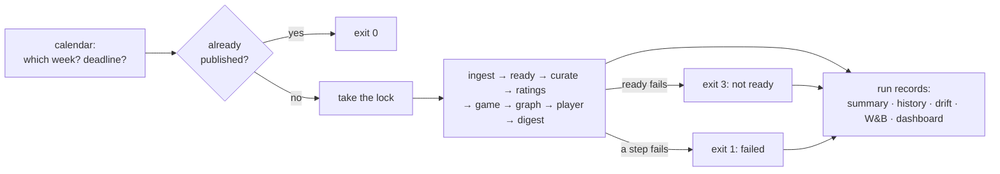

# Weekly operations: how the weekly run works (P07)

This guide explains the pieces P07 added around the weekly pipeline: the calendar, `nfl weekly run --auto`, the run lock, starting Neo4j, the run records (summary, history, the W&B pipeline run), alerts, drift checks, the season dashboard, the Saturday injury update and time-travel simulations. For **what to type and what to do when something breaks**, use the [runbook](../runbook.md). For every W&B chart, the [W&B guide](weights-and-biases.md).

## 1. The idea in two minutes

Every week the project does the same thing: wait until last week's games are final and in nflverse's data, refresh everything, refit the models, rebuild the graph, write the digest, before the next week's first kickoff. Until P07 a person had to know which week to run and when, remember to resume a failed step, and look in several files to see what happened.

P07 makes that one command, **`uv run nfl weekly run --auto`**, that:

1. **knows the week** from the schedule and the clock (§2), including Thanksgiving, Christmas, international mornings, byes, week 18 and the playoffs;
2. **knows whether it can run**: it exits with code 3 ("not ready") if last week isn't final yet (first by refreshing only the schedule, so a hopeless retry costs seconds, not a full ingest), and with 0 if this week was already published, so running it again is always safe;
3. **can't collide** with another run (a lock, §3), and **starts Neo4j** if it's down (§4);
4. **records itself** (§5): a summary file, one row in a history table, one W&B run, and the season dashboard (§8);
5. **checks itself** (§7): five drift signals from doc 08 raise alerts, never retune anything.

**Manual-first (D71).** Rishi chose not to schedule anything in P07: the project isn't deployed, and every manual run worked. So a person runs the command (Tuesday) and the injury update (Saturday, §9). The exit codes and the lock are exactly what a scheduler would need, so turning on scheduling later only wraps these commands ([runbook → Scheduling later](../runbook.md#scheduling-later-not-now)).

## 2. The calendar (`src/nflengine/ops/calendar.py`)

**Input:** nflverse's schedule (the newest raw snapshot: it works before curation) and a clock. Kickoff times in the schedule are US Eastern; they're converted to UTC exactly as curation does, so daylight saving is handled (the 2024 opener: Thursday 20:20 EDT = 00:20 UTC Friday; week 12's Monday game: 20:15 EST = 01:15 UTC).

**What it works out** (`plan_week`, returning a `WeekPlan`):

| Field | Rule | Example (Tuesday 2024-11-26 10:00 ET) |
|---|---|---|
| season | The latest season whose first kickoff is at most 10 days away; the offseason belongs to the season that just ended | 2024 |
| week | The earliest week that still has a game kicking off after now | 13 |
| phase | `preseason` (week 1 before its first kickoff), `regular`, `playoffs`, `offseason` | regular |
| previous week complete | Every game of week N−1 has a final score (live: in the newest snapshot; the `ready` step then also checks play-by-play) | 13/13 final |
| deadline | The first kickoff of week N | Thu 2024-11-28 12:30 ET (Thanksgiving), 50.5 h away |
| retry window | Wednesday 18:00 ET after week N−1's last game, or the week's first kickoff if earlier (Christmas 2024: Wednesday 13:00); "not ready" after it is an alert | Wed 2024-11-27 18:00 ET |
| started games | Week N games already kicked off | 0 |
| special | Tags for the slate (below) | thursday, thanksgiving, black_friday |

**Special cases**, all found from kickoff times and venues rather than assumed:

| Tag | When | Real examples |
|---|---|---|
| `thursday`, `thanksgiving`, `black_friday` | A Thursday game; games on the 4th Thursday of November; the Friday after | 2024 week 13 (3 Thursday games + LV@KC on Black Friday) |
| `christmas`, `midweek` | Games on Dec 25; any Tuesday / Wednesday game | 2024 week 17: Christmas fell on a **Wednesday**, so the deadline was Wed 13:00 ET; 2026 week 1: SF@LA in Melbourne on a Wednesday evening ET |
| `friday`, `saturday`, `monday_doubleheader` | Odd game days | 2024 week 1 Friday night in São Paulo; Saturday games in weeks 16–18 and the wild card round |
| `neutral_site`, `international`, `morning_kickoff` | Neutral venue (not the Super Bowl): nflverse's `Neutral` or any venue abroad, the same rule as the curated `neutral_site` (D99: 2026 PHI@JAX at Tottenham is listed as a Jaguars home game); abroad (from the venue's time zone in `config/stadiums.yaml`); before 11:00 ET | 2024 week 5 NYJ@MIN in London 09:30 ET; 2024 wild card MIN@LA moved to Glendale by the wildfires = neutral but **not** abroad |
| `byes` | Teams without a game (the team list is printed) | 2024 week 5: DET, LAC, PHI, TEN |
| `early_season`, `final_week`, `playoffs` | Weeks 1–3 (ratings lean on last season); the last regular week (rested starters); weeks 19–22 | |

One data quirk it handles: **nflverse lists 2025's international games under the home team's stadium** (Dublin's MIN@PIT as Acrisure Stadium). The `game_venues` corrections in `stadiums.yaml` (added in P03 for travel features) are read first, so those games are still found abroad.

**Odd moments:**
- Sunday afternoon of week N: the target is week N with the deadline passed and some games started ("late run": those games keep their earlier predictions).
- The Sunday night after week 18: no game is left in the schedule, but the playoffs aren't over. `--auto` (holding the lock) refreshes only the schedule (a few seconds) and, if the wild-card games still aren't there, records a not-ready run (exit 3); after the retry window it alerts.
- After the Super Bowl: `idle`, nothing to do.
- A new season in the schedule while `config/settings.yaml` still says the old one: `--auto` refuses and asks for the settings update (P10 pre-season work).

**Tested** on the real 2024–2026 schedules (`tests/fixtures/schedules_2024_2026.csv`, a column subset of nflverse's schedule as of 2026-10-04; `tests/ops/test_calendar.py`, 26 tests).

**See it:** `uv run nfl weekly status` prints the plan for now; `--as-of 2024-11-26T10:00` for any other moment.

## 3. The lock (`src/nflengine/ops/lock.py`)

A weekly run or an injury update holds an **operating-system lock** on `D:\nfl-ml-data\runs\.weekly.lock` (a byte-range lock: `msvcrt.locking` on Windows, `fcntl.flock` elsewhere). A second run can't get it and stops with exit 4. Both commands share it because both write the same run folders, the graph and W&B aliases. The lock is taken **before** anything writes, including the schedule-only refreshes `--auto` may do.

Because the operating system releases the lock the moment its process ends (crash included), nothing has to guess whether a lock is stale: no process-id checks, no age limits, no race between two runs taking over the same stale lock, and a run whose PC slept keeps its lock. (The first version guessed from process ids and age; the Sol review showed two runs could both take over a stale lock, and a 6-hour limit could break a sleeping run's lock.) The file's text is only a note: pid, computer, command, start time, emptied at the end of the run. If a run finds a note but no lock, that run died without cleaning up, and it reports the note as an `info` alert. Tested with a child process that takes the lock and dies.

## 4. Starting Neo4j (`src/nflengine/ops/services.py`)

Doc 02 always said "Neo4j down: try to start the container once". As built in P05 the `graph` step simply degraded. Now it first calls `ensure_neo4j()`:

1. ping Neo4j (5-second timeout); up → nothing to do;
2. if the Docker engine isn't running, start Docker Desktop (Windows) and wait up to 4 minutes;
3. `docker compose up -d` once, from the repo root;
4. wait up to 3 minutes for Neo4j to answer.

A credentials problem (a rejected password, `NEO4J_PASSWORD` not set) isn't "down": nothing is started and the step degrades at once with that reason. If the start fails, the step still runs the fail-soft graph build, which records `unavailable` in `graph_results.json`; otherwise a re-run of a week could reuse that week's older `ok` file and publish stale graph sections (Sol review). It never raises: if any step fails, the `graph` step degrades as before (the digest goes out without graph sections, with a banner). Command output is never echoed (compose can print variable warnings); only exit codes and fixed sentences are reported. **Checked live on 2026-10-04:** with the container stopped, it ran `docker compose up -d` and Neo4j answered after **50 seconds**.

## 5. Run records (`src/nflengine/ops/summary.py`, `ops/records.py`)

After every run (finished, failed, not ready or simulated), three records are written. None of them can change the run's result: each part fails soft.

**`run_summary.json`** in the week's run folder holds the whole run:

| Key | What |
|---|---|
| `status`, `exit_code`, `error` | `ok`, `degraded`, `failed`, `not_ready`; the failure reason (scrubbed, below) |
| `plan` | The calendar plan (§2) |
| `steps` | Each step: status, seconds, detail, and `this_run` (`weekly_run.json` keeps earlier runs' steps after a resume; only this run's count) |
| `deadline`, `published`, `on_time`, `hours_before_deadline` | Did the digest go out before the first kickoff? |
| `freshness` | One row per ingested dataset (newest snapshot, age in days, last ingest status; research-only datasets such as nflverse participation are listed but never stale) plus the newest week of the weekly sources (play-by-play, player stats, snaps, injury reports, depth charts, NGS, PFR, FTN) vs the week before the target; `stale` when a snapshot is more than 7 days old or a source is more than one week behind |
| `ingest`, `quality` | Datasets and failures of this run's ingest; quality checks and any failures of this run's curate |
| `models` | The model versions in the week's prediction files |
| `digest` | The final checks, failed checks, regenerated, banner, market used, graph status (only when the digest step ran in this run) |
| `drift`, `alerts` | §7 and §6 |

**`pipeline_history.parquet`** (`runs/<season>/`) gets one row per run: status, times, deadline and on-time, failed / degraded steps, the digest's checks, the number of drift alerts, who launched it. A week can have several rows (a "not ready", then the real run, then a resume); the dashboard and drift checks take the last real run per week.

**The W&B pipeline run**: group `weekly-pipeline`, job type `pipeline`, name `pipeline-<season>-w<NN>` (simulations: job type `simulation`, `sim-<season>-w<NN>`). Summary keys `status`, `total_minutes`, `on_time`, `hours_before_deadline`, `step/<name>_seconds` and `_status`, `stale_sources`, `ingest/*`, `quality/*`, `checks_passed`, `regenerated`, `banner`, `drift/<signal>` and its value; tables `steps`, `freshness`, `drift`; a `step_seconds` bar chart. Since P08 it also carries the week's `consistency/*` numbers (from `consistency.json`) and `run_summary.json` has `models.team` and a `consistency` block. It also **uses** the week's `game-model`, `graph-results`, `player-model` and `digest` artifacts (and `team-model`, P08), so W&B's lineage view finally links a published digest to the model and graph it came from (a gap listed in the W&B guide §10). A failed run ends the W&B run with exit code 1. Details in the [W&B guide §4.9](weights-and-biases.md).

**Scrubbing.** Free text that reaches these files, the console or W&B passes through `scrub()`: URL query strings are cut (the Odds API key travels as one), `user:password@` in URLs, `Bearer <token>`, secret-looking `name=value` and `"name": "value"` pairs, and bare key-shaped strings (`sk-…`, `wandb_v1_…`, long hex) are masked, on top of the step-level sanitizing from earlier phases. Step details are scrubbed before they reach `weekly_run.json`, and every alert's title and text before it is printed, stored or sent (tested on a table of secret shapes).

**State files are written atomically** (`weekly_run.json`, the history): a temporary file swapped in. A state file left unreadable by an older crash is kept as `weekly_run.json.corrupt` and the run starts fresh, still writing its records (Sol review).

**One record per week.** When a week has several runs, the weekly views (`latest_runs`) use the **last run that published** a digest: a later resume that failed before the digest doesn't erase the week's on-time and checks point. The history file is written to a temporary file and swapped in, so a crash can't corrupt it.

## 6. Alerts

An alert is a short title plus a sentence on what to do. They come from: a failed step (error), "not ready" after the retry window (error), a degraded step (warn), digest checks that failed after regeneration (warn), a taken-over lock (info), and the drift signals (warn). They are printed at the end of the run, stored in `run_summary.json`, and, with `ops.wandb_alerts: true`, sent as **W&B alerts**, which W&B delivers by email or in its app according to your W&B notification settings. That is the only "notification" channel in P07: no SMTP was added (decisions log Q02, D71). The [runbook](../runbook.md#what-each-alert-means) says what to do for each.

## 7. Drift checks (`src/nflengine/ops/drift.py`)

Doc 08 lists five signals that should make a person look, never make the code retune. They are evaluated after every weekly run, for the run of week N, which grades the weeks before N. Thresholds live in `config/settings.yaml` → `drift`.

| Signal | Rule as built | Data |
|---|---|---|
| `game_vs_elo` | The game-weighted Brier over a rolling **4 graded weeks**, model minus Elo; alert when the model is behind (gap > 0) in each of the last **3** such windows | Each graded week's saved primary predictions (the probabilities the digest showed) + results |
| `calibration` | Season-to-date ECE of the shown probabilities (10 equal-width bins); alert above the **higher of 0.05 and the noise level**: the 90th percentile of the ECE a perfectly calibrated model would show on the same games (simulated, seeded); not evaluated below 64 graded games | Same |
| `player_vs_baseline` (one per position group: QB, RB, WR/TE, EDGE/DL, LB/S; since P08 also CB/S and TEAM, the team stat totals, from the groups present in the scoreboard; probability targets have no MAE and don't enter it: they have `player_prob_vs_baseline`, the same rule on the Brier score of the chances, D85, replayed on 2019–2025 with 0 alerts) | Each target's MAE vs the rolling baseline's (counts vs the baseline's median, D65), weighted by scored projections, averaged over the group's targets; alert when the group is behind in each of the last 3 rolling 4-week windows | The accuracy scoreboard (P06): live rows, and walk-forward rows for 2026 weeks 1–3 |
| `data_freshness` | Alert if any dataset in the run summary's freshness table is stale (snapshot > 7 days old, or a weekly source more than one week behind) | `run_summary.json` → `freshness` (§5) |
| `checks` | Alert when more than 20% of the last 4 weeks' digests failed their final checks (published with the banner); the share that needed a second writer pass is reported alongside | `pipeline_history.parquet` |

**Windows, in one place.** A graded week is one with at least one gradable game. A rolling window needs its full 4 weeks (no partial windows), so a signal needs 6 graded weeks (4-week window, 3 in a row) before it can alert; before that it says `insufficient_data`. In 2026 the live game rows start in week 4, so the first possible `game_vs_elo` alert comes with the week-10 run; the player scoreboard also holds walk-forward rows for weeks 1–3, so player alerts are possible from the week-7 run.

**Tuned on history before trusting it.** `drift.replay_drift` replays each signal week by week over the walk-forward backtests of 2019–2025, exactly as the live check would have seen them:

| Signal (2019–2025, 82–94 evaluable run weeks) | Alerting share of weeks | Episodes |
|---|---|---|
| `calibration` at doc 08's flat 0.05 | **85%** | 11 |
| `calibration` with the noise level (as built), model-only probabilities | 20% | 6 (mostly 2023, whose season ECE really was 0.137) |
| `calibration` with the noise level, the shown (market-informed) probabilities | 5% | 5 single weeks (2019 weeks 6 and 8; 2024 weeks 5, 16 and 18) |
| `game_vs_elo`, model-only probabilities | 27% | 8 |
| `game_vs_elo`, the shown probabilities (as built) | 2% | 1 (2019 weeks 12–13) |
| `player_vs_baseline`, every group | 0% | 0 |

Two lessons. A flat ECE limit of 0.05 is below the noise floor: a perfectly calibrated model averages an ECE of about **0.08** on one season's 100–270 games, so the flat rule would fire nearly every week. Hence the noise-adjusted limit, which falls from about 0.16 after five weeks to about 0.08 by week 18 (D75). And the model-only probabilities are only about 0.002 Brier better than Elo over a season (P03), so a 4-week window flips sign often; the digest shows the market-informed probabilities when lines exist, and against those the rule fired once in seven seasons, so the doc-08 margin of zero is kept.

**This week's digest counts.** The `checks` signal is evaluated with this run's own row already in the history, so a failing digest counts the same week, not a week later.

**Reading a signal.** Each `DriftSignal` has `status` (`ok`, `alert`, `insufficient_data`), `value` (the gap, ECE, improvement or failure rate), `threshold`, a plain `detail` sentence with the numbers, and the doc-08 `response`. In the 2025 week-11 simulation (§10): `game_vs_elo ok` (over graded weeks 7–10, 56 games, the model's Brier 0.2052 vs Elo's 0.2101), `calibration ok` (ECE 0.033 over 149 games; a perfect model averages 0.079 there), all five player groups ok (from +0.3% for EDGE/DL to +8.2% for QB over weeks 7–10).

## 8. The season dashboard (`src/nflengine/ops/dashboard.py`)

> **Every chart, what it shows and whether higher or lower is better:** [W&B guide → The season dashboard](weights-and-biases.md#the-season-dashboard-p07-every-chart-explained). This section covers how the dashboard is built.

Doc 08 asked for a W&B Report, "2026 Season Dashboard", with the season's Brier vs Elo vs market, the cumulative calibration curve, the watch-list hit rate, the player model's improvement per position group, and pipeline health. W&B reports draw their charts from runs, so the dashboard has two parts:

1. **One run per published weekly run** (`log_season_dashboard`): group `season-dashboard`, job type `dashboard`, name `season-<season>-w<NN>`. It logs the **whole season to date** as line series, then takes the tag `dashboard-current` and removes it from the season's older dashboard runs.
2. **The Report** (`nfl dashboard build --season 2026`, once): a **Season at a glance** row of eight numbers (season Brier for model / Elo / market, pick accuracy, season ECE, player MAE vs baseline, on-time rate, checks pass rate), then five sections (Game model, Calibration, Watch list, Player model, Pipeline health), each with a short "how to read this" text and line plots whose run set is filtered to `Group = season-dashboard`, tag `dashboard-current` and tag `season:2026`. Because the filter always finds the newest run, **the report updates by itself** after every weekly run; nobody edits it. A manual re-run of an **older** week doesn't move it back (the pipeline checks `dashboard.json` → `last_run_week` first). Its URL is kept in `runs/2026/dashboard.json`.

| Series | x-axis | What |
|---|---|---|
| `game/*` | graded week | Brier model / Elo / market (weekly and season to date), the rolling 4-week gap vs Elo (the drift input), pick accuracy, points error |
| `cal/*`, `calcurve/*` | graded week; predicted probability | Season ECE next to the chance level (a perfect model's ECE on the same games); the calibration curve (observed vs predicted by bin, with the diagonal) |
| `watch/*` | graded week | Watch-list hit rate, weekly and season to date |
| `player/*` | graded week | MAE improvement over the baseline per position group: weekly, season to date, rolling 4 weeks (the drift input), all groups together, and whether the week's rows are live (1) or walk-forward (0) |
| `pipe/*` | run week | On time (1/0) and the running on-time rate, hours before the deadline, run minutes, checks passed and the running pass rate, second writer pass, degraded steps, drift alerts |

All are standard line plots, so they render in the W&B mobile app. **In week 4 of 2026 the report is mostly empty**: no live week has been graded yet (the week-5 run grades week 4), so only the player series (2026 weeks 1–3 are walk-forward rows) have points. It fills in from Tuesday's week-5 run.

The report: [2026 Season Dashboard](https://wandb.ai/models-ontario-tech-university/nfl-analytics-engine/reports/2026-Season-Dashboard--VmlldzoxODA1NTI5MQ==). Smoke runs went to the separate group `season-dashboard-smoke` (tag `smoke`) so the report never shows them.

## 9. The Saturday injury update (`src/nflengine/ops/injury_update.py`)

**Why.** Tuesday's digest uses Tuesday's injury report, but final designations come out on Friday, and a quarterback change can arrive after Tuesday (week 4 of 2026: the digest named Case Keenum as the Bears' QB; news after the data pull said otherwise). `uv run nfl weekly injury-update --auto` (Saturday morning) re-checks.

**What it does**, in order:

1. **Gate:** `flags.injury_update_enabled` must be true (it is), and the week's main run must exist (`predictions_games.parquet` and `watchlist.parquet` in the run folder). It shares the weekly run's lock.
2. **Before state:** reads the week's curated injury report and reserve lists *before* re-ingesting, because a same-day snapshot is overwritten in place.
3. **Re-ingest** only what moves between Tuesday and Saturday: nflverse injuries, weekly rosters, depth charts and the schedule; ESPN (injuries, news, scoreboard odds); the Odds API. Then re-curate with the blocking quality checks. Ratings aren't rebuilt: no games were played since Tuesday.
4. **Re-predict** games and players with `run_train(..., output="update")`. That writes `predictions_games_update.parquet` and `predictions_players_update.parquet` next to the main files and **nothing else**: no model files, W&B artifacts, aliases, status file or scoreboard rows. Tuesday's files are untouched, so next week's report card still grades what the digest published.
5. **Compare** every game that hasn't kicked off: home win probability, predicted score, expected quarterbacks, and the market line; and every watch-list player: injury status then (the watch list's own `injury_status`) vs now, and his new projection. Games already under way are left out.
6. **Material?** (doc 06, refined in D73): a game's home win probability moved by **5 points or more**, or a watch-list player's status changed **to or from Doubtful, Out or IR** (Questionable → Doubtful, Doubtful → Out, Out → cleared, onto a reserve list). A plain Questionable tag added or removed doesn't count: Tuesday's watch list usually predates the week's injury report, so every Saturday Questionable would otherwise publish an addendum (all three reviewers flagged it). Every status change is still listed in `injury_update.json`. A watch-list player on a reserve list now shows as IR. For a game that moved, code lists the likely reasons: an expected-QB change, a line move of half a point or more, then up to 3 players per team whose status worsened to Doubtful, Out or IR, the most important first (average snap share over his last 3 games).
7. **Writes** `runs/<season>/week<NN>/injury_update.json` every time. **Only if material**, it publishes a short **code-written** addendum (no LLM: every line is a change code can state exactly; D73) to `reports/<season>/week<NN>-injury-update.md`: a header with the update time and injury snapshot, a table of the games that moved (win % then → now, predicted score then → now, why), the watch-list status changes, and a footer saying next week's report card still grades Tuesday's numbers.
8. **Records:** one `pipeline_history.parquet` row per update (`ok`, `degraded` when the player refit or W&B logging failed, `failed`), written inside the lock. **W&B** (fail-soft: an outage never stops the update): one run, `weekly-pipeline` / `injury-update` (`injury-update-<season>-w<NN>`), with `material`, `games_compared`, `games_moved`, `max_prob_move`, `qb_changes`, `watch_status_changes`, `started_games_excluded`, the game and watch-list tables, and the artifact `injury-update` (type `digest`).

**Checked on the live week-4 data** (Sunday 2026-10-04, 16:07 ET, `--no-ingest`, no W&B): 11 of 16 games had kicked off and were left out; the 5 remaining games and the 1 watch-list pick still to play were compared; nothing moved (0.0 points) and no addendum was written; the main files' sha256 hashes were unchanged; the game refit took 4.5 s and the player refit 66 s. With unchanged data the refit **reproduces Tuesday's numbers exactly** (Kirk Cousins: 242.1 passing yards both times), so any move in a real Saturday update comes from new data, not from refitting noise. The smoke's files were deleted afterwards. The first real update is Saturday 2026-10-10.

## 10. Time travel: simulating a past week

`--as-of` sets the clock. A moment in the past turns the run into a **simulation**:

- the calendar answers for that moment (week, deadline, special cases);
- "is last week final?" can't use today's data (every 2025 game is final now), so a game counts as final once `kickoff + ops.data_lag_hours` (10 h) has passed. A Monday night game at 20:15 ET is "in the data" by 06:15 Tuesday;
- the steps are `ready` (from that rule) and `digest`, produced as a **backtest** for that moment: as-of data, the canonical walk-forward predictions, the placeholder writer unless `--llm` says otherwise, and **no graph sections** (a backtest graph build would wipe the live graph; the 2026-10-04 proof runs below still built it and the live graph was restored afterwards, which is why the three reviews asked for `graph="off"`);
- files go only under `runs/digest-backtests/` and `reports/backtests/`; the W&B record is `weekly-pipeline` / `simulation`; nothing live is touched, and the season dashboard isn't updated.

**Proven on 2025 weeks 10 and 11** (2026-10-04; W&B `weekly-pipeline` / `simulation`):

| `--as-of` (ET) | Result | What it shows |
|---|---|---|
| Mon 2025-11-03 22:00 | `not_ready`, exit 3 (`jxqxazom`) | Week 9's Monday game (ARI@DAL) isn't in the data yet: 13/14 final |
| Tue 2025-11-04 10:00 | `ok`, exit 0, 95 s (`59p8uw4z`) | The retry runs week 10: published 58.2 h before Thursday's kickoff (on the simulated clock), checks passed; slate tags `thursday`, `international` (ATL@IND in Berlin, 09:30 ET), `byes` (CIN, DAL, KC, TEN) |
| Tue 2025-11-04 10:00 again | `already_done`, exit 0 | Running twice is harmless |
| Tue 2025-11-11 10:00 | `ok`, exit 0, 86 s (`nywth4ts`) | The next week, first try |

The week-10 run raised a `calibration` alert (ECE 0.053 over 135 games against the flat 0.05). That alert is what led to the noise-adjusted limit (§7): a perfectly calibrated model averages 0.082 on that many games.

## 11. What changed in the code, file by file

| File | Role |
|---|---|
| `src/nflengine/ops/calendar.py` | The calendar (§2) |
| `src/nflengine/ops/lock.py` | The lock (§3) |
| `src/nflengine/ops/services.py` | Neo4j / Docker start-up (§4) |
| `src/nflengine/ops/records.py` | Shared records: history schema, `DriftSignal`, `Alert` |
| `src/nflengine/ops/summary.py` | Freshness, `run_summary.json`, history rows, the W&B pipeline run (§5) |
| `src/nflengine/ops/drift.py` | Drift signals and the replay (§7) |
| `src/nflengine/ops/dashboard.py` | The dashboard run and the W&B Report (§8) |
| `src/nflengine/ops/injury_update.py` | The Saturday update (§9) |
| `src/nflengine/weekly.py` | `run_pipeline` (calendar, lock, steps, records), simulations, the `graph` step's Neo4j start |
| `src/nflengine/cli.py` | `nfl weekly run --auto / --as-of / --dry-run / --force / --no-wandb / --expect-week` (CR02), `nfl weekly status`, `nfl weekly injury-update`, `nfl dashboard build / update` |
| `src/nflengine/ops/events.py`, `src/nflengine/fsutil.py` | CR02: progress events (§11a); the replace retry |
| `src/nflengine/models/game_runs.py`, `player_runs.py` | `run_train(..., output="update")` for the injury update |
| `config/settings.yaml` | `ops:`, `drift:`, `injury_update:` blocks; `flags.injury_update_enabled: true` |

**Settings** (`config/settings.yaml`):

| Key | Default | Meaning |
|---|---|---|
| `ops.data_lag_hours` | 10 | Simulations: hours after kickoff a game counts as in the data |
| `ops.neo4j_start_timeout_s`, `ops.docker_start_timeout_s` | 180, 240 | Waits in §4 |
| `ops.wandb_alerts` | true | Send alerts as W&B alerts |
| `ops.promote_auto` | true | `--auto` moves the `production` alias to each live fit (D72) |
| `drift.*` | doc 08 | §7 |
| `injury_update.*` | 0.05, true | §9 |

## 11a. Progress events and `--expect-week` (CR02)

The control room (CR02) draws a run live, so every run now writes a short diary of itself, and the Run button needs a guard against running the wrong week. Both help at the terminal too.

**`--expect-week N`** (with `--auto`; `nfl weekly injury-update --auto` takes it too): the run stops before anything (no step, no record, no event; the lock is released) with **exit 6** if the calendar's week isn't N. The check comes after the calendar has resolved the week (including the schedule-only refresh under the lock), so it catches a week that moved between the page and the run. Dry runs check it too. Live check on 2026-10-06 01:25 ET: `--expect-week 6 --dry-run` and `--expect-week 6` both said "the calendar's week is week 5, not week 6 (--expect-week): nothing was run", exit 6; only the lock note was written and emptied.

**Progress events** (`src/nflengine/ops/events.py`): one file per run, resume, Saturday update or rehearsal, `runs\<season>\week<NN>\events\<run-id>.jsonl`, one JSON object per line:

| Type | When | Carries |
|---|---|---|
| `run_start` | First | What kind of run, the command, the steps it will do, the step a resume starts from and the steps an earlier sitting finished (`earlier`), who launched it (`via: control-room` from the app), the calendar's plan lines |
| `step_start` / `step_end` | Around each step, and the run records (`records`) | The step; at the end its status, seconds and detail |
| `progress` | Inside a step | `fraction` (0–1 of the step), a label: "dataset 12/30 · nflverse · pbp", "table 17 · plays", "loading 5/23 · node:Player", "refitting 7/23 · rec_yds-wrte", "building payload.json" |
| `llm` | Around the digest's LLM call | `start` / `rewrite`, then `done` (or `failed`) with the provider, seconds, reasoning count and cost. The call isn't streamed (P09's rule), so nothing comes in between |
| `log` | Every console line | The text (colour markup removed), its class, the step it belongs to |
| `run_end` | Last | Status, exit code, message, published, the failed step, `material` (Saturday) |

A 2026 week-4 rehearsal wrote 104 events (22 KB): 61 log lines, 31 progress events, the four steps, the LLM's start and done, start and end. Every text is scrubbed; each line is written whole; and **a failure to write an event never changes the run** (the writer goes quiet; a test makes the events folder a file and the run still ends `ok`). Runs that stop before any step (offseason, exit 6, already published, locked) write none.

**Two small changes that came with it:** the pipeline's atomic writers (`weekly_run.json`, the history, the prediction files, curated and ratings tables, raw snapshots) now retry their final replace for about two seconds if another process has the file open (on Windows a replace fails while someone reads), because the control room reads a run's files while it's live; and a rehearsal now holds its own lock on its folder (`.<folder>.rehearsal.lock`), so two rehearsals can't share one.

## 12. Limits and what's next

- **Nothing is scheduled** (D71). The runbook lists what scheduling would take.
- **Alerts go to W&B only**: a missed run raises no alert, because a run that never starts can't send one. A scheduler (or a person) is the safeguard.
- **Playoff weeks** go through the same pipeline but haven't been run end to end yet: check the first one by hand (P10).
- **The `production` alias isn't read by the pipeline**; P08 decides whether the weekly run should load the `production` model instead of refitting.
