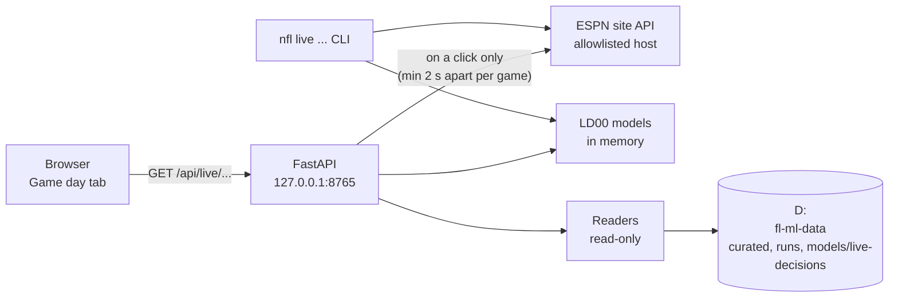
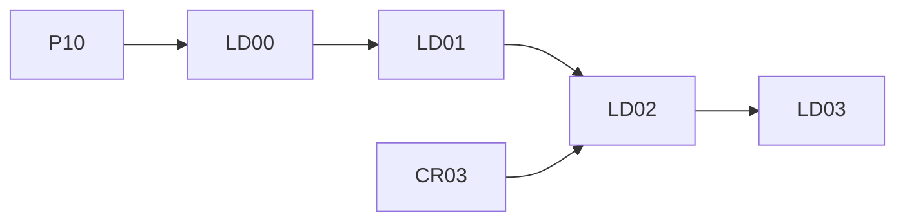

# Live decisions: the 3rd- and 4th-down bot

Status → see the **Live decisions** rows in [plans/PROGRESS.md](../plans/PROGRESS.md). Decisions: D107–D109 in the [decisions log](../10-decisions-log.md). Planned 2026-10-08.

While Rishi watches a game, he opens the control room, picks a game in progress and, on a 3rd or 4th down he cares about, presses **Check this play**. Within a second he sees what the numbers say:
- **4th down:** go for it, kick or punt, the win probability after each choice, and how sure the bot is;
- **3rd down:** the chance they convert, the chance they pass, and "if they're stopped short", the 4th-down call for each possible distance.

Next to the call he sees whether this team tends to pull it off: its conversions, its kicker, its coach's habits. It's its own track, **LD00–LD03**, with its own new models. The **existing models stay exactly as they are** (D107).

## 1. What was agreed (Rishi, 2026-10-08)

| Topic | Decision |
|---|---|
| Live data | **ESPN's public (unofficial) site API**, polled from the app's server. Rishi accepted the terms caveat (Disney's terms bar automated access; personal, low-volume use) and the risk that it changes without notice (D109) |
| When it computes | **Only when Rishi presses "Check this play"** on the game he picked. No automatic alerts. Several games can be live at once; he chooses which one and which plays matter (tied game, 4th & 5, 30 seconds left) |
| Downs | 3rd and 4th downs. A check on 3rd down also shows the 4th-down call for every distance they could be left with, so the answer is ready even when ESPN's feed is late |
| Where it lives | A new **Game day** week tab, added after **Graph**. Existing tabs keep their order and content (D108) |
| Models | All new: win probability, 3rd/4th-down yards gained, field goal, punt, and a situational pass model. Trained, tracked and versioned on their own. They read curated data and may read published outputs (market lines, team ratings), and never change them (D107) |
| Speed | Inference is well under a millisecond per decision (a probe: 0.14 ms for a full go / kick / punt decision with LightGBM in the project's venv). ESPN's feed is the slow part |

## 2. What the research found (2026-10-08)

**ESPN's live feed** (field names checked against this season's archived scoreboards):
- `events[i].competitions[0].situation`: `down`, `distance`, `yardLine`, `downDistanceText` ("3rd & Goal at LAR 2"), `possession` (team id as a string), `possessionText`, `isRedZone`, `homeTimeouts`, `awayTimeouts`, `lastPlay.{text, type.text, probability.homeWinPercentage, start / end.yardLine}`. It describes the **next snap**, and it's absent before and after a game.
- Clock and score: `competitions[0].status.{clock, displayClock, period, type.state}` (pre / in / post), `competitors[k].{score, homeAway, team.id}`.
- Endpoints:
  - the full scoreboard: 22 KB gzipped, cached by ESPN for 5 s;
  - one game, `.../scoreboard/{eventId}`: 3.4 KB, cached 1 s. **Use this for a check**;
  - `summary?event=ID`: 52 KB, with every play (`drives.previous[].plays[]`: start / end state, clock, text, `wallclock` = snap time), ESPN's own win probability per play and DraftKings lines.

  Responses took 60–170 ms; no rate limiting was seen (10 quick calls).
- **Quirks:**
  - `yardLine` counts from the **home** team's goal line, not the offense's.
  - `yardsToEndzone` was wrong in about 1 snap in 10 (0 on timeouts, mirrored on home punts): derive yards to goal from `yardLine` and possession.
  - Timeouts in goal-to-go read `down = -1, distance = 0`. (LD01: in every archived case it was an "Official Timeout" right after a score, a kickoff or try next, with a junk yard line and no `possession`; see below.)
  - The summary's plays have no timeouts remaining (nfl4th parses "Timeout #N by TEAM").
  - Team codes differ from nflverse (WSH / WAS, LAR / LA).
  - Fake punts are typed "Rush" with "(Punt formation)" in the text.
  - No wind in the feed (temperature and conditions only); `venue.indoor` exists.
- `api.nfl.com` needs a token (HTTP 401). The licensed option is Sportradar (2 s updates, paid).

**Checked again in LD01 (2026-10-10), with the 2026 summaries of weeks 1–5 and archived live scoreboards:**
- Every path above still holds. Sizes today (JSON / gzipped): the scoreboard 270 KB / ~22 KB (ESPN caches it 6 s), one game 18 KB / ~3.4 KB (1 s), a summary ~600 KB / ~50 KB (3 s); answers in 45–170 ms.
- **The `situation`'s `lastPlay` has no `wallclock`**; snap times come only from the summary (joined by play id). In game, `competitions[0].odds` is null.
- **ESPN's play id = event id + nflverse's `play_id`** for every snap (`40187298040` = event 401872980, play 40). Timeout rows' ids differ.
- **Summary clocks:** `clock.displayValue` only (no `value`). It's the **snap** clock (equal to nflverse's `quarter_seconds_remaining` on all 8,813 non-scoring snaps of weeks 1–4), except on **scoring plays, where it's the clock at the score**.
- **Summary scores** (`homeScore` / `awayScore`) are after the play, the try included (extra points and two-point tries are inside the touchdown play's text, not rows of their own); some timeout and two-minute-warning rows show 0–0, and a plain play can carry a stray score: only `scoringPlay` rows move the score.
- **`down = -1`** means no snap is pending (a TV timeout before a kickoff or a try); a team timeout keeps the down. **At halftime** the state stays `in` (detail "Halftime") and the situation keeps a stale 1st & 10 with no `possession` and no `downDistanceText`: only `lastPlay.type.text == "End of Half"` tells. In summaries, Official Timeout, two-minute-warning and End Period rows carry a down and a yard line too (a two-minute warning can read "4th & 9"): they're not snaps.
- **Roof:** the scoreboard's `venue.indoor` exists; the summary's `gameInfo.venue` has no `indoor` (65 of 65).
- **Timeouts in the summary:** "Timeout #N by TEAM" (GSIS codes too: BLT, HST, CLV, ARZ), "Timeout #4" exists (an excess timeout), some "Timeout"-typed rows are really "Official Timeout" or the two-minute warning, and a **lost challenge costs a timeout that only the play text shows** ("Indianapolis challenged …, and the play was Upheld. (Timeout #1.)"; the marker is missing in 4 of 14).
- **The play's type isn't what happened:** a play wiped out by a penalty is often typed as the play that was run ("Rush", "Pass Incompletion", even "Punt": 73 snaps in weeks 1–5, all `no_play` in nflverse; 655 more are typed "Penalty"), and a punt with a fumbled return is typed "Fumble Recovery (Opponent)". Read the text: "No Play", " punts ", "field goal is" decide; a fake punt is typed "Rush" with "(Punt formation)".
- **Rare text and typing slips:** 9 of 11,976 plays have short-form text ("Kirk Cousins Pass Complete for 5 Yds to …") that drops challenges and penalty details; a real play can be typed "End Period"; the start spot can be a yard off ESPN's own text, and a spot correction can be missed.
- At both 2026 neutral sites (Melbourne, Rio) ESPN's home team is nflverse's.

**Parity with nflverse (LD01):** replaying every finished 2026 game (weeks 1–5, 65 games), **2,745 of 2,788 3rd / 4th-down states equal nflverse's (98.5%; the 3 on one side only count as not equal)**; the offense, down, quarter and score always agree; the rest are scoring-play clocks (14), the two feeds' timeout logs (12), nflverse charging a lost challenge one play early (8) and one-yard spot differences (6). The same engine on the same 73 4th downs (five games) makes the same call from both sources, 73 of 73 (guide §8).

**Measured lag on a live game:** run on Sun 2026-10-11 (`nfl live latency`; LD01's dated step, PROGRESS → Season calendar); the numbers go here.

**Timing:**
- In week 4 a 3rd-down snap came a median 42 s before the next 4th-down snap (p10 36 s, p90 51 s, 219 pairs).
- ESPN's feed was seen trailing the snap by **8, 12, 30 and 84 s** in archived snapshots, plus up to 5 s of cache.
- TV delay at Super Bowl LX: antenna ~19 s, cable 38 s, Peacock 48 s, YouTube TV / Hulu 53 s, NFL+ 62 s ([The Desk](https://thedesk.net/2026/02/stats-perform-phenix-latency-super-bowl-lx/)). On a stream the feed usually beats the picture; on cable or an antenna it sometimes won't. **Hence the 3rd-down "if stopped short" table, and a clear "as of" stamp on every answer.**

**How others do it:**
- **`nfl4th`** (Ben Baldwin, [github.com/nflverse/nfl4th](https://github.com/nflverse/nfl4th)):
  - a yards-gained model with 76 classes, trained on 3rd and 4th downs 2014–2019 (down, distance, yard line, era, roof, spread, total);
  - a field goal GAM on distance;
  - an empirical punt distribution;
  - win probability averaged from nflfastR's `vegas_wp` and a second model.

  Its live bot polls ESPN's summary every minute and posts **after** the play. It still assumes the opponent starts at its own 25 after a score; since 2025 a touchback comes out to the **35**.
- **NGS Decision Guide** (AWS): XGBoost with 17 yardage classes, team EPA features, Brier 0.21.
- **"Analytics, have some humility"** (Brill, Yurko & Wyner, [arXiv 2311.03490](https://arxiv.org/abs/2311.03490)): with bootstrapped uncertainty only **48%** of 4th-down calls in 2018–22 were clear-cut, and 44% differ by under 1 win-probability point. So the bot labels **toss-ups**.
- **nflfastR's WP model** ([write-up](https://opensourcefootball.com/posts/2020-09-28-nflfastr-ep-wp-and-cp-models/)): 12 features plus the spread; calibration error 0.0055–0.0066. Our curated `plays` already carry `wp`, `vegas_wp` and `xpass`: ready-made baselines.

## 3. Screens

**Game day** (week tab, after Graph):

| State | Shows | Reads | Phase |
|---|---|---|---|
| Current week, games on | The week's games (upcoming / live / final) with score, clock and down & distance, refreshed slowly while the tab is open. Click one → its panel: score, clock, possession, timeouts, ESPN's situation and when ESPN last updated, our pre-game win % and the market spread. **Check this play** → the call card | ESPN scoreboard (server side, cached), the week's `predictions_games.parquet` (read-only), curated `lines` | LD02 |
| The call card: 4th down | Go / Field goal / Punt with the win probability after each, the gain over the next best, a **Confident / Lean / Toss-up** label, the odds behind it (convert %, make %, the punt's expected landing spot), and "**Is this team good at this?**" (season and last-season 4th-down and short-yardage conversions, the kicker's makes by distance, the coach's go rate in spots like this) | The LD00 models (in memory), curated plays and player stats as of last week | LD02 |
| The call card: 3rd down | Chance they convert, chance they pass, and the **if-stopped table** (4th & 1 … 4th & 10 from where they'd be: the call and the gain for each) | Same | LD02 |
| A finished week | **Decision review:** every 4th down of the week, the bot's call against the coach's, the win probability it cost or gained; the most aggressive coaches; the bot's own calibration on real plays | Curated plays (read-only), the LD00 models | LD03 |
| A week before its games | The slate with kickoff times, "Game day opens at the first kickoff" | The calendar | LD02 |

## 4. Architecture

- **`src/nflengine/live/`** (new package): `espn.py` (the client: host allowlist, timeouts, back-off), `state.py` (ESPN JSON → our game state, with every quirk above), `models.py` (load / score), `decide.py` (go / kick / punt; the 3rd-down table), `context.py` ("is this team good at this?"), `replay.py`.
- **Models** under `{NFL_DATA_ROOT}/models/live-decisions/<version>/`, logged to W&B as the artifact `live-decision-models` (with a `production` alias of its own).
- **CLI:** `nfl live train | backtest | games | call --event ID | replay --event ID | latency --event ID | parity`; `nfl app --live-replay EVENT` (LD02).
- **App (as built in LD02, D118):** `GET /api/live/{season}/{week}/games[?refresh=1]` (the list; it also carries every game's situation, so there's no separate `/situation`), `GET /api/live/{season}/{week}/games/{event}/call` (a check), `GET /api/live/{season}/{week}/games/{event}/context?offense=XXX` (the team context); LD03 adds `GET /api/live/{season}/{week}/review`. The event id is validated (digits, and it must be in that week's scoreboard); a browser's cross-site request is refused. The service behind them is `src/nflengine/app/readers/live.py`; `nfl app --live-replay EVENT` serves a finished week as if live (`live/replayfeed.py`).
- **What the app writes:** nothing outside `cache/control-room/live/` (the team context per week, `context/<season>-wNN.json`). "Check" is a GET: it changes nothing.

## 5. Safety rules

On top of the control room's §5 and CLAUDE.md's Security section:
1. **One outbound host:** `site.api.espn.com` (HTTPS). The client refuses any other host. No credentials are sent; there are none.
2. **Polite polling:** a fresh ESPN call only on a click, or a slow list refresh (about 30 s) while the Game day tab is visible; at most one call per game every 2 s; exponential back-off on errors; a fixed User-Agent naming the project.
3. **ESPN text is data:** play descriptions are shown as text (never HTML) and pass through `clean()`.
4. **A broken feed never breaks the app:** the card says "ESPN didn't answer (…), last good state 14 s ago" and still shows the last answer.

## 6. The no-touch rule (D107)

This track adds; it never changes what exists:
- no change to the game, ratings / Elo, player or team-totals models, their features, settings, training, artifacts or `production` aliases, the digest or its writer, the weekly graph, or the weekly run's steps and the Run button;
- new code in `src/nflengine/live/`; new W&B job types and artifacts; new data folders; a new `live:` block in `settings.yaml`;
- shared files change only by adding (a CLI group, a path helper, the app's router and tab list);
- every phase closes with the **production-unchanged check**: the protected-paths test (`tests/test_production_untouched.py`, LD00 creates it) and a rehearsal of the newest published week that reproduces its predictions (`weekly-ops` skill §5c).

## 7. Phases

| Phase | Title | Depends on | Delivers |
|---|---|---|---|
| [LD00](LD00-decision-models.md) | Decision models | P10 | Win probability, yards gained (3rd / 4th down), field goal, punt, pass models; the decision engine; leave-one-season-out backtests vs `vegas_wp` and simple baselines; W&B runs and the `live-decision-models` artifact; model card; the production-unchanged test |
| [LD01](LD01-live-feed.md) | The live feed and replay | LD00 | The ESPN client and state parser; `nfl live games / call / replay / latency`; state parity vs nflverse play-by-play for 2026 weeks 1–5; a measured feed lag on a live game |
| [LD02](LD02-game-day-tab.md) | The Game day tab | LD01, CR03 | Mockup first; the tab, the click-to-check call card with team context; the first live use on a real game |
| [LD03](LD03-decision-review.md) | Decision review and season tracking | LD02 | Finished weeks' decision review, coach aggressiveness, the bot's live calibration and a `decision-review` W&B run per week |

Same 🤖 / 🧑 / ✋ tags and protocol as every phase ([plans/README.md](../plans/README.md)). Commit prefixes `[LD00]` … `[LD03]`. **Mockup first** for LD02 and LD03, as in the control room: the approved mockup is the visual spec.

**Docs each phase leaves:**
- the guide `guides/live-decisions.md` (started in LD00);
- the model card `model_cards/live-decision-models.md` (LD00);
- the skill `.claude/skills/live-decisions/SKILL.md` (LD00);
- the W&B guide's new section (LD00, LD03).

## 8. As built

Each phase adds what it built and any differences from this spec here, with decision numbers.

### LD00: decision models (2026-10-10; D113, D114, D115)

- **Built:** `src/nflengine/live/` = `schema.py` (the `GameState` contract, eras, rules by season), `data.py` (training frames), `models.py` (the six models), `decide.py` (the engine), `train.py`, `backtest.py`; `nfl live train | backtest | call`; `tests/live/` (294 unit tests + the bundle's 7 integration tests); `tests/test_production_untouched.py` (the D107 guard for all three tracks). Guide [`guides/live-decisions.md`](../guides/live-decisions.md), model card [`model_cards/live-decision-models.md`](../model_cards/live-decision-models.md), skill `live-decisions`.
- **Shipped:** `live-decision-models:production` = `2010-2025_20261010T054343Z` (W&B `hxmgioka`). Backtest `p3y90nh0` (the ship decision; re-run as `m70hg3pa` after the Sol fixes, D115, with identical model metrics): win probability within 0.0011 Brier of `vegas_wp` (calibration 0.0048), yards gained 12 / 12 seasons, field goal 10 / 12, pass 6 / 12 (it beats `xpass` in every season `xpass` never trained on; shipped by Rishi, D114).
- **Findings from the LD00 probes (checked live on 2026-10-10):**
  - 31,985 4th downs in 2018–2025 (5,750 attempts); lines, `wp`, `vegas_wp`, `xpass` complete on runs and passes.
  - **Rules eras:** touchback after a kickoff at the 20 (to 2015), 25 (2016–23), 30 (2024), 35 (2025+); the receiver's mean start after a score 23.0 → 25.4 → 29.8 → 30.6 yards from its own goal (2026 weeks 1–4: 30.5); extra point 99.3% → 93–96% from 2015; OT 15 → 10 minutes in 2017; in 2025 no OT game ended on the first possession (both teams possess).
  - **Field goals:** distance = yards to goal + 18 (90%); a miss → the spot of the kick 8 yards back; indoors +3.6 points at 40–55 yards; a kicker's own record adds ~0.1% (not used).
  - **State semantics:** the second-half kickoff goes to the team that didn't receive the opening one (2,227 / 2,227 games); timeouts are never missing on a snap; `games.neutral_site` (not the raw `location`) marks neutral sites.
- **Differences from this spec:** the bootstrap uses 20 refits and only for calls closer than 5 points (the 20 ms budget; D113); the win-probability model is boosted from a logistic base (D113, model card → Tuning); goal-to-go defensive-penalty first downs are left out of the yards-gained model; the bot's live use reads `models/live-decisions/production.json` (the app reads files, not the alias).
- **For LD01:** build a `GameState` (offense's side: `yardline_100` from `yardLine` + possession, both timeouts, the pre-game spread and total from the offense's side, `season`, `home` +1 / 0 / −1, `receive_2h_ko` from the opening kickoff); `GameState` rejects bad input with a readable message; `Engine(load_production()).fourth_down(state)` / `.third_down(state)`.

### LD01: the live feed and replay (2026-10-10; D116, D117)

- **Built:** `src/nflengine/live/` + `espn.py` (the client: one host, 2 s per game, 0.5 s between requests, 5 s timeout, back-off 2 → 60 s, stale answers instead of errors), `state.py` (`load_contexts` from curated games / lines / espn_scoreboard / weather_forecasts, `build_state`, `parse_event` → `LiveState`), `replay.py` (a summary as if live; timeouts, scores and scoring-play clocks rebuilt), `latency.py`, `parity.py`, `show.py`; `nfl live games | call --event | replay | latency | parity`; `paths.live_data` (`{NFL_DATA_ROOT}/live/`: `probe/`, `summaries/`, `latency/`, `parity/`). Tests: trimmed real ESPN JSON in `tests/fixtures/live/`, a fake transport (no test reaches the network). Guide [`guides/live-decisions.md`](../guides/live-decisions.md) §7–8, runbook → Game day, skill `live-decisions` §5c.
- **Results:** state parity 98.5% (2,745 / 2,788, target 98%); decision replay 73 / 73; production unchanged (guard test + the week-5 rehearsal identical). The live lag: Sunday 2026-10-11 (above).
- **Differences from this spec / the phase file:** `nfl live call --event` extends LD00's `call` (`--state` still works); `nfl live parity` added (the check as a command); finished games' summaries are kept under `live/summaries/` (ESPN is asked once per game); the CLI reads the summary too in the first half (who received the opening kickoff) and when the scoreboard shows `down = -1`; a 0.5 s spacing between any two requests on top of the 2 s per game; a null `games.roof` (retractable roofs before the game) falls back to the stadium's usual roof, then ESPN's `venue.indoor`; outdoor wind and temperature come from nflverse (played games) or the pre-game forecast; no W&B for the parity check (a data check, not a model run); the latency measurement moved to Sunday (Rishi: close now, measure Sunday).
- **For LD02:** call `EspnClient.game(event)` (one shared client in the app, so the 2 s rule and the back-off hold for every browser tab), `load_contexts(season).context(event, json)` (cache it per season), `parse_event(...)` and `Engine(load_production(), decide_settings())`. Show `LiveState.reason` when there's no state, `warnings` as notes, `Fetched.stale` / `error` / `age_s()` as the "as of" line, and ESPN's text through `clean()`. A first-half check needs the summary (`opening_receiver`): fetch it once per game and keep the answer.

### LD02: the Game day tab (2026-10-10; D118, D119)

- **Built:** the backend: `src/nflengine/app/readers/live.py` (`LiveService`: the week's games, a check, the team context; one shared `EspnClient` for every browser tab, the engine loaded once, curated game facts per season, the play logs, first sightings and last checks per game), the routes in `app/server.py` (`GET /api/live/{season}/{week}/games[?refresh=1]`, `.../games/{event}/call`, `.../games/{event}/context?offense=XXX`), `src/nflengine/live/context.py` ("is this team good at this?", cached per week), `src/nflengine/live/replayfeed.py` (`nfl app --live-replay`), `Contexts.by_game` in `live/state.py`, and `live/espn.py`'s client now waits outside its lock. The web: the **Game day** tab after Graph (`web/src/pages/week/GameDayTab.tsx` + `gameday/`), `useLiveGames` / `useLiveCall` / `useLiveContext`. Mockup: [`mockup/`](mockup/README.md), [published](https://claude.ai/artifact/QpALHDapDHPhLTHLNCQDsW), approved by Rishi; its data comes from `mockup/dump_payloads.py` (the real API on replayed 2026 week-4 games). Guide [`guides/live-decisions.md`](../guides/live-decisions.md) §9, [`guides/control-room.md`](../guides/control-room.md) §2e, runbook → Game day.
- **What a check costs:** one `scoreboard/{event}` call (ESPN ~100 ms) + 6 ms (4th down) or 22 ms (3rd down, bootstraps included) on the server; the first check after `nfl app` starts loads the models (~1 s; the first list request starts loading them), the first check of a first-half game also reads the play log once (~2 s).
- **The replay feed's check:** on all 65 saved 2026 games, just before each of 9,510 snaps posts, the live parser reads the state LD01's replay builds for it in 99.7%.
- **Production unchanged:** the guard test passes; the week-5 rehearsal reproduced the published games / players / teams rows exactly.
- **Differences from this spec / the phase file (D118):** season and week in every live URL; no `/situation` endpoint (the list carries every game's situation); Game day's week runs until 6 h after the week's last kickoff (not the calendar's week); the summary at once only for a first-half check (once per game) or `down = -1`, else in the background after a check (at most every 30 s per game); "last play N s ago" from the snap when the server has the play log, else from the app's first sighting; the "ESPN may be behind" hint past 55 s; no "win chance now" on a 4th-down card; `/api/live/*` refuses browsers' cross-site requests.
- **For LD03:** the review endpoint `GET /api/live/{season}/{week}/review` goes next to these routes (past weeks already return `phase: "past"` without asking ESPN, and the tab shows "Decision review: coming in LD03" there); the team context's per-week cache and the bot's scored 4th downs (`context.py`'s `_scored_fourth_downs`) are a start for the week's decision table.
