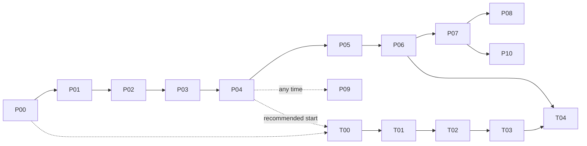

# Plans: Phase-by-Phase Build

This folder turns the design docs (`documentation/01`–`11`) into an ordered, **end-to-end build plan**. Any agent, or Rishi, can pick it up cold, see exactly where the last session stopped, and carry on.

- **[PROGRESS.md](PROGRESS.md)** is the live tracker: current phase, status of every phase, session log, the log of steps Rishi ran.
- One file per phase (`P00`–`P10` for the main build, `T00`–`T04` for Track 2), plus [STRETCH.md](STRETCH.md) for unscheduled extras.

## Phase map

| Phase | Title | Depends on | Delivers |
|---|---|---|---|
| [P00](P00-foundations.md) | Foundations | — | Repo skeleton, uv env, data root on D:, Neo4j in Docker, W&B, CLI, `nfl doctor` |
| [P01](P01-data-ingestion.md) | Data ingestion and curation | P00 | Every data source → dated Parquet snapshots on D:, curated tables, quality checks |
| [P02](P02-team-ratings.md) | Team ratings, Elo, trend | P01 | Opponent-adjusted EPA ratings, Elo, trend direction and drivers |
| [P03](P03-game-model.md) | Game model v0 | P02 | Win probability, margin, predicted score; walk-forward backtests vs Elo and market |
| [P04](P04-digest-v0.md) | Digest v0: **first live digest** | P03 | Payload, placeholder LLM, checks, report card, "Under the hood", first real weekly digest |
| [P05](P05-knowledge-graph.md) | Knowledge graph v1 | P04 | Full Neo4j schema, weekly rebuild, core multi-hop queries, graph sections in the digest |
| [P06](P06-player-model.md) | Player model v1 + accuracy scoreboard | P05 | Offense and defense main-stat projections, watch list, accuracy scoreboard |
| [P07](P07-automation.md) | Automation and weekly operations | P06 | Scheduled hands-off weekly runs, retries, notifications, season dashboard |
| [P08](P08-models-v2.md) | Models v2 + advanced graph | P07 | LightGBM game model, extra targets (TD/sack/INT, coverage, team stats), GDS insights |
| [P09](P09-llm-connection.md) | Connect a real LLM | P04 (any time after) | Real provider wired into `LLMClient`; Rishi picks the model |
| [P10](P10-season-operations.md) | Season operations and offseason | P07 | In-season runbook, playoffs, end-of-season review, 2027 pre-season retune |
| [T00](T00-bdb-data-and-baselines.md) | BDB data + baselines | P00 (recommended after P04) | BDB 2026 on D:, splits, constant-velocity and physics baselines |
| [T01](T01-bdb-gbt.md) | BDB gradient-boosted model | T00 | LightGBM displacement model |
| [T02](T02-bdb-sequence.md) | BDB sequence model | T01 | GRU / Transformer trajectory model (GPU) |
| [T03](T03-bdb-interaction.md) | BDB interaction model | T02 | Attention across players / GNN |
| [T04](T04-bdb-bridge.md) | Track 2 → Track 1 bridge | T03, P06 | Findings doc, NGS feature recommendations, historical movement profiles in the graph |



**Main path to the first live digest:** P00 → P01 → P02 → P03 → P04. That's the priority while the 2026 season is underway.

## Working model: Rishi in the loop

Rishi wants to stay hands-on, especially for training runs watched live in W&B. Every task in a phase file has one of these tags:

| Tag | Meaning | What the agent does |
|---|---|---|
| 🤖 **Agent** | Routine build work | Does it, tests it, ticks it off |
| 🧑 **Rishi runs** | Training, tuning, backtests, first graph build, digest reviews: anything worth watching or learning from | Prepares everything (code, config, the exact command), writes **"What to look for"** notes (which W&B charts, what good and bad look like), then **pauses and hands over**. If Rishi says "go ahead" / "just run it", the agent runs it with the tag `launched-by:agent` and logs it as delegated |
| ✋ **Checkpoint** | A decision point (end of phase, promoting a model, a change that affects earlier results) | Summarizes the state and asks. Continues only after Rishi says so |

Rules:
- **Never skip a 🧑 or ✋ step silently.** A pause isn't a failure. Set the phase status to ⏸ in PROGRESS.md and say exactly what's waiting.
- Data ingestion, scaffolding, loaders, tests and query code are 🤖 and don't need Rishi.
- Once P07 is done, **the weekly retrain and digest run on their own**. Rishi just watches W&B.

## How to pick up work (agent protocol)

1. **Read [PROGRESS.md](PROGRESS.md):** current phase, status, and the last session's "Next step".
2. **Read the phase file in full**, then the docs in its **Read first** list.
3. **Check prerequisites:** run the earlier phases' quick verification commands (each phase's *Exit criteria* lists them). If something is broken, fix it first and log it.
4. **Work the tasks in order.** Tick the checkboxes **in the phase file** as tasks finish. The phase file's checkboxes are the task-level truth; PROGRESS.md is the phase-level truth.
5. **At 🧑 / ✋ steps:** follow the working model above.
6. **At the end of every session**, even mid-phase:
   - update PROGRESS.md: status, a session log entry (what got done, where you stopped, exact next step, any deviations)
   - commit with a `[Pxx]` prefix
7. **Phase done** = every task ticked, every exit criterion verified (with the commands run and their results noted in the session log), the ✋ end-of-phase checkpoint approved by Rishi. Only then start the next phase.

## Ground rules for all phases

- **The design docs are the spec.** If implementation needs to differ from a doc, update that doc **and** add an entry to [10-decisions-log.md](../10-decisions-log.md) in the same commit. Never drift silently.
- **Data lives on D:.** All paths come from `NFL_DATA_ROOT` through the `paths` module. Nothing large and no secrets go in git.
- **Leakage rules** ([04](../04-track1-models.md)) apply to every feature and every evaluation. Leakage tests must pass.
- **Every training and evaluation run logs to W&B** ([08](../08-experiment-tracking.md)), with live curves.
- **Tests:** `uv run pytest` passes before a phase is marked done. `uv run ruff check` is clean.
- **Git:** work on the current working branch (`dev_rishi` unless Rishi says otherwise). Small logical commits, prefixed `[P03] …`. Don't push unless Rishi asks.
- **Ask, don't assume,** when a choice belongs to Rishi (see the open questions in [10](../10-decisions-log.md)).

## Phase file template

Each phase file follows this structure:

```
# Pxx: Title
Status → see PROGRESS.md
- Depends on / Unlocks
- Read first (docs)
## Goal
## Scope (in / out)
## Tasks (🤖 / 🧑 / ✋, checkboxes)
## Rishi-in-the-loop moments (what to look for)
## Exit criteria (+ how to verify)
## Handoff to next phase
## Pitfalls / notes
```
