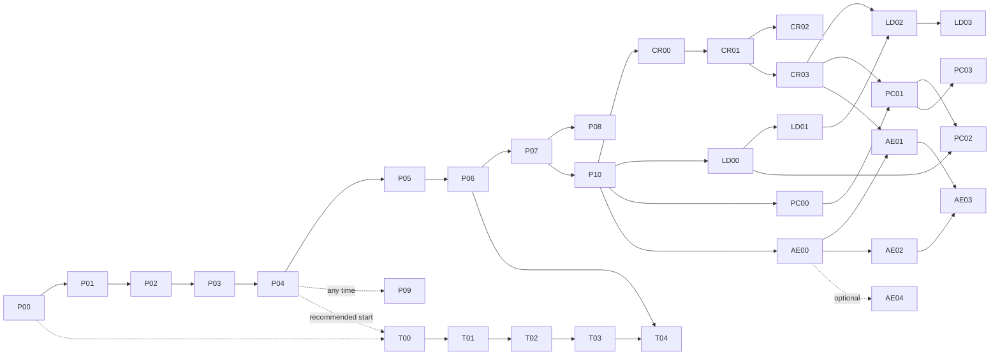

# Plans: Phase-by-Phase Build

This folder turns the design docs (`documentation/01`–`11`) into an ordered, **end-to-end build plan**. Any agent, or Rishi, can pick it up cold, see exactly where the last session stopped, and carry on.

- **[PROGRESS.md](PROGRESS.md)** is the live tracker: current phase, status of every phase, session log, the log of steps Rishi ran.
- One file per phase (`P00`–`P10` for the main build, `T00`–`T04` for Track 2), plus [STRETCH.md](STRETCH.md) for unscheduled extras.
- **Control room track** (`CR00`–`CR03`, the local web app): its spec, phase files and approved mockup live in their own folder, [`../control-room/`](../control-room/README.md); its status rows are in PROGRESS.md like every other phase.
- **Three feature tracks planned on 2026-10-08** (D107–D112), each with its own folder, spec and phase files, status rows in PROGRESS.md:
  - **Live decisions** (`LD00`–`LD03`, [`../live-decisions/`](../live-decisions/README.md)): the live 3rd- / 4th-down bot;
  - **Play calling** (`PC00`–`PC03`, [`../play-calling/`](../play-calling/README.md)): team tendencies, a weekly forecast, play diagrams;
  - **Ask the Engine** (`AE00`–`AE04`, [`../ask-the-engine/`](../ask-the-engine/README.md)): plain-English questions, and the history graph.

  **All three follow the no-touch rule (D107):** new models only; the production models, the digest, the weekly graph and the weekly run stay as they are.

## Phase map

| Phase | Title | Depends on | Delivers |
|---|---|---|---|
| [P00](P00-foundations.md) | Foundations | — | Repo skeleton, uv env, data root on D:, Neo4j in Docker, W&B, CLI, `nfl doctor` |
| [P01](P01-data-ingestion.md) | Data ingestion and curation | P00 | Every data source → dated Parquet snapshots on D:, curated tables, quality checks |
| [P02](P02-team-ratings.md) | Team ratings, Elo, trend | P01 | Opponent-adjusted EPA ratings, Elo, trend direction and drivers |
| [P03](P03-game-model.md) | Game model v0 | P02 | Win probability, margin, predicted score; walk-forward backtests vs Elo and market |
| [P04](P04-digest-v0.md) | Digest v0: **first live digest** | P03 | Payload, placeholder LLM, checks, report card, "Under the hood", first real weekly digest |
| [P05](P05-knowledge-graph.md) | Knowledge graph v1 | P04 | Full Neo4j schema, weekly rebuild, core multi-hop queries, graph sections in the digest |
| [P06](P06-player-model.md) | Player model v1 + accuracy scoreboard | P05 | Offense and defense main-stat projections, watch list, accuracy scoreboard |
| [P07](P07-automation.md) | Automation and weekly operations | P06 | Manual-first (D71): `nfl weekly run --auto` (calendar, lock, not-ready exit), run records, alerts, drift checks, season dashboard, Saturday injury update, runbook; scheduling deferred |
| [P08](P08-models-v2.md) | Models v2 + advanced graph | P07 | LightGBM game model v1 evaluated, **v0 kept** (D79); 12 new player targets (TD / sack / INT chances, QB TDs, CB/S coverage) and 4 team stat totals shipped; consistency layer; Q5b–Q10 incl. GDS PageRank + KNN, a Wikipedia-built coaching seed |
| [P09](P09-llm-connection.md) | Connect a real LLM | P04 (any time after) | GLM 5.3 Flash via OpenRouter (wired in P04, D56) re-checked on today's digest: fact-checked backtests, prompt v2 + check fixes, reasoning-safe routing, `nfl doctor` routing check; no native adapters (D87) |
| [P10](P10-season-operations.md) | Season operations and offseason | P07 | Built and rehearsed in week 5 (D89): `nfl weekly rehearse` (D90), playoff weeks (D91), `nfl season weeks|review`, runbook sections; the dated steps (season log, playoff check, review, retune, ✋ 2027) on PROGRESS → Season calendar |
| [CR00](../control-room/CR00-foundations.md) | Control room: foundations | P10 | `nfl app` (FastAPI on 127.0.0.1), the React shell, both themes, the safety rules and their tests |
| [CR01](../control-room/CR01-week-archive.md) | Control room: the week archive | CR00 | Every week tab from real files (read-only), the three pipeline views and the per-week picker |
| [CR02](../control-room/CR02-run-control.md) | Control room: run control | CR01 | `--expect-week`, progress events, pre-flight + Run / Resume / injury update, live views; the first Tuesday run from the app |
| [CR03](../control-room/CR03-mlops-and-season.md) | Control room: MLOps and season pages | CR01 | MLOps → Health · W&B runs · Artifacts, Scorecard, Teams, Models, Alerts, Health |
| [LD00](../live-decisions/LD00-decision-models.md) | Live decisions: decision models | P10 | Win probability, yards gained, field goal, punt, pass and kickoff models; the decision engine; backtests; the production-unchanged test |
| [LD01](../live-decisions/LD01-live-feed.md) | Live decisions: the live feed and replay | LD00 | ESPN client and state parser, `nfl live …`, parity vs nflverse, a measured feed lag |
| [LD02](../live-decisions/LD02-game-day-tab.md) | Live decisions: the Game day tab | LD01, CR03 | Click-to-check call card with team context; the first live use |
| [LD03](../live-decisions/LD03-decision-review.md) | Live decisions: decision review | LD02 | Finished weeks' review, coach aggressiveness, the bot's live calibration |
| [PC00](../play-calling/PC00-tendency-data.md) | Play calling: tendency data | P10 | Enriched plays and tendency tables as of each week |
| [PC01](../play-calling/PC01-play-calling-pages.md) | Play calling: the pages | PC00, CR03 | Explore → Play calling; the Play calls week tab |
| [PC02](../play-calling/PC02-tendency-forecast.md) | Play calling: the tendency forecast | PC01, LD00 | Next-game rates vs the opponent, backtested, graded weekly |
| [PC03](../play-calling/PC03-play-diagrams.md) | Play calling: play diagrams | PC01 | Reconstructed animations, the play browser, Big Data Bowl clips if allowed |
| [AE00](../ask-the-engine/AE00-query-layer.md) | Ask the Engine: the query layer | P10 | Guard stack, templates, golden set, model bake-off |
| [AE01](../ask-the-engine/AE01-ask-tab.md) | Ask the Engine: the page | AE00, CR03 | Explore → Ask the Engine |
| [AE02](../ask-the-engine/AE02-history-graph.md) | Ask the Engine: the history graph | AE00 | A second Neo4j with play-level nodes 2018+ |
| [AE03](../ask-the-engine/AE03-connections-and-graph-ml.md) | Ask the Engine: connections and graph ML | AE01, AE02 | Six degrees, derived relationships, GDS lab, the path benchmark |
| [AE04](../ask-the-engine/AE04-local-query-model.md) | Ask the Engine (optional): local model | AE00 | LoRA fine-tunes with / without LLM-JEPA, served locally |
| [T00](T00-bdb-data-and-baselines.md) | BDB data + baselines | P00 (recommended after P04) | BDB 2026 on D:, splits, constant-velocity and physics baselines |
| [T01](T01-bdb-gbt.md) | BDB gradient-boosted model | T00 | LightGBM displacement model |
| [T02](T02-bdb-sequence.md) | BDB sequence model | T01 | GRU / Transformer trajectory model (GPU) |
| [T03](T03-bdb-interaction.md) | BDB interaction model | T02 | Attention across players / GNN |
| [T04](T04-bdb-bridge.md) | Track 2 → Track 1 bridge | T03, P06 | Findings doc, NGS feature recommendations, historical movement profiles in the graph |



**Main path to the first live digest:** P00 → P01 → P02 → P03 → P04. That's the priority while the 2026 season is underway.

## Working model: Rishi in the loop

Rishi wants to stay hands-on, especially for training runs watched live in W&B. Every task in a phase file has one of these tags:

| Tag | Meaning | What the agent does |
|---|---|---|
| 🤖 **Agent** | Routine build work | Does it, tests it, ticks it off |
| 🧑 **Rishi runs** | Training, tuning, backtests, first graph build, digest reviews: anything worth watching or learning from | Prepares everything (code, config, the exact command), writes **"What to look for"** notes (which W&B charts, what good and bad look like), then **pauses and hands over**. If Rishi says "go ahead" / "just run it", the agent runs it with the tag `launched-by:agent` and logs it as delegated |
| ✋ **Checkpoint** | A decision point (end of phase, promoting a model, a change that affects earlier results) | Summarizes the state and asks. Continues only after Rishi says so |

Rules:
- **Never skip a 🧑 or ✋ step silently.** A pause isn't a failure. Set the phase status to ⏸ in PROGRESS.md and say exactly what's waiting.
- Data ingestion, scaffolding, loaders, tests and query code are 🤖 and don't need Rishi.
- Since P07 the weekly retrain and digest are **one command** (`uv run nfl weekly run --auto`, run by hand: manual-first, D71). Rishi reads the digest and watches W&B; scheduling it later only wraps that command ([runbook](../runbook.md)).

## How to pick up work (agent protocol)

The full step-by-step routine (probing before building, verification, review, quirks, end-of-run report, kickoff prompt) is the **`phase-workflow` skill**: [`.claude/skills/phase-workflow/SKILL.md`](../../.claude/skills/phase-workflow/SKILL.md). The short version:

1. **Read [PROGRESS.md](PROGRESS.md):** current phase, status, and the last session's "Next step".
2. **Read the phase file in full**, then the docs in its **Read first** list.
3. **Check prerequisites:** run the earlier phases' quick verification commands (each phase's *Exit criteria* lists them). If something is broken, fix it first and log it.
4. **Work the tasks in order.** Tick the checkboxes **in the phase file** as tasks finish. The phase file's checkboxes are the task-level truth; PROGRESS.md is the phase-level truth.
5. **At 🧑 / ✋ steps:** follow the working model above.
6. **At the end of every session**, even mid-phase:
   - update PROGRESS.md: status, a session log entry (what got done, where you stopped, exact next step, any deviations)
   - commit with a `[Pxx]` prefix (`[CRxx]` for the control room), then push to `origin dev_rishi`
7. **Phase done** = every task ticked, every exit criterion verified (with the commands run and their results noted in the session log), the ✋ end-of-phase checkpoint approved by Rishi. Only then start the next phase.

## Ground rules for all phases

- **The design docs are the spec.** If implementation needs to differ from a doc, update that doc **and** add an entry to [10-decisions-log.md](../10-decisions-log.md) in the same commit. Never drift silently.
- **Data lives on D:.** All paths come from `NFL_DATA_ROOT` through the `paths` module. Nothing large and no secrets go in git.
- **Leakage rules** ([04](../04-track1-models.md)) apply to every feature and every evaluation. Leakage tests must pass.
- **Every training and evaluation run logs to W&B** ([08](../08-experiment-tracking.md)), with live curves.
- **Tests:** `uv run pytest` passes before a phase is marked done. `uv run ruff check` is clean.
- **Git:** work on the current working branch (`dev_rishi` unless Rishi says otherwise). Small logical commits, prefixed `[P03] …`. Commit and push at the end of each phase or session. Never force-push, and don't merge to `main` without Rishi's OK.
- **Ask, don't assume,** when a choice belongs to Rishi (see the open questions in [10](../10-decisions-log.md)).

## Phase file template

Each phase file follows this structure:

```
# Pxx: Title
Status → see PROGRESS.md
- Depends on / Unlocks
- Read first (docs)
## Goal
## Scope (in / out)
## Tasks (🤖 / 🧑 / ✋, checkboxes)
## Rishi-in-the-loop moments (what to look for)
## Exit criteria (+ how to verify)
## Handoff to next phase
## Pitfalls / notes
```
