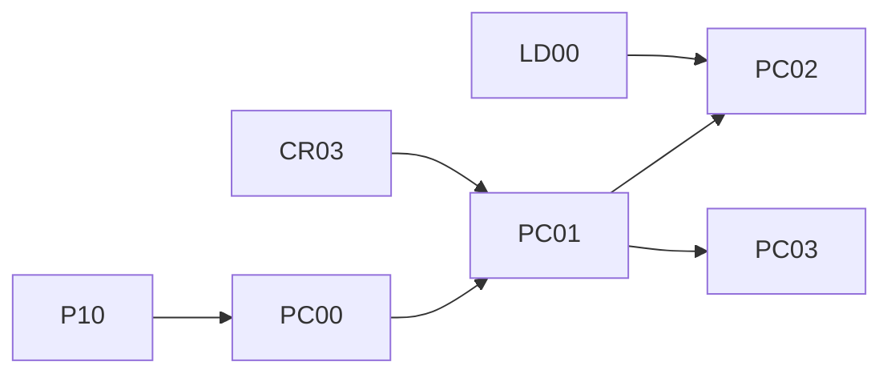

# Play calling: team tendencies, forecasts and play diagrams

Status → see the **Play calling** rows in [plans/PROGRESS.md](../plans/PROGRESS.md). Decisions: D107, D108, D110 in the [decisions log](../10-decisions-log.md). Planned 2026-10-08.

The goal is a section of the control room where Rishi clicks **Play calling**, picks a team, and sees how it calls plays on offense and defense, drawn like a playbook:
- what it runs most, by situation;
- where the ball goes;
- how that's changing week to week.

Each week a new model forecasts what each team is likely to call **against its next opponent**. A play browser shows individual plays as diagrams. It's its own track, **PC00–PC03**, with its own new model, and the **existing models stay exactly as they are** (D107).

## 1. What was agreed (Rishi, 2026-10-08)

| Topic | Decision |
|---|---|
| Where it lives | **General pages** in a new sidebar group, **Explore** → **Play calling** (32 teams → a team page). **Weekly forecasts** in a new week tab, **Play calls**, added after **Game day**. Existing tabs and pages unchanged (D108) |
| What it forecasts | **Rates for the next game against that opponent**, not single plays: pass rate over expected, play-action, screens, deep shots, run direction, and on defense blitz rate, rushers and box count. Graded after the games against what happened |
| The "play" button | A **reconstructed diagram**, labelled as such: the pre-snap picture and where the ball went, animated. Not real player tracking, which doesn't exist publicly for 2024–2026 (D110) |
| Real animated plays | Only from **Big Data Bowl** tracking (2022–2023 seasons), as "a real example of this concept", if the data's terms allow it (PC03, ✋) |
| Expectations | Rishi: "whatever you can do for that one, I am completely fine with". The ML side is the forecast model and how honestly it beats its baselines |

## 2. What the data can and can't show (checked 2026-10-08)

| Source | What it gives | Seasons | During 2026? |
|---|---|---|---|
| nflverse play-by-play (`plays`) | run / pass, `pass_length` (short / deep), `pass_location` (left / middle / right), `air_yards`, `run_location`, `run_gap` (end / tackle / guard), `shotgun`, `no_huddle`, `qb_dropback`, `qb_scramble`, `xpass`, `pass_oe` | 2010–2026 here | **Yes**, nightly |
| FTN charting (`ftn_plays`) | play-action, screen, RPO, motion, trick play, QB under center / shotgun / pistol, backfield count, box count, blitzers, pass rushers, hash, QB out of the pocket, drops, catchable / contested | 2022–2026 (2026 through week 4 on D: on 2026-10-08) | **Yes**, about 2 days after games (FTN's 48-hour target) |
| nflverse participation (research only, D14) | formation (shotgun / under center / pistol), **personnel** (11, 12 …), defense personnel, box, rushers, players on the field, **coverage shell** (Cover 0 / 1 / 2 / 2-man / 3 / 4 / 6 / 9), man / zone, **route of the targeted receiver** (quick out, hitch, go, post …), time to throw, pressure | 2016–2025. Coverage from 2018 (about 38% of plays until 2022, about 49% from 2023: pass plays); routes for the target only | **No.** FTN-sourced since 2023, published after the season (2025's on 2026-02-10). **2026's arrives about February 2027** |
| Big Data Bowl tracking | x / y for every player, 10 frames a second; BDB 2025 adds formation, receiver alignment, routes for every receiver, coverage and man / zone (PFF) | 2022 weeks 1–9 (BDB 2024 / 2025); 2023 pass plays (BDB 2026) | No public tracking exists for 2024–2026 games |

So **in season, the pages show** play-by-play and FTN tendencies. Personnel, formations, coverage shells and routes appear as **2023–2025 history** (labelled research data) until 2026's participation file lands.

Big Data Bowl 2027: a university event listing suggests a launch on 2026-10-09, not confirmed by the NFL or Kaggle on 2026-10-08. PC03 checks again, and the season calendar already has the ✋ step.

**Checked again in PC00 (2026-10-10, D122; details in the [guide](../guides/play-calling.md) §2):**
- FTN joins 99.3-99.9% of 2022-2025 scrimmage plays: FTN keeps blank placeholder rows for a few plays it didn't chart (2024_07_BAL_TB: 97 of 131), now treated as not charted. 2026: weeks 1-3 complete and 15 of week 4's 16 games on Tuesday 2026-10-06.
- **When FTN lands:** nflverse pulls FTN at least twice a day (~11:00 and ~17:00 UTC); FTN lands 35-51 hours after kickoff. Tuesday evening has every game but Monday night's; Wednesday should complete the week (to confirm 2026-10-14).
- Participation joins 100% of 2016-2025 scrimmage plays; on dropbacks coverage fills 0% (2016-17), ~89% (2018-22), ~99.8% (2023-25), the target's route 85-90%. **Two vocabularies:** NGS to 2022 (formations SINGLEBACK / I_FORM / EMPTY / JUMBO / WILDCAT, routes FLAT / HITCH / CROSS ...), FTN from 2023 (UNDER CENTER, QUICK OUT / HITCH-CURL / IN-DIG ...).
- League PROE sits below 0 (nflverse's `xpass` isn't re-centred): 2025 neutral -2.0 points; rbsdm's 2025 league mean is -1.7. Our 2025 neutral PROE ranks the teams with Spearman 0.975 against rbsdm.

## 3. Screens

**Explore → Play calling** (sidebar, new group):

| Page / part | Shows | Reads | Phase |
|---|---|---|---|
| Teams grid | 32 team tiles with one or two signature numbers (pass rate over expected, blitz rate), sortable | `playcalling/<S>/team_tendencies.parquet` | PC01 |
| Team page: Offense | **Identity** (rates vs league with percentile bars: pass rate over expected, shotgun / under center / pistol, no-huddle, motion, play-action, screen, RPO, deep shots, aDOT); **By situation** (down × distance, field zone, score state heat table); **Where the ball goes** (a field diagram of pass direction × depth; run direction and gap on an offensive-line diagram); **Week by week** (sparklines); **History, 2023–2025** (personnel, formations, routes of targets: research data) | the tendency tables; `plays_enriched` | PC01 |
| Team page: Defense | Blitz rate, rushers, box count, opponent pass rate over expected allowed, what offenses do against it; **History, 2023–2025**: coverage shells, man / zone | Same | PC01 |
| Team page: Next game | This week's forecast against the opponent (from PC02), with a link to the week's Play calls tab | `playcalling/<S>/week<NN>/forecast.parquet` | PC02 |
| Play browser | This team's plays for a chosen week, filtered (down, play type, result); click → the **reconstructed diagram** animates; "**See a real one**" plays a Big Data Bowl clip of the same concept (if allowed) | `plays_enriched`; the BDB concept library | PC03 |

**Play calls** (week tab, after Game day):

| State | Shows | Reads | Phase |
|---|---|---|---|
| Before the games | Each game: both offenses' forecast rates against the other defense, the baseline next to each, the biggest matchup shifts ("CIN's play-action rate expected up 6 points: DAL allows the league's most") | `forecast.parquet` | PC01 (descriptive), PC02 (forecast) |
| After the games | Forecast vs actual per team and rate; how the forecast did against its baselines this week | `forecast.parquet` + the week's plays; `playcall_scoreboard.parquet` | PC02 |

## 4. Architecture

- **`src/nflengine/playcalling/`** (new package):
  - `build.py`: plays + FTN (+ participation for history) → enriched plays and tendency tables, as of a week;
  - `forecast.py`: the PC02 model;
  - `diagrams.py`: a reconstructed play's geometry, sent to the browser as JSON; the browser draws and animates it;
  - `bdb.py`: the PC03 concept library.
- **Files** under `{NFL_DATA_ROOT}/playcalling/<S>/`: `plays_enriched.parquet`, `team_tendencies.parquet` (team × side × as-of week × metric × situation bucket: n, rate, league rate, difference), `week<NN>/forecast.parquet`, `playcall_scoreboard.parquet`. A model artifact under `models/playcall/`.
- **CLI:**
  - `nfl playcalling build --season S [--through-week W]`;
  - `nfl playcalling forecast --season S --week W`;
  - `nfl playcalling backtest`;
  - `nfl playcalling grade --season S --week W`.
- **How it refreshes:** its own commands, **not a weekly-run step** (D107). **Decided in PC00 (Rishi, 2026-10-10, D122): a runbook line**, no button: `nfl playcalling build --season 2026` after Tuesday's weekly run, and on Wednesday after 13:00 ET an FTN refresh (`nfl ingest --sources nflverse --datasets ftn_charting`, `nfl curate`) and the build again, for Monday night's FTN. (The options were a runbook line, a "Refresh play calling" button as a fourth allowlisted command, or a fail-soft weekly-run step, not recommended.)
- **App:** `GET /api/playcalling/teams`, `/api/playcalling/teams/{team}?season=&side=`, `/api/playcalling/teams/{team}/plays?season=&week=`, `/api/playcalling/plays/{game_id}/{play_id}/diagram`, `/api/weeks/{S}/{W}/play-calls`. All GET, all read-only. **As built in PC01:** `/api/playcalling/teams?season=`, `/api/playcalling/teams/{team}?season=&side=`, `/api/playcalling/teams/{team}/history?side=` (an addition: History has its own answer, loaded when opened) and `/api/weeks/{S}/{W}/play-calls`; the play browser's two endpoints come with PC03.

## 5. The no-touch rule (D107)

The Live decisions README §6 applies word for word:
- new code in `src/nflengine/playcalling/`;
- new files, W&B job types (`playcall-build`, `playcall-backtest`, `playcall-forecast`) and an artifact (`playcall-model`);
- a `playcalling:` block in `settings.yaml`;
- the production-unchanged check at every close.

The forecast model may read LD00's `pass` model (a new model, not production) and the published market lines.

## 6. Phases

| Phase | Title | Depends on | Delivers |
|---|---|---|---|
| [PC00](PC00-tendency-data.md) | Tendency data | P10 | Enriched plays and tendency tables (2016–2026, as of each week), league baselines, the refresh decision, the guide and skill |
| [PC01](PC01-play-calling-pages.md) | The Play calling pages | PC00, CR03 | Mockup first; Explore → Play calling (teams grid, team pages, history); the Play calls week tab (descriptive matchups) |
| [PC02](PC02-tendency-forecast.md) | The tendency forecast | PC01, LD00 | The forecast model with walk-forward backtests against four baselines, W&B, model card; forecasts and grading in the Play calls tab and on team pages |
| [PC03](PC03-play-diagrams.md) | Play diagrams and the play browser | PC01 | Reconstructed animated diagrams, the play browser; the Big Data Bowl concept library if its terms allow |

Commit prefixes `[PC00]` … `[PC03]`. **Mockup first** for PC01 and PC03.

**Docs each phase leaves:**
- the guide `guides/play-calling.md` (PC00 onward);
- the model card `model_cards/playcall-forecast.md` (PC02);
- the skill `.claude/skills/play-calling/SKILL.md` (PC00);
- the W&B guide's section (PC00, PC02).

## 7. As built

Each phase adds what it built and any differences from this spec here, with decision numbers.

### PC00: tendency data (2026-10-10, D122)

- **Built:** `src/nflengine/playcalling/` (`labels.py`: definitions, situation buckets, the metric registry; `participation.py`: research participation parsed into play labels; `build.py`), `nfl playcalling build --season S [--through-week W] [--history 2016-2025|all] [--no-wandb|--smoke]`, the `playcalling:` settings block, the `playcall-build` W&B run (group `play-calling`), the guide `guides/play-calling.md`, the skill `play-calling`.
- **Files** under `playcalling/<S>/`, 2016-2026 built (~115 MB in all): `plays_enriched`, `team_tendencies`, and two **additions to §4's list**: `team_game_tendencies` (per team-game: the week-by-week sparklines and PC02's actuals) and `league_tendencies` (the league baselines), plus `build.json`. A `--through-week` build goes to `through_weekWW/`. The forecast and scoreboard files (`week<NN>/forecast.parquet`, `playcall_scoreboard.parquet`) come with PC02.
- **The tables:** per team, side (offense / defense = what offenses do against it), as-of week (games strictly before it), window (`season`, `last4`, `last_season`), ~90 metrics (pbp 2016+, FTN 2022+, a PFR blitz cross-check 2018+, participation `history_only` 2016-2025) x situations (`all`, `neutral`; six key metrics also by down & distance, field zone, score and two-minute): n, games, value, league value, diff, percentile.
- **Differences from the spec:** league PROE isn't "near 0 by construction" (the exit criterion): it's about -2 points since 2022 because `xpass` isn't re-centred, so pages read `diff`; the 2025 PROE check against rbsdm passes (Spearman 0.975, same top 5, 4 of the bottom 5). Participation metrics never reach a later season's `last_season` window (2026 rows carry no research data; the pages read 2023-2025 history from those seasons' folders).
- **As of a week = what a Tuesday run could see (D123, Sol's review):** games before week W, FTN once 48 h have passed since kickoff (Monday night's game counts from the next week), the PFR cross-check a week behind; built on Tuesday or after Wednesday's refresh, the as-of tables are the same.
- **For PC01:** read `team_tendencies` at the newest `as_of_week` (`build.json → as_of_weeks`), filter `~history_only` for the in-season identity, `family` for the heat table, `team_game_tendencies` for the week-by-week sparklines; percentiles rank every team with plays, so grey out small `n`. **For PC02:** targets and actuals from `team_game_tendencies`, features from `team_tendencies` (never `history_only`; the as-of rows already hold back what a Tuesday run couldn't see, so a forecast made any time before Thursday's game and its backtest see the same features).

### PC01: the Play calling pages (2026-10-10, D124)

- **Built:** the control room's **Explore** group (between Season and System) with **Play calling**: the teams grid (`/explore/play-calling`) and a page per team (`/explore/play-calling/{team}`: Offense / Defense, a five-second summary, Identity, By situation, Where the ball goes, Week by week, History 2023-2025); the **Play calls** week tab after Game day (each game's two matchups, the week's biggest matchup shifts). Backend `src/nflengine/app/readers/playcalling.py` + four GETs; web `web/src/pages/explore/`, `web/src/pages/week/PlayCallsTab.tsx`, charts `RateBar`, `HeatTable`, `FieldZones`, `RunLanes`, `MatchStrip`. Guide: `guides/play-calling.md` §8; the control-room guide §2f.
- **The mockup** (the visual spec): [Play Calling Mockup](https://claude.ai/artifact/KFwYaMJnxjpPdXEz7MsxPQ), source `mockup/` (its data from the real API, `mockup/dump_payloads.py`). Rishi waived the ✋ approval at the kickoff; it was built first and the React port follows it, with five deliberate differences (`mockup/README.md`).
- **Differences from §3-§4 and the phase file:**
  - History is its own endpoint (`/teams/{team}/history?side=`), fetched only when the section is opened;
  - the Play calls tab is **descriptive**: each offense's rate next to what the other defense allowed and the league's; the "biggest matchup shifts" are a defense's distance from the league in standard deviations of the 32 defenses (no "expected up N points": that's PC02's forecast);
  - the server writes the sentences (the five-second summary, the shifts) and every metric's short name, unit, denominator and tooltip, so the mockup and the app say the same thing;
  - History shows the newest three participation seasons from 2023 (one vocabulary), not 2016-2025;
  - "Last 4" is left out of the window switch while a team has played 4 or fewer games (it equals the season);
  - for 2018-2021 (no FTN) the grid's defense signature is PFR's blitz count.
- **Checks:** every cell the reader returns equals its table row (86,168 cells, 2026 / 2025 / 2019); the spot checks against rbsdm, Sharp Football and articles for KC, LA, MIN (2025): nothing beyond definition differences, and with rbsdm's filter our PROE equals rbsdm's for all 32 teams (guide §8.6); production unchanged (the guard test + the week-5 rehearsal identical).
- **Reviews (D125):** a read-only cross-review (8 findings: old seasons' empty metrics, the 2016-2017 grid, a played "next" game, FTN notes on weeks they can't affect, the shift's spread, the weekly cut-off, a strict history flag, wording), the test worker's input-breaking tests (a games table without its columns), the screenshots (a layout overflow) and Sol (1 P1: file-derived team text bypassed `clean()`; 6 P2; 2 P3): all fixed with tests. Tests: 517 app tests (164 new + 24 integration on the real data), 63 of 64 planted mutants caught (the survivor equivalent), 424 Vitest tests.
